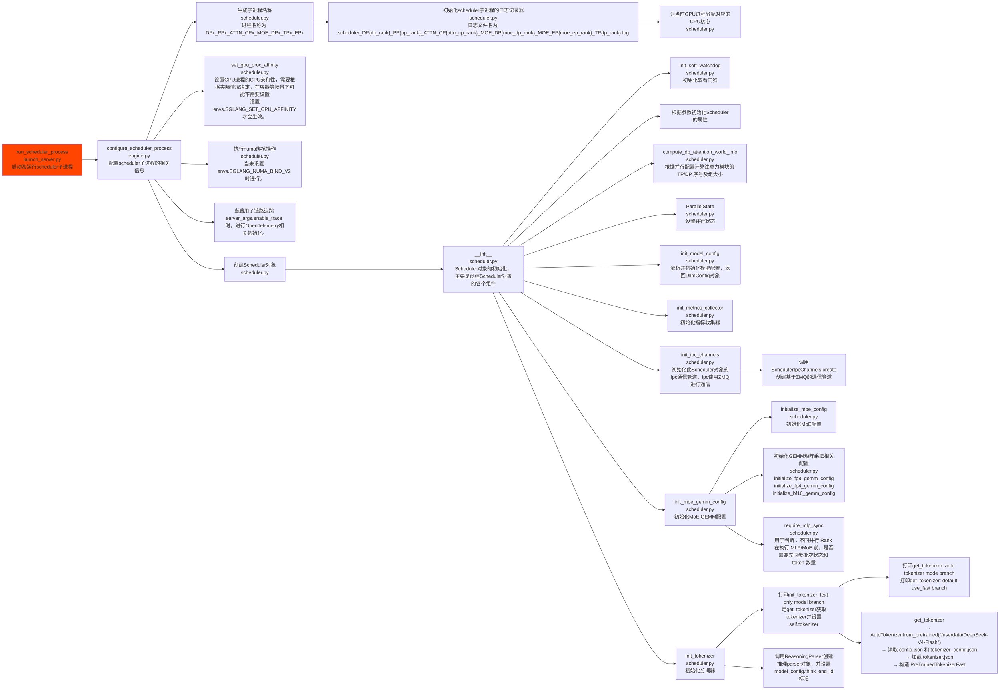

```mermaid
%%{init: { "flowchart": { "useMaxWidth": false } } }%%
flowchart LR
    A["run_scheduler_process<br/>launch_server.py<br/>启动及运行scheduler子进程"] --> B["configure_scheduler_process<br/>engine.py<br/>配置scheduler子进程的相关信息"]
    B --> C["生成子进程名称<br/>scheduler.py<br/>进程名称为 DPx_PPx_ATTN_CPx_MOE_DPx_TPx_EPx"]
    C --> D["初始化scheduler子进程的日志记录器<br/>scheduler.py<br/>日志文件名为 scheduler_DP{dp_rank}_PP{pp_rank}_ATTN_CP{attn_cp_rank}_MOE_DP{moe_dp_rank}_MOE_EP{moe_ep_rank}_TP{tp_rank}.log"]
    D --> E["为当前GPU进程分配对应的CPU核心<br/>scheduler.py<br/>"]
    B --> F["set_gpu_proc_affinity<br/>scheduler.py<br/>设置GPU进程的CPU亲和性，需要根据实际情况决定，在容器等场景下可能不需要设置<br/>设置envs.SGLANG_SET_CPU_AFFINITY才会生效。"]
    B --> G["执行numa绑核操作<br/>scheduler.py<br/>当未设置 envs.SGLANG_NUMA_BIND_V2 时进行。"]
    B --> H["当启用了链路追踪 server_args.enable_trace 时，进行OpenTelemetry相关初始化。"]
    B --> I["创建Scheduler对象<br/>scheduler.py<br/>"]
    I --> I1["__init__<br/>scheduler.py<br/>Scheduler对象的初始化，主要是创建Scheduler对象的各个组件"]
    I1 --> I2["init_soft_watchdog<br/>scheduler.py<br/>初始化软看门狗"]
    I1 --> I3["根据参数初始化Scheduler的属性"]
    I1 --> I4["compute_dp_attention_world_info<br/>scheduler.py<br/>根据并行配置计算注意力模块的 TP/DP 序号及组大小"]
    I1 --> I5["ParallelState<br/>scheduler.py<br/>设置并行状态"]
    I1 --> I6["init_model_config<br/>scheduler.py<br/>解析并初始化模型配置，返回DllmConfig对象"]
    I1 --> I7["init_metrics_collector<br/>scheduler.py<br/>初始化指标收集器"]
    
    I1 --> I8["init_ipc_channels<br/>scheduler.py<br/>初始化此Scheduler对象的ipc通信管道，ipc使用ZMQ进行通信"]
    I8 --> I81["调用SchedulerIpcChannels.create创建基于ZMQ的通信管道"]
    I1 --> I9["init_tokenizer<br/>scheduler.py<br/>初始化分词器"]
    I1 --> I10["init_moe_gemm_config<br/>scheduler.py<br/>初始化MoE GEMM配置"]
    I10 --> I101["initialize_moe_config<br/>scheduler.py<br/>初始化MoE配置"]
    I10 --> I102["初始化GEMM矩阵乘法相关配置<br/>scheduler.py<br/>initialize_fp8_gemm_config<br/>initialize_fp4_gemm_config<br/>initialize_bf16_gemm_config"]
    I10 --> I103["require_mlp_sync<br/>scheduler.py<br/>用于判断：不同并行 Rank 在执行 MLP/MoE 前，是否需要先同步批次状态和 token 数量"]
        
    I9 --> I91["打印init_tokenizer: text-only model branch<br/>走get_tokenizer获取tokenizer并设置self.tokenizer"]
    I91 --> I911["打印get_tokenizer: auto tokenizer mode branch<br/>打印get_tokenizer: default use_fast branch"]
    I91 --> I912["get_tokenizer<br/>→ AutoTokenizer.from_pretrained(&quot;/userdata/DeepSeek-V4-Flash&quot;)<br/>→ 读取 config.json 和 tokenizer_config.json<br/>→ 加载 tokenizer.json<br/>→ 构造 PreTrainedTokenizerFast"]
    I9 --> I92["调用ReasoningParser创建推理parser对象，并设置model_config.think_end_id标记"]
    
    style A fill:#ff4500
    click A href "./启动流程.md" "返回启动流程文档" _self

```
