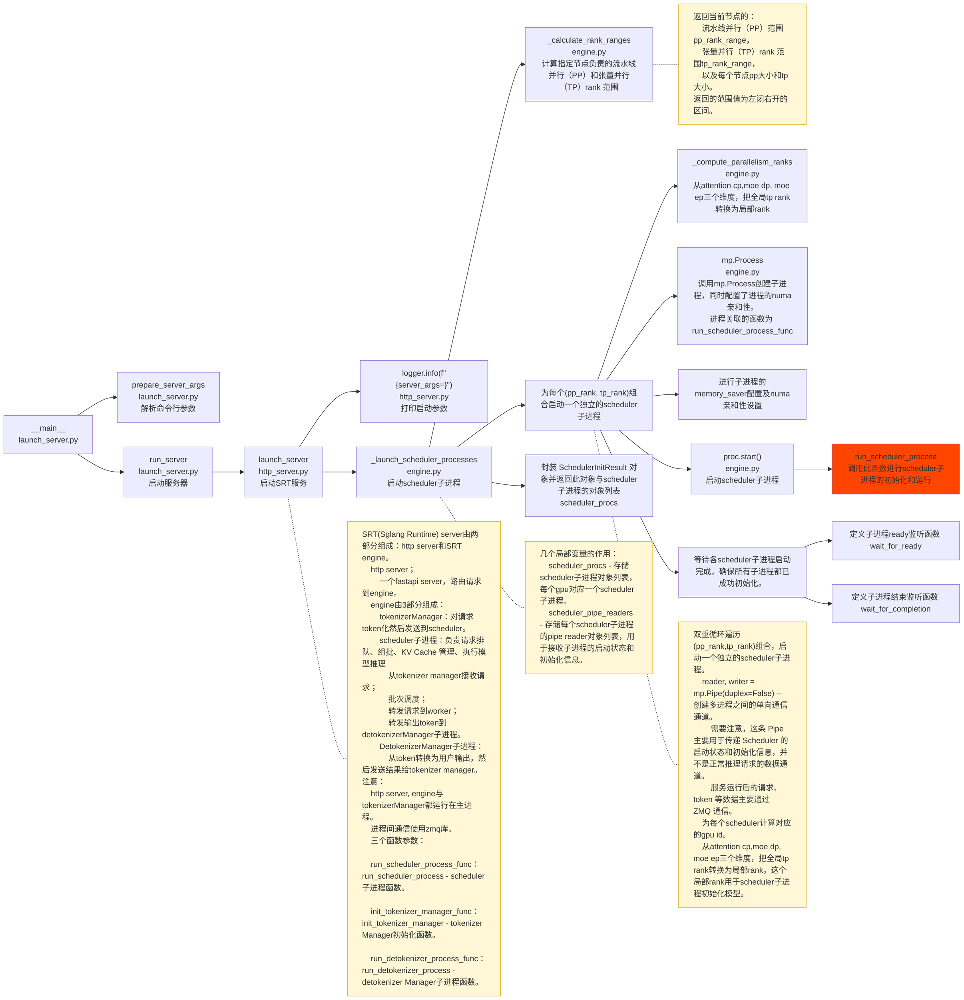

```mermaid
%%{init: { "flowchart": { "useMaxWidth": false } } }%%
flowchart LR
    A["__main__<br/>launch_server.py"] --> B["prepare_server_args<br/>launch_server.py<br/>解析命令行参数"]
    A --> C["run_server<br/>launch_server.py<br/>启动服务器"]
    C --> D["launch_server<br/>http_server.py<br/>启动SRT服务"]
    D --> D1["logger.info(f#quot;{server_args=}#quot;)<br/>http_server.py<br/>打印启动参数"]
    D --> D2["_launch_scheduler_processes<br/>engine.py<br/>启动scheduler子进程"]
    D2 --> DD1["_calculate_rank_ranges<br/>engine.py<br/>计算指定节点负责的流水线并行（PP）和张量并行（TP）rank 范围"]
    D2 --> DD2["为每个(pp_rank, tp_rank)组合启动一个独立的scheduler子进程"]
    DD2 --> DDD1["_compute_parallelism_ranks<br/>engine.py<br/>从attention cp,moe dp, moe ep三个维度，把全局tp rank转换为局部rank"]
    DD2 --> DDD2["mp.Process<br/>engine.py<br/>调用mp.Process创建子进程，同时配置了进程的numa亲和性。<br/>进程关联的函数为 run_scheduler_process_func"]
    DD2 --> DDD3["进行子进程的memory_saver配置及numa亲和性设置"]
    DD2 --> DDD4["proc.start()<br/>engine.py<br/>启动scheduler子进程"]
    DDD4 --> DDD41["<span id='ddd41'>run_scheduler_process</span><br/>调用此函数进行scheduler子进程的初始化和运行"]
    DD2 --> DDD5["等待各scheduler子进程启动完成，确保所有子进程都已成功初始化。"]
    DDD5 --> DDDD1["定义子进程ready监听函数 wait_for_ready"]
    DDD5 --> DDDD2["定义子进程结束监听函数 wait_for_completion"]
    D2 --> D3["封装 SchedulerInitResult 对象并返回此对象与scheduler子进程的对象列表scheduler_procs"]
    
    Note1["SRT(Sglang Runtime) server由两部分组成：http server和SRT engine。<br/>&nbsp;&nbsp;&nbsp;&nbsp;http server；<br/>&nbsp;&nbsp;&nbsp;&nbsp;&nbsp;&nbsp;&nbsp;&nbsp;一个fastapi server，路由请求到engine。<br/>&nbsp;&nbsp;&nbsp;&nbsp;engine由3部分组成：<br/>&nbsp;&nbsp;&nbsp;&nbsp;&nbsp;&nbsp;&nbsp;&nbsp;tokenizerManager：对请求token化然后发送到scheduler。<br/>&nbsp;&nbsp;&nbsp;&nbsp;&nbsp;&nbsp;&nbsp;&nbsp;scheduler子进程：负责请求排队、组批、KV Cache 管理、执行模型推理<br/>&nbsp;&nbsp;&nbsp;&nbsp;&nbsp;&nbsp;&nbsp;&nbsp;&nbsp;&nbsp;&nbsp;&nbsp;从tokenizer manager接收请求；<br/>&nbsp;&nbsp;&nbsp;&nbsp;&nbsp;&nbsp;&nbsp;&nbsp;&nbsp;&nbsp;&nbsp;&nbsp;批次调度；<br/>&nbsp;&nbsp;&nbsp;&nbsp;&nbsp;&nbsp;&nbsp;&nbsp;&nbsp;&nbsp;&nbsp;&nbsp;转发请求到worker；<br/>&nbsp;&nbsp;&nbsp;&nbsp;&nbsp;&nbsp;&nbsp;&nbsp;&nbsp;&nbsp;&nbsp;&nbsp;转发输出token到detokenizerManager子进程。<br/>&nbsp;&nbsp;&nbsp;&nbsp;&nbsp;&nbsp;&nbsp;&nbsp;DetokenizerManager子进程：<br/>&nbsp;&nbsp;&nbsp;&nbsp;&nbsp;&nbsp;&nbsp;&nbsp;&nbsp;&nbsp;&nbsp;&nbsp;从token转换为用户输出，然后发送结果给tokenizer manager。<br/>注意：<br/>&nbsp;&nbsp;&nbsp;&nbsp;http server, engine与tokenizerManager都运行在主进程。<br/>&nbsp;&nbsp;&nbsp;&nbsp;进程间通信使用zmq库。
    三个函数参数：
        &nbsp;&nbsp;&nbsp;&nbsp;run_scheduler_process_func：run_scheduler_process - scheduler子进程函数。
        &nbsp;&nbsp;&nbsp;&nbsp;init_tokenizer_manager_func：init_tokenizer_manager - tokenizer Manager初始化函数。
        &nbsp;&nbsp;&nbsp;&nbsp;run_detokenizer_process_func：run_detokenizer_process - detokenizer Manager子进程函数。"]
        
    D -.- Note1
    style Note1 fill:#fff7d6,stroke:#d6a700,text-align:left
    
    Note2["返回当前节点的：<br/>&nbsp;&nbsp;&nbsp;&nbsp;流水线并行（PP）范围pp_rank_range，<br/>&nbsp;&nbsp;&nbsp;&nbsp;张量并行（TP）rank 范围tp_rank_range，<br/>&nbsp;&nbsp;&nbsp;&nbsp;以及每个节点pp大小和tp大小。<br/>返回的范围值为左闭右开的区间。"]
    DD1 -.- Note2
    style Note2 fill:#fff7d6,stroke:#d6a700,text-align:left
    
    Note3["双重循环遍历(pp_rank,tp_rank)组合，启动一个独立的scheduler子进程。<br/>&nbsp;&nbsp;&nbsp;&nbsp;reader, writer = mp.Pipe(duplex=False) -- 创建多进程之间的单向通信通道。<br/>&nbsp;&nbsp;&nbsp;&nbsp;&nbsp;&nbsp;&nbsp;&nbsp;需要注意，这条 Pipe 主要用于传递 Scheduler 的启动状态和初始化信息，并不是正常推理请求的数据通道。<br/>&nbsp;&nbsp;&nbsp;&nbsp;&nbsp;&nbsp;&nbsp;&nbsp;服务运行后的请求、token 等数据主要通过 ZMQ 通信。<br/>&nbsp;&nbsp;&nbsp;&nbsp;为每个scheduler计算对应的gpu id。<br/>&nbsp;&nbsp;&nbsp;&nbsp;从attention cp,moe dp, moe ep三个维度，把全局tp rank转换为局部rank，这个局部rank用于scheduler子进程初始化模型。"]
    DD2 -.- Note3
    style Note3 fill:#fff7d6,stroke:#d6a700,text-align:left
    
    Note4["几个局部变量的作用：<br/>&nbsp;&nbsp;&nbsp;&nbsp;scheduler_procs - 存储scheduler子进程对象列表，每个gpu对应一个scheduler子进程。<br/>&nbsp;&nbsp;&nbsp;&nbsp;scheduler_pipe_readers - 存储每个scheduler子进程的pipe reader对象列表，用于接收子进程的启动状态和初始化信息。"]
    D2 -.- Note4
    style Note4 fill:#fff7d6,stroke:#d6a700,text-align:left
    
    style DDD41 fill:#ff4500
    click DDD41 href "./scheduler子进程启动与运行.md" "打开 scheduler 子进程启动与运行文档" _self
```
