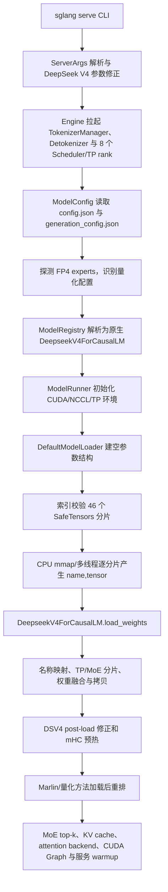

# DeepSeek-V4-Flash 模型目录文件说明

> 本文回答两个问题：模型目录中每个文件做什么，以及该目录通过 SGLang 启动时如何变成可执行的 TP8 模型。

## 1. 采集范围、依据与限制

| 项目 | 值 |
|---|---|
| Pod | `sglang-agg-dsv4-flash-h100-0` |
| 目标路径 | `/userdata/DeepSeek-V4-Flash` |
| 文档更新时间 | 2026-08-04（Asia/Shanghai） |
| 目录清单基线 | 2026-08-03 采集的 DeepSeek 官方 Hugging Face 仓库 `deepseek-ai/DeepSeek-V4-Flash` `main` 分支递归清单 |
| 当前清单规模 | 73 个文件，合计约 148.67 GiB（159,630,041,626 字节）；其中 46 个权重分片合计约 148.66 GiB |
| 可信度说明 | 文件作用可由官方仓库内容确认；**文件名、大小及是否存在尚未与目标 Pod 逐项比对**。Pod 中若有下载缓存、转换后权重、软链接或运维附加文件，可能与本表不同。 |
| SGLang 源码基线 | 本地仓库 commit `fd8679510737e632e74255520bb21606caa04cf7`（2026-07-30） |
| 部署镜像 | StatefulSet 写的是 `sglang:v0.5.13.post1-cu130`；镜像内代码可能与上述本地 commit 不完全一致 |

官方模型卡说明 DeepSeek-V4-Flash 为 MoE 模型，约 284B 总参数、13B 激活参数、1M token 上下文，发布权重采用 FP4 与 FP8 混合精度。该仓库没有 Jinja chat template，而是提供专用的 `encoding/` 编解码实现。

### 1.1 `config.json` 中与加载直接相关的关键值

| 配置项 | 官方 checkpoint 值 | 加载含义 |
|---|---:|---|
| `architectures` / `model_type` | `DeepseekV4ForCausalLM` / `deepseek_v4` | 选择 SGLang 原生 DeepSeek V4 模型类和专用参数 hook |
| `num_hidden_layers` / `hidden_size` | `43` / `4096` | 构造 43 个主模型 decoder layer，每层 hidden width 为 4096 |
| `vocab_size` | `129280` | 决定 embedding 与 LM head 的第一维，并由 TP 参数类分片 |
| `n_routed_experts` / `n_shared_experts` | `256` / `1` | 构造 routed/shared experts，并决定 expert 权重映射范围 |
| `num_experts_per_tok` | `6` | 每 token 路由到 6 个 routed experts；影响 MoE top-k 结构，不影响文件发现 |
| `index_n_heads` / `index_topk` | `64` / `512` | 构造 DSA indexer 与稀疏注意力 top-k 相关参数 |
| `max_position_embeddings` | `1048576` | 声明 1M token 最大位置长度；实际可服务长度仍受启动参数与 KV cache 显存约束 |
| `num_nextn_predict_layers` | `1` | checkpoint 还携带一个 MTP/NextN 层；未启用 speculative draft 时，主模型加载器会跳过超出 43 个主层的权重 |
| `expert_dtype` | `fp4` | 官方 checkpoint 的 routed experts 为 FP4 布局；SGLang 仍会读 SafeTensors header 做实际确认 |
| `quantization_config` | `fp8`, dynamic activation, `e4m3`, block `128x128`, scale `ue8m0` | 为非 FP4 专家部分和相应算子建立 FP8 quant config；这也是“FP4 + FP8 混合 checkpoint”的来源 |
| `torch_dtype` | `bfloat16` | 未量化/解量化后的默认浮点参数与激活 dtype 基线 |

以上值来自官方 [`config.json`](https://huggingface.co/deepseek-ai/DeepSeek-V4-Flash/raw/main/config.json)。

### 1.2 先给结论

SGLang 冷启动会直接读取以下四组文件；前三组决定模型能否正常完成加载，第四组决定默认生成行为：

1. `config.json`：确定模型架构、维度、层数、MoE、注意力和量化信息。
2. `model.safetensors.index.json` 与全部 46 个 `model-*.safetensors`：索引用于筛选/校验分片并辅助 FP4 专家探测，分片提供实际参数。
3. `tokenizer_config.json` 与 `tokenizer.json`：构造 tokenizer；未指定 `--tokenizer-path` 时与 `--model-path` 相同。
4. `generation_config.json`：不是构造 GPU 模型的必要文件，但当前 `sampling_defaults=model` 默认设置会读取它作为采样默认值。

`encoding/`、`inference/`、`assets/`、模型卡、许可证和 Git 属性均不进入 SGLang 权重加载主链路。尤其是 `encoding/encoding_dsv4.py`：它是 DeepSeek 官方消息协议的参考实现，当前部署使用的是 SGLang 内置的 `deepseekv4` tool-call parser、`deepseek-v4` reasoning parser，以及额外挂载的 `serving_chat.py`，并不会从模型目录直接 import 该文件。

## 2. 文件逐项说明

> SafeTensors 分片按 checkpoint 打包策略切分，不等于“一片对应一层”。要回答某个张量具体在哪个分片，必须查询 `model.safetensors.index.json` 的 `weight_map`；不能从 `000xx` 文件名可靠推断。

| 序号 | 相对路径 | 大小 | 作用 |
|---:|---|---:|---|
| 1 | `.gitattributes` | 1.57 KiB (1,603 B) | Git 属性配置；声明大文件由 Git LFS/Xet 管理，避免权重被直接写入普通 Git 对象。 |
| 2 | `LICENSE` | 1.06 KiB (1,084 B) | MIT 许可证文本，规定模型仓库代码与权重的使用、复制和分发条款。 |
| 3 | `README.md` | 12.84 KiB (13,149 B) | 官方模型卡：介绍模型架构、规模、评测、编码格式、运行方式、许可证及引用信息。 |
| 4 | `assets/dsv4_performance.png` | 976.91 KiB (1,000,354 B) | README 使用的性能对比图，仅用于文档展示，不参与模型加载或推理。 |
| 5 | `config.json` | 1.71 KiB (1,749 B) | Transformers 主模型配置；定义 DeepseekV4ForCausalLM 架构、43 层、MoE 专家、稀疏注意力、1M 上下文、RoPE、FP4/FP8 量化等参数。 |
| 6 | `encoding/README.md` | 7.93 KiB (8,118 B) | DeepSeek-V4 专用消息编码协议说明，涵盖多轮对话、思考模式、工具调用和输出解析。 |
| 7 | `encoding/encoding_dsv4.py` | 27.25 KiB (27,908 B) | 提示词编解码参考实现：把 OpenAI 风格 messages 转成模型输入串，并把生成文本解析回结构化消息。 |
| 8 | `encoding/test_encoding_dsv4.py` | 3.65 KiB (3,741 B) | 编码/解析逻辑的自动化测试入口，用测试向量校验参考实现。 |
| 9 | `encoding/tests/test_input_1.json` | 2.68 KiB (2,748 B) | 编码测试用例 1 的结构化输入，覆盖一种对话/工具调用场景。 |
| 10 | `encoding/tests/test_input_2.json` | 526 B (526 B) | 编码测试用例 2 的结构化输入。 |
| 11 | `encoding/tests/test_input_3.json` | 4.44 KiB (4,546 B) | 编码测试用例 3 的结构化输入。 |
| 12 | `encoding/tests/test_input_4.json` | 2.67 KiB (2,730 B) | 编码测试用例 4 的结构化输入。 |
| 13 | `encoding/tests/test_output_1.txt` | 2.33 KiB (2,390 B) | 测试用例 1 的期望编码结果，用于回归比对。 |
| 14 | `encoding/tests/test_output_2.txt` | 342 B (342 B) | 测试用例 2 的期望编码结果，用于回归比对。 |
| 15 | `encoding/tests/test_output_3.txt` | 3.24 KiB (3,313 B) | 测试用例 3 的期望编码结果，用于回归比对。 |
| 16 | `encoding/tests/test_output_4.txt` | 2.49 KiB (2,552 B) | 测试用例 4 的期望编码结果，用于回归比对。 |
| 17 | `generation_config.json` | 170 B (170 B) | 默认生成参数：启用采样，temperature=1.0、top_p=1.0，并定义 BOS/EOS token ID。 |
| 18 | `inference/README.md` | 951 B (951 B) | 官方参考推理代码说明，给出权重转换、单机/多机 torchrun 交互及批量推理命令。 |
| 19 | `inference/config.json` | 991 B (991 B) | 官方参考推理实现使用的运行配置，供转换脚本和 Transformer 参考实现读取。 |
| 20 | `inference/convert.py` | 6.91 KiB (7,075 B) | 把 Hugging Face SafeTensors 权重转换、重分片为参考推理实现所需的模型并行格式；也处理 FP4/FP8 专家权重。 |
| 21 | `inference/generate.py` | 6.15 KiB (6,296 B) | 参考生成程序：加载 tokenizer/模型，执行 prefill 与逐 token decode，支持交互、文件批量及分布式推理。 |
| 22 | `inference/kernel.py` | 21.68 KiB (22,198 B) | TileLang 自定义 GPU 内核，包括 FP4/FP8 量化与 GEMM、稀疏注意力及 mHC 相关计算。 |
| 23 | `inference/model.py` | 37.73 KiB (38,632 B) | DeepSeek-V4 的 PyTorch/分布式参考模型定义，组装注意力、MoE、量化算子、缓存和前向传播。 |
| 24 | `inference/requirements.txt` | 92 B (92 B) | 运行官方参考推理代码所需的 Python 依赖版本清单。 |
| 25 | `model-00001-of-00046.safetensors` | 1010.00 MiB (1,059,061,856 B) | 模型权重分片 1/46；保存部分张量，须依据 model.safetensors.index.json 与其余分片共同加载。 |
| 26 | `model-00002-of-00046.safetensors` | 3.32 GiB (3,566,321,192 B) | 模型权重分片 2/46；保存部分张量，须依据 model.safetensors.index.json 与其余分片共同加载。 |
| 27 | `model-00003-of-00046.safetensors` | 3.32 GiB (3,566,321,192 B) | 模型权重分片 3/46；保存部分张量，须依据 model.safetensors.index.json 与其余分片共同加载。 |
| 28 | `model-00004-of-00046.safetensors` | 3.35 GiB (3,596,229,272 B) | 模型权重分片 4/46；保存部分张量，须依据 model.safetensors.index.json 与其余分片共同加载。 |
| 29 | `model-00005-of-00046.safetensors` | 3.32 GiB (3,568,768,976 B) | 模型权重分片 5/46；保存部分张量，须依据 model.safetensors.index.json 与其余分片共同加载。 |
| 30 | `model-00006-of-00046.safetensors` | 3.34 GiB (3,590,024,776 B) | 模型权重分片 6/46；保存部分张量，须依据 model.safetensors.index.json 与其余分片共同加载。 |
| 31 | `model-00007-of-00046.safetensors` | 3.32 GiB (3,568,768,976 B) | 模型权重分片 7/46；保存部分张量，须依据 model.safetensors.index.json 与其余分片共同加载。 |
| 32 | `model-00008-of-00046.safetensors` | 3.34 GiB (3,590,024,776 B) | 模型权重分片 8/46；保存部分张量，须依据 model.safetensors.index.json 与其余分片共同加载。 |
| 33 | `model-00009-of-00046.safetensors` | 3.32 GiB (3,568,768,976 B) | 模型权重分片 9/46；保存部分张量，须依据 model.safetensors.index.json 与其余分片共同加载。 |
| 34 | `model-00010-of-00046.safetensors` | 3.34 GiB (3,590,024,776 B) | 模型权重分片 10/46；保存部分张量，须依据 model.safetensors.index.json 与其余分片共同加载。 |
| 35 | `model-00011-of-00046.safetensors` | 3.32 GiB (3,568,768,976 B) | 模型权重分片 11/46；保存部分张量，须依据 model.safetensors.index.json 与其余分片共同加载。 |
| 36 | `model-00012-of-00046.safetensors` | 3.34 GiB (3,590,026,352 B) | 模型权重分片 12/46；保存部分张量，须依据 model.safetensors.index.json 与其余分片共同加载。 |
| 37 | `model-00013-of-00046.safetensors` | 3.32 GiB (3,568,770,544 B) | 模型权重分片 13/46；保存部分张量，须依据 model.safetensors.index.json 与其余分片共同加载。 |
| 38 | `model-00014-of-00046.safetensors` | 3.34 GiB (3,590,026,352 B) | 模型权重分片 14/46；保存部分张量，须依据 model.safetensors.index.json 与其余分片共同加载。 |
| 39 | `model-00015-of-00046.safetensors` | 3.32 GiB (3,568,770,544 B) | 模型权重分片 15/46；保存部分张量，须依据 model.safetensors.index.json 与其余分片共同加载。 |
| 40 | `model-00016-of-00046.safetensors` | 3.34 GiB (3,590,026,352 B) | 模型权重分片 16/46；保存部分张量，须依据 model.safetensors.index.json 与其余分片共同加载。 |
| 41 | `model-00017-of-00046.safetensors` | 3.32 GiB (3,568,770,544 B) | 模型权重分片 17/46；保存部分张量，须依据 model.safetensors.index.json 与其余分片共同加载。 |
| 42 | `model-00018-of-00046.safetensors` | 3.34 GiB (3,590,026,352 B) | 模型权重分片 18/46；保存部分张量，须依据 model.safetensors.index.json 与其余分片共同加载。 |
| 43 | `model-00019-of-00046.safetensors` | 3.32 GiB (3,568,770,544 B) | 模型权重分片 19/46；保存部分张量，须依据 model.safetensors.index.json 与其余分片共同加载。 |
| 44 | `model-00020-of-00046.safetensors` | 3.34 GiB (3,590,026,352 B) | 模型权重分片 20/46；保存部分张量，须依据 model.safetensors.index.json 与其余分片共同加载。 |
| 45 | `model-00021-of-00046.safetensors` | 3.32 GiB (3,568,770,544 B) | 模型权重分片 21/46；保存部分张量，须依据 model.safetensors.index.json 与其余分片共同加载。 |
| 46 | `model-00022-of-00046.safetensors` | 3.34 GiB (3,590,026,352 B) | 模型权重分片 22/46；保存部分张量，须依据 model.safetensors.index.json 与其余分片共同加载。 |
| 47 | `model-00023-of-00046.safetensors` | 3.32 GiB (3,568,770,544 B) | 模型权重分片 23/46；保存部分张量，须依据 model.safetensors.index.json 与其余分片共同加载。 |
| 48 | `model-00024-of-00046.safetensors` | 3.34 GiB (3,590,026,352 B) | 模型权重分片 24/46；保存部分张量，须依据 model.safetensors.index.json 与其余分片共同加载。 |
| 49 | `model-00025-of-00046.safetensors` | 3.32 GiB (3,568,770,544 B) | 模型权重分片 25/46；保存部分张量，须依据 model.safetensors.index.json 与其余分片共同加载。 |
| 50 | `model-00026-of-00046.safetensors` | 3.34 GiB (3,590,026,352 B) | 模型权重分片 26/46；保存部分张量，须依据 model.safetensors.index.json 与其余分片共同加载。 |
| 51 | `model-00027-of-00046.safetensors` | 3.32 GiB (3,568,770,544 B) | 模型权重分片 27/46；保存部分张量，须依据 model.safetensors.index.json 与其余分片共同加载。 |
| 52 | `model-00028-of-00046.safetensors` | 3.34 GiB (3,590,026,352 B) | 模型权重分片 28/46；保存部分张量，须依据 model.safetensors.index.json 与其余分片共同加载。 |
| 53 | `model-00029-of-00046.safetensors` | 3.32 GiB (3,568,770,544 B) | 模型权重分片 29/46；保存部分张量，须依据 model.safetensors.index.json 与其余分片共同加载。 |
| 54 | `model-00030-of-00046.safetensors` | 3.34 GiB (3,590,026,352 B) | 模型权重分片 30/46；保存部分张量，须依据 model.safetensors.index.json 与其余分片共同加载。 |
| 55 | `model-00031-of-00046.safetensors` | 3.32 GiB (3,568,770,544 B) | 模型权重分片 31/46；保存部分张量，须依据 model.safetensors.index.json 与其余分片共同加载。 |
| 56 | `model-00032-of-00046.safetensors` | 3.34 GiB (3,590,026,352 B) | 模型权重分片 32/46；保存部分张量，须依据 model.safetensors.index.json 与其余分片共同加载。 |
| 57 | `model-00033-of-00046.safetensors` | 3.32 GiB (3,568,770,544 B) | 模型权重分片 33/46；保存部分张量，须依据 model.safetensors.index.json 与其余分片共同加载。 |
| 58 | `model-00034-of-00046.safetensors` | 3.34 GiB (3,590,026,352 B) | 模型权重分片 34/46；保存部分张量，须依据 model.safetensors.index.json 与其余分片共同加载。 |
| 59 | `model-00035-of-00046.safetensors` | 3.32 GiB (3,568,770,544 B) | 模型权重分片 35/46；保存部分张量，须依据 model.safetensors.index.json 与其余分片共同加载。 |
| 60 | `model-00036-of-00046.safetensors` | 3.34 GiB (3,590,026,352 B) | 模型权重分片 36/46；保存部分张量，须依据 model.safetensors.index.json 与其余分片共同加载。 |
| 61 | `model-00037-of-00046.safetensors` | 3.32 GiB (3,568,770,544 B) | 模型权重分片 37/46；保存部分张量，须依据 model.safetensors.index.json 与其余分片共同加载。 |
| 62 | `model-00038-of-00046.safetensors` | 3.34 GiB (3,590,026,352 B) | 模型权重分片 38/46；保存部分张量，须依据 model.safetensors.index.json 与其余分片共同加载。 |
| 63 | `model-00039-of-00046.safetensors` | 3.32 GiB (3,568,770,544 B) | 模型权重分片 39/46；保存部分张量，须依据 model.safetensors.index.json 与其余分片共同加载。 |
| 64 | `model-00040-of-00046.safetensors` | 3.34 GiB (3,590,026,352 B) | 模型权重分片 40/46；保存部分张量，须依据 model.safetensors.index.json 与其余分片共同加载。 |
| 65 | `model-00041-of-00046.safetensors` | 3.32 GiB (3,568,770,544 B) | 模型权重分片 41/46；保存部分张量，须依据 model.safetensors.index.json 与其余分片共同加载。 |
| 66 | `model-00042-of-00046.safetensors` | 3.34 GiB (3,590,026,352 B) | 模型权重分片 42/46；保存部分张量，须依据 model.safetensors.index.json 与其余分片共同加载。 |
| 67 | `model-00043-of-00046.safetensors` | 3.32 GiB (3,568,770,544 B) | 模型权重分片 43/46；保存部分张量，须依据 model.safetensors.index.json 与其余分片共同加载。 |
| 68 | `model-00044-of-00046.safetensors` | 3.34 GiB (3,590,026,352 B) | 模型权重分片 44/46；保存部分张量，须依据 model.safetensors.index.json 与其余分片共同加载。 |
| 69 | `model-00045-of-00046.safetensors` | 1010.26 MiB (1,059,332,516 B) | 模型权重分片 45/46；保存部分张量，须依据 model.safetensors.index.json 与其余分片共同加载。 |
| 70 | `model-00046-of-00046.safetensors` | 3.35 GiB (3,593,956,092 B) | 模型权重分片 46/46；保存部分张量，须依据 model.safetensors.index.json 与其余分片共同加载。 |
| 71 | `model.safetensors.index.json` | 5.12 MiB (5,371,381 B) | 46 个 SafeTensors 分片的总索引；把每个张量名映射到所在分片，并记录权重总字节数，加载器据此按需定位权重。 |
| 72 | `tokenizer.json` | 6.07 MiB (6,367,146 B) | 完整 Fast Tokenizer 数据，包含词表、分词模型、规则和特殊 token，用于文本与 token ID 互转。 |
| 73 | `tokenizer_config.json` | 801 B (801 B) | Tokenizer 行为配置；指定 PreTrainedTokenizerFast、BOS/EOS/PAD token、是否自动添加边界 token，以及 1,048,576 token 最大长度。 |

## 3. 文件与 SGLang 运行时的关系

| 文件/目录 | SGLang 是否读取 | 读取阶段 | 缺失或异常的结果 |
|---|---|---|---|
| `config.json` | 是 | 参数后处理、`ModelConfig` 构造 | 无法识别 `deepseek_v4`/`DeepseekV4ForCausalLM`，或按错误维度建模 |
| `generation_config.json` | 是，但只影响默认生成行为 | `ModelConfig` 构造 | 服务仍可加载；回退到 SGLang/OpenAI 侧默认采样参数 |
| `tokenizer_config.json` | 是 | TokenizerManager、Scheduler/TP worker 初始化 tokenizer | tokenizer 类、特殊 token 或最大长度可能错误，通常会直接初始化失败 |
| `tokenizer.json` | 是 | Fast tokenizer 初始化 | 无法完成文本与 token ID 的互转 |
| `model.safetensors.index.json` | 是 | FP4 expert dtype 探测；SafeTensors 文件集合过滤与完整性校验 | 无索引时仍可 glob 分片，但失去索引过滤和缺片的快速失败；此 checkpoint 应保留索引 |
| 46 个 `model-*.safetensors` | 是 | 每个 TP rank 的权重迭代与参数加载 | 索引引用的任一分片缺失都会在加载前报错；张量缺失还可能产生未初始化参数告警 |
| `encoding/` | 否 | 不进入加载链路 | 不影响权重或 tokenizer 加载；影响的是如何正确实现对话/工具协议的参考资料是否齐全 |
| `inference/` | 否 | 不进入 SGLang 链路 | 不影响 SGLang；只影响官方参考推理、转换和调试能力 |
| `README.md`、`LICENSE`、`.gitattributes`、`assets/` | 否 | 无 | 不影响推理；但许可证、来源追踪和运维文档仍应保留 |

一个容易误解的细节是：SGLang 的默认加载器不会按 `weight_map` 逐个随机访问张量。它先 glob 所有 `*.safetensors`，用索引得到“合法且必须存在的分片集合”，再逐分片打开并 yield 张量。因此索引同时承担去重和完整性检查，而真正的数据读取仍发生在 46 个 SafeTensors 文件上。

## 4. 本部署的启动条件

仓库中的 [`notes/sglang-agg-dsv4-flash-h100-statefulset.yaml`](sglang-agg-dsv4-flash-h100-statefulset.yaml) 给出了如下关键参数：

| 参数 | 当前值 | 对加载流程的影响 |
|---|---|---|
| `--model-path` | `/userdata/DeepSeek-V4-Flash` | 配置、tokenizer、索引和权重均从本地目录读取，不触发 Hugging Face 权重下载 |
| `--trust-remote-code` | 开启 | 允许 Transformers 配置/tokenizer 的远程代码机制；但本 checkpoint 的模型类实际由 SGLang 原生 `DeepseekV4ForCausalLM` 提供 |
| `--tp` | `8` | 启动 8 个 TP rank；每个 rank 构造本地参数并从 checkpoint 中取自己所需的切片 |
| `--mem-fraction-static` | `0.90` | 模型加载后按剩余显存规划 KV cache 等静态内存池，不改变 checkpoint 内容 |
| `--enable-nsa-prefill-context-parallel` | 开启 | 该参数名在当前源码中对应 DSA/NSA 兼容路径；DeepSeek V4 hook 会进一步校验 CP 模式和并行规模 |
| `--nsa-prefill-cp-mode` | `round-robin-split` | 决定 prefill context-parallel 的切分模式，不改变权重读取方式 |
| `--moe-runner-backend` | `marlin` | 要求 MoE 执行选择 Marlin backend；checkpoint 量化配置和硬件校验通过后，FP4 routed-expert 参数会进入相应的加载后重排/打包路径 |
| `--tool-call-parser` | `deepseekv4` | 影响输出文本的工具调用解析，不参与模型权重加载 |
| `--reasoning-parser` | `deepseek-v4` | 影响 reasoning/content 拆分，不参与模型权重加载 |

还需注意，仓库这份 YAML 的容器脚本第一条有效命令是 `sleep infinity`，所以如果它与集群实际生效版本完全一致，后面的 `pip install`、代码 patch 和 `sglang serve` 永远不会执行。它可能是调试期间故意保留的暂停点，也可能与正在运行的 Pod spec 不同；必须用 `kubectl get pod ... -o yaml` 复核，不能把该 YAML 当作 Pod 当前状态的证据。

## 5. SGLang 模型加载全流程

### 5.1 总览



### 5.2 阶段一：CLI、架构识别与 DeepSeek V4 参数修正

1. `sglang serve` 在 [`python/sglang/cli/serve.py:139`](../python/sglang/cli/serve.py#L139) 调用 `prepare_server_args()`，随后进入标准 LLM HTTP server。
2. [`prepare_server_args()`](../python/sglang/srt/server_args.py#L8983) 用 `ServerArgs` 解析命令行；当没有独立 `--tokenizer-path` 时，将 tokenizer 路径设成模型路径（[`server_args.py:4037`](../python/sglang/srt/server_args.py#L4037)）。
3. 参数后处理会先读取 HF config 识别 `DeepseekV4ForCausalLM`，收集模型专用 override，再调用 `apply_deepseek_v4_defaults()`（[`server_args.py:4988`](../python/sglang/srt/server_args.py#L4988)）。DeepSeek V4 hook 会设置/校验 KV cache、并发请求、CP 和 MegaMoE 相关约束（[`deepseek_v4_hook.py:106`](../python/sglang/srt/arg_groups/deepseek_v4_hook.py#L106)、[`deepseek_v4_hook.py:158`](../python/sglang/srt/arg_groups/deepseek_v4_hook.py#L158)）。
4. `launch_server()` 拉起 HTTP/TokenizerManager、Scheduler 子进程和 Detokenizer 子进程；组件关系见 [`http_server.py:2656`](../python/sglang/srt/entrypoints/http_server.py#L2656)。TP8 时会创建 8 个负责 GPU 模型的 scheduler/worker rank。

### 5.3 阶段二：读取模型配置、生成配置和 tokenizer

1. 每个 `TpModelWorker` 先通过 `ModelConfig.from_server_args()` 建立模型配置（[`tp_worker.py:405`](../python/sglang/srt/managers/tp_worker.py#L405)）。
2. `ModelConfig` 调用 `get_config()` 读取 `config.json`，同时调用 `get_generation_config()` 读取 `generation_config.json`（[`model_config.py:275`](../python/sglang/srt/configs/model_config.py#L275)）。HF parser 最终调用 `AutoConfig.from_pretrained()`（[`config.py:75`](../python/sglang/srt/utils/hf_transformers/config.py#L75)）。
3. SGLang 把 Transformers 的 `DeepseekV3Config` 以 `model_type=deepseek_v4` 注册为别名（[`common.py:132`](../python/sglang/srt/utils/hf_transformers/common.py#L132)），所以配置解析不依赖模型目录里额外的 `configuration_*.py`。
4. 对 DeepSeek V4，`ModelConfig` 会读取索引并只打开一个 routed-expert 所在 SafeTensors 分片的 header，依据 dtype `U8/I8/F4` 或 `F8_E4M3` 判断 checkpoint 是 MXFP4 experts 还是转换后的 FP8 experts（[`configs/deepseek_v4.py:13`](../python/sglang/srt/configs/deepseek_v4.py#L13)、[`weight_utils.py:87`](../python/sglang/srt/model_loader/weight_utils.py#L87)）。这个探测只读 header，不加载整片权重。
5. `ModelConfig._verify_quantization()` 从 `config.json` 的 `quantization_config` 解析量化方法；CLI 未显式给 `--quantization` 时采用 checkpoint 声明（[`model_config.py:1417`](../python/sglang/srt/configs/model_config.py#L1417)）。
6. TokenizerManager 和 TP worker 通过 `get_tokenizer(model_path)` 读取 `tokenizer_config.json` 与 `tokenizer.json`，默认使用 fast tokenizer（[`tokenizer_manager.py:417`](../python/sglang/srt/managers/tokenizer_manager.py#L417)、[`tokenizer.py:460`](../python/sglang/srt/utils/hf_transformers/tokenizer.py#L460)）。多个进程可能各自初始化 tokenizer，但这与 GPU 权重的 TP 分片无关。
7. `generation_config.json` 中的非空 `temperature/top_p/top_k/min_p/repetition_penalty` 会在默认 `sampling_defaults=model` 下成为请求未指定字段时的默认值（[`model_config.py:1561`](../python/sglang/srt/configs/model_config.py#L1561)）。它不会参与神经网络参数初始化。

### 5.4 阶段三：注册并创建 SGLang 原生模型结构

1. `ModelRegistry` 扫描 `sglang.srt.models` 中导出的 `EntryClass`；`deepseek_v4.py` 导出 `DeepseekV4ForCausalLM`（[`registry.py:94`](../python/sglang/srt/models/registry.py#L94)、[`deepseek_v4.py:3173`](../python/sglang/srt/models/deepseek_v4.py#L3173)）。
2. `get_model_architecture()` 根据 `config.architectures=["DeepseekV4ForCausalLM"]` 选择该原生类，而不是 Transformers 的通用 fallback（[`model_loader/utils.py:195`](../python/sglang/srt/model_loader/utils.py#L195)）。
3. `ModelRunner` 先设置当前 GPU、初始化 torch distributed/NCCL 和 TP/PP/CP group，然后进入 `initialize()`/`load_model()`（[`model_runner.py:328`](../python/sglang/srt/model_executor/model_runner.py#L328)、[`model_runner.py:564`](../python/sglang/srt/model_executor/model_runner.py#L564)）。
4. 当前命令未指定特殊 `--load-format`，因此 `auto` 最终选择 `DefaultModelLoader`。它先根据 checkpoint 量化配置创建 quant config，再直接在当前目标设备上构造 `DeepseekV4ForCausalLM` 空参数结构（[`loader.py:201`](../python/sglang/srt/model_loader/loader.py#L201)、[`loader.py:775`](../python/sglang/srt/model_loader/loader.py#L775)）。
5. 模型构造函数建立 embedding、43 个 decoder layer、最终 norm、mHC head 和 LM head；PP 时只构造本 stage 层，TP 参数类则只分配本 rank 所需分片（[`deepseek_v4.py:2120`](../python/sglang/srt/models/deepseek_v4.py#L2120)、[`deepseek_v4.py:2461`](../python/sglang/srt/models/deepseek_v4.py#L2461)）。

### 5.5 阶段四：发现、校验并迭代 SafeTensors 分片

1. `_prepare_weights()` 发现 `model_path` 是本地目录，于是不会调用 Hugging Face snapshot download（[`loader.py:437`](../python/sglang/srt/model_loader/loader.py#L437)）。
2. `load-format=auto` 按优先级寻找 `*.safetensors`、`*.bin`；找到 SafeTensors 后停止，最终得到 46 个权重文件。
3. `filter_duplicate_safetensors_files()` 读取 `model.safetensors.index.json.weight_map`，只保留索引引用的分片，并在任何索引引用文件缺失时立刻报错（[`weight_utils.py:665`](../python/sglang/srt/model_loader/weight_utils.py#L665)）。
4. 默认 `model_loader_extra_config` 未关闭多线程，因此进入带滑动窗口的多线程 SafeTensors iterator；默认最多 8 个加载线程。每个分片通常由 `safe_open(..., device="cpu")` 以 mmap 方式打开，再逐张量 yield `(name, tensor)`（[`loader.py:547`](../python/sglang/srt/model_loader/loader.py#L547)、[`weight_utils.py:1099`](../python/sglang/srt/model_loader/weight_utils.py#L1099)）。
5. 这里的“每个 TP rank 都遍历 checkpoint”很重要：它不是先把 46 片平均分给 8 个进程，而是每个 rank 看到张量流，再由目标参数的 `weight_loader` 选择/切分属于本 rank 的部分。共享存储和页缓存的吞吐会直接影响八卡同时冷启动时间。

### 5.6 阶段五：DeepSeek V4 专用权重映射、融合与分片

`DefaultModelLoader` 将张量流交给 `DeepseekV4ForCausalLM.load_weights()`（[`loader.py:807`](../python/sglang/srt/model_loader/loader.py#L807)、[`deepseek_v4.py:2800`](../python/sglang/srt/models/deepseek_v4.py#L2800)），后者执行以下工作：

1. **可选 `wo_a` 反量化**：如果没有启用原生 FP8 `wo_a` GEMM，会先检查 `.wo_a.scale`，必要时将 FP8 `wo_a` 与 scale 转回目标格式。该分支会把 generator 转成 list，CPU 内存峰值明显更高。
2. **官方命名到 SGLang 命名的转换**：例如 `embed.weight -> model.embed_tokens.weight`、`head.weight -> lm_head.weight`、`.attn. -> .self_attn.`、`.ffn. -> .mlp.`、`w1/w2/w3 -> gate/down/up_proj`、`.scale -> .weight_scale_inv`（[`deepseek_v4.py:2682`](../python/sglang/srt/models/deepseek_v4.py#L2682)）。
3. **PP 层过滤**：只加载当前 PP stage 的 `[start_layer, end_layer)`；本部署 PP=1，因此全部 43 层都保留。
4. **TP 参数切分**：embedding、LM head、attention projection 和普通 linear 的参数对象各自带 `weight_loader`，从完整 checkpoint tensor 中复制本 TP rank 的 shard。
5. **gate/up 堆叠**：checkpoint 中独立的 `gate_proj` 与 `up_proj` 被装入 SGLang 的 `gate_up_proj` 两个 shard（映射定义见 [`deepseek_v4.py:199`](../python/sglang/srt/models/deepseek_v4.py#L199)）。
6. **MoE expert 映射**：为全部 routed experts（以及启用融合时的 shared expert）生成 `expert_id + shard_id` 映射；FusedMoE/Marlin 参数加载器依据最终 TP/EP 与 expert-location 布局，装入本 rank 对应的 expert 权重或分片。本部署没有显式给出 EP 参数，最终派生布局应以启动日志为准。
7. **DeepSeek V4 特有融合**：将 compressor 的 `wkv` 与 `wgate` 拼成 `wkv_gate`；开启对应优化时，还会把 `wq_a` 与 `wkv` 拼成 `wqkv_a`（[`deepseek_v4.py:3020`](../python/sglang/srt/models/deepseek_v4.py#L3020)）。
8. **并行拷贝**：满足条件的 tensor load 通过线程池提交，最后等待全部 future 完成；未知、当前 rank 不存在或 MTP-only 的权重会按规则跳过，剩余未加载参数会产生 warning。

### 5.7 阶段六：加载后处理与服务就绪

1. DeepSeek V4 自己先执行 `post_load_weights()`：整理 FP8 `wo_a` scale 布局、应用 attention compressor APE hotfix、刷新 mHC norm 权重缓存，并按配置预热 mHC kernel（[`deepseek_v4.py:2660`](../python/sglang/srt/models/deepseek_v4.py#L2660)、[`deepseek_v4.py:3146`](../python/sglang/srt/models/deepseek_v4.py#L3146)）。
2. 回到 `DefaultModelLoader` 后，遍历所有带 `quant_method` 的模块并调用 `process_weights_after_loading()`；这里完成 Marlin/其他量化 backend 所需的重排、打包或在线量化（[`loader.py:843`](../python/sglang/srt/model_loader/loader.py#L843)）。
3. 模型切换为 `eval()`，`ModelRunner` 随后准备 MoE top-k、层信息、KV cache dtype 和 attention backend（[`model_runner.py:574`](../python/sglang/srt/model_executor/model_runner.py#L574)）。
4. 权重加载完成后才根据剩余显存和 `mem_fraction_static=0.90` 分配请求池/KV cache，之后初始化 DeepSeek V4 attention backend、捕获 CUDA Graph 并执行 server warmup。全部 scheduler rank 把初始化结果发回父进程后，HTTP 服务才具备正常 readiness。

## 6. 关键诊断结论

- **缺片优先看索引错误**：当前源码会明确列出 `model.safetensors.index.json` 引用但磁盘不存在的分片，不应只看 glob 到了多少个文件。
- **FP4/FP8 判断以 tensor header 为准**：目录名叫 `DeepSeek-V4-Flash` 并不足以判断 experts 布局。SGLang 实际检查 routed-expert tensor dtype。
- **TP8 不代表每个进程只读 1/8 文件**：默认加载路径中八个 rank 都会遍历 checkpoint，网络盘/共享盘 I/O 和 Linux page cache 是冷启动关键瓶颈。
- **Marlin 是加载后的执行布局**：checkpoint 中的 FP4 expert tensor 先按名称映射到 FusedMoE 参数，随后量化方法再做 Marlin 重排；不是由 `inference/convert.py` 在启动时转换。
- **官方 `inference/` 不参与**：SGLang 使用自己的 `deepseek_v4.py`、attention backend、MoE 和量化 kernel，不会启动模型目录里的 `inference/generate.py`。
- **`trust-remote-code` 不等于加载模型目录 Python 文件**：当前架构已由 SGLang 原生注册；该开关主要影响 Transformers 配置/tokenizer 的解析权限。

## 7. Pod 实机复核命令

在具备有效 kubeconfig 与 `kubectl` 的环境中，先核对 Pod 当前 namespace、镜像、command/args 和挂载，再导出实际目录：

```bash
kubectl -n lm-test get pod sglang-agg-dsv4-flash-h100-0 -o yaml

kubectl -n lm-test exec -c sglang-leader sglang-agg-dsv4-flash-h100-0 -- \
  sh -lc "find /userdata/DeepSeek-V4-Flash -type f -printf '%s\t%P\n' | sort -k2"
```

建议同时记录软链接，避免把链接大小误认为真实权重大小：

```bash
kubectl -n lm-test exec -c sglang-leader sglang-agg-dsv4-flash-h100-0 -- \
  sh -lc "find /userdata/DeepSeek-V4-Flash -type l -printf '%P\t->\t%l\n' | sort"
```

可用以下只读脚本检查索引引用是否完整，并统计索引实际涉及的分片数：

```bash
kubectl -n lm-test exec -i -c sglang-leader sglang-agg-dsv4-flash-h100-0 -- \
  python3 - /userdata/DeepSeek-V4-Flash <<'PY'
import json
import os
import sys

root = sys.argv[1]
with open(os.path.join(root, "model.safetensors.index.json"), encoding="utf-8") as f:
    index = json.load(f)
files = sorted(set(index["weight_map"].values()))
missing = [name for name in files if not os.path.isfile(os.path.join(root, name))]
print("tensor_count=", len(index["weight_map"]))
print("shard_count=", len(files))
print("metadata=", index.get("metadata"))
print("missing=", missing)
raise SystemExit(bool(missing))
PY
```

完成实机复核后，应更新本文顶部的“Pod 实机核验”状态，并以 Pod 输出为准修订文件数量、大小、软链接和额外文件。不要为了核验冷启动而对 148 GiB 权重执行全量 SHA256，除非确实需要数据完整性审计；索引缺片检查和 SafeTensors header 检查成本低得多。

## 8. 参考资料与源码入口

- [DeepSeek 官方 Hugging Face 模型仓库](https://huggingface.co/deepseek-ai/DeepSeek-V4-Flash)
- [官方仓库文件树](https://huggingface.co/deepseek-ai/DeepSeek-V4-Flash/tree/main)
- [Hugging Face 仓库递归文件 API](https://huggingface.co/api/models/deepseek-ai/DeepSeek-V4-Flash/tree/main?recursive=true&expand=false)
- [官方 encoding 目录说明](https://huggingface.co/deepseek-ai/DeepSeek-V4-Flash/tree/main/encoding)
- [官方 inference 目录说明](https://huggingface.co/deepseek-ai/DeepSeek-V4-Flash/tree/main/inference)
- [本地部署 StatefulSet](sglang-agg-dsv4-flash-h100-statefulset.yaml)
- [SGLang 通用模型加载器](../python/sglang/srt/model_loader/loader.py)
- [DeepSeek V4 原生模型与权重映射](../python/sglang/srt/models/deepseek_v4.py)
- [DeepSeek V4 配置与 FP4 expert 探测](../python/sglang/srt/configs/deepseek_v4.py)
- [SafeTensors 迭代器与索引校验](../python/sglang/srt/model_loader/weight_utils.py)
