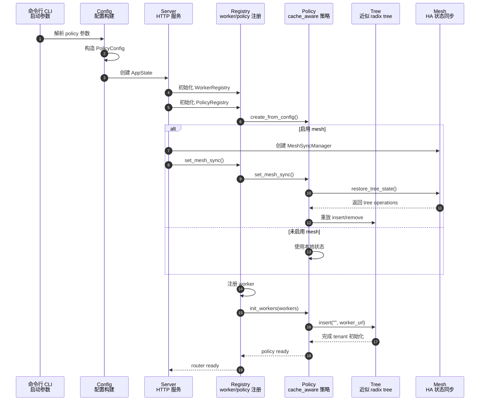
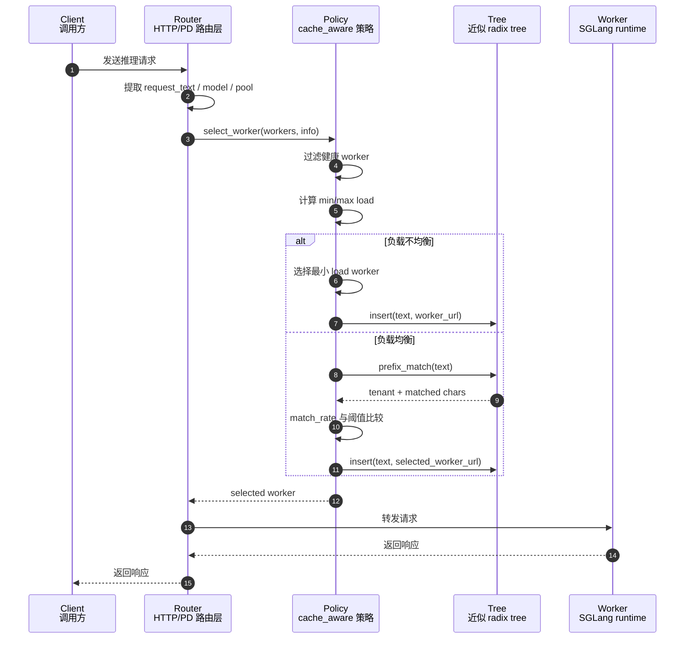

# SGLang KV Router 机制介绍

> 基于本工作区 `code/sglang` 当前源码梳理，重点参考：
> `sgl-model-gateway/src/policies/cache_aware.rs`、`prefix_hash.rs`、`tree.rs`、
> `policies/mod.rs`、`main.rs`、`bindings/python/src/sglang_router/router_args.py`。

## 1. KV Router 解决什么问题

LLM serving 中，prefill 阶段会为 prompt 生成 KV cache。后续请求如果拥有相同或较长的共享前缀，并且被路由到同一个 worker，就可以复用该 worker 内部的 prefix cache/radix cache，从而减少 prefill 计算，降低 TTFT 和整体延迟。

SGLang router 的 KV 相关机制本质上不是直接搬运或查询后端真实 KV tensor，而是在 router 层做“cache locality aware routing”：

- 让相似 prompt 尽量落到同一个 worker。
- 在 cache affinity 和负载均衡之间动态取舍。
- 在 PD disaggregation 场景中分别对 prefill、decode worker pool 做路由。
- 在 HA/mesh 场景中可同步部分近似路由状态。

需要特别区分两层状态：

| 层级 | 典型组件 | 状态含义 |
|---|---|---|
| SGLang runtime | scheduler、radix cache、HiCache、KV memory pool | 真实 KV cache、token block、GPU/CPU/存储侧缓存 |
| SGLang router/gateway | `cache_aware`、`prefix_hash` policy | 近似的请求前缀到 worker 归属关系，用来提高下一次路由命中概率 |

所以，router 的 cache-aware 命中是“路由层认为这个 worker 更可能有可复用 KV”，不是后端 runtime 已确认的真实 KV hit。

## 2. 相关路由策略总览

本地源码中，和 KV locality 最相关的是两个 policy：

| Policy | 机制 | 优点 | 代价/限制 |
|---|---|---|---|
| `cache_aware` | 基于请求文本维护近似 radix tree，记录文本前缀归属 worker | 前缀匹配更精细，能利用较长公共前缀 | 占用 router 内存；使用文本字符而非 token；是历史近似状态 |
| `prefix_hash` | 取前 N 个 token 做 xxhash，再走一致性哈希环 | 简单、稳定、状态少、复杂度低 | 只做前缀分组，不知道真实重叠长度；对 tokenizer/请求 token 依赖更强 |

此外还有 `consistent_hashing`、`manual`、`bucket` 等策略，但它们不是典型的 KV prefix reuse 路由。`bucket` 会用 request text 长度做分桶，更偏负载/长度分布控制；`manual` 更偏显式 routing key 粘滞。

## 3. `cache_aware` 的核心机制

`CacheAwarePolicy` 的设计目标是：系统负载相对均衡时优先 cache affinity；负载明显不均衡时优先 shortest-queue。

### 3.1 数据结构

`CacheAwarePolicy` 内部维护：

```text
DashMap<String, Arc<Tree>>
```

key 是：

```text
{pool_tag}::{model_id}
```

其中 `pool_tag` 有三类：

- `regular`
- `prefill`
- `decode`

这样做的原因是 PD 模式下同一个 model 可能同时有 prefill 和 decode worker。若只按 model 建树，prefill/decode 的 `tree.insert(text, url)` 会互相覆盖归属，导致 locality 退化。源码中明确用 `(pool, model)` 隔离 tree。

`Tree` 是一个多 tenant、线程安全的近似 radix tree：

- tenant 是 worker URL。
- node 存储文本片段和属于哪些 tenant。
- 每个 tenant 有字符计数 `tenant_char_count`，用于控制 tree 大小。
- node 上维护 tenant 最近访问 epoch，用于 LRU 近似淘汰。
- children 使用 `DashMap<char, NodeRef>`，并针对 char key 做了轻量 hasher 优化。
- 文本操作以 UTF-8 字符为单位，避免直接 byte slice 导致中文等非 ASCII 字符边界错误。

### 3.2 初始化

worker 注册后，cache-aware policy 会为对应 `(pool, model)` tree 写入空字符串：

```text
tree.insert("", worker.url())
```

这一步相当于把 worker 作为候选 tenant 加入 tree。后续真实请求到来后，再把请求文本插入到对应 worker tenant 下。

worker 删除时，会从 tree 中移除该 tenant：

```text
tree.remove_tenant(worker.url())
```

### 3.3 请求路由决策

`select_worker` 的主流程可以概括为：

1. 过滤 healthy worker，并要求 circuit breaker 允许执行。
2. 基于第一个 healthy worker 计算当前 pool/model 的 tree key。
3. 读取 worker 当前 load，计算 `min_load` 和 `max_load`。
4. 如果负载不均衡，走 shortest-queue。
5. 如果负载均衡，走 prefix match。

负载不均衡条件是两个阈值同时满足：

```text
(max_load - min_load) > balance_abs_threshold
max_load > min_load * balance_rel_threshold
```

这意味着 `cache_aware` 并不是盲目追求 cache 命中。只有当系统没有明显热点 worker 时，才优先按前缀归属路由。

### 3.4 Prefix match 选择 worker

负载均衡时，router 会拿请求文本 `request_text` 去 tree 做最长前缀匹配：

```text
result = tree.prefix_match_with_counts(text)
match_rate = matched_char_count / input_char_count
```

随后：

- 如果 `match_rate > cache_threshold`，选择 `result.tenant` 对应的 worker。
- 如果 `match_rate <= cache_threshold`，选择当前 load 最小的 healthy worker。
- 选中 worker 后，无论是否命中，都执行 `tree.insert(text, selected_worker_url)`，更新近似路由状态。
- 如果命中的 tenant 已经不存在或不健康，则移除 stale tenant，再 fallback 到第一个 healthy worker。

默认 Python 绑定参数中 `cache_threshold = 0.3`，standalone Rust CLI 也是 `0.3`。源码中的 `CacheAwareConfig::default()` 是 `0.5`，实际运行要看入口构造配置。

### 3.5 负载不均衡时仍更新 tree

当进入 shortest-queue 分支时，router 选择当前 load 最小的 healthy worker。但如果请求带有 `request_text`，仍然会把该文本插入到 tree，并同步到 mesh。

这点很重要：负载不均衡会暂时牺牲 cache locality，但不会让近似 tree 停止学习；等负载回到均衡状态，后续请求仍能基于最近路由结果获得 cache affinity。

## 4. `Tree` 的插入、匹配和淘汰

### 4.1 插入

`Tree::insert(text, tenant)` 做的是压缩前缀树插入：

- 沿着当前文本的首字符查找 child。
- 如果没有 child，新建叶子节点，节点文本为剩余字符串。
- 如果已有 child，计算共享前缀长度。
- 如果共享长度小于 node 文本长度，则拆分节点。
- 如果完全匹配当前 node，则继续向下。
- 插入结束后更新 tenant 的 LRU epoch。

该实现尽量避免中间 `Vec<char>` 分配，优先用 slice 遍历；ASCII 有快路径，非 ASCII 走 char 边界逻辑。

### 4.2 匹配

`prefix_match_with_counts(text)` 返回：

```text
tenant
matched_char_count
input_char_count
```

匹配过程沿 radix tree 向下走，累计共享字符数。最终 node 上可能有多个 tenant，当前实现优先用 node 上缓存的 `last_tenant`，缓存失效时再从 `tenant_last_access_time` 中取一个 tenant。

这解释了一个边界：`cache_aware` 是近似策略，不会严格证明某个 worker 拥有最长 token 级 KV 前缀。它只是通过历史请求文本和 tenant 归属来提高“相似请求落到同 worker”的概率。

### 4.3 淘汰

`CacheAwarePolicy` 可启动后台周期任务：

```text
eviction_interval_secs > 0 时，每隔 interval 执行 tree.evict_tenant_by_size(max_tree_size)
```

tree 会根据 `tenant_char_count` 和 node 上的 LRU epoch 做近似叶子淘汰，防止 router 层树无限增长。

注意这里的 `max_tree_size` 不是 GPU KV cache 大小，而是 router 近似 tree 的容量控制。Python 绑定默认 `2**26`，standalone Rust CLI 默认 `67108864`。

## 5. `prefix_hash` 机制

`PrefixHashPolicy` 是更轻量的 KV locality 策略。

流程：

1. 从 `SelectWorkerInfo.tokens` 中取 token 序列。
2. 截取前 `prefix_token_count` 个 token，默认 256。
3. 对 token bytes 计算 xxhash。
4. 用 hash key 在预先构建的 worker 一致性哈希环上找 worker。
5. 若目标 worker load 不超过 `(total_load + 1) / num_workers * load_factor`，直接使用。
6. 若目标 worker 超载，选择一个满足 load 条件的最小 load worker。
7. 如果没有 hash ring 或查找失败，fallback 到最小 load worker。

默认 `load_factor = 1.25`。

相比 `cache_aware`：

- `prefix_hash` 不需要维护请求历史 tree。
- 同样前缀 token 会稳定落到同一 worker，有利于 KV 复用。
- 新 worker 加入/删除时，一致性哈希只影响部分 key。
- 它不计算当前请求和历史请求的真实重叠长度，因此 locality 精度低于 radix tree 近似匹配。

适用场景：

- 请求前缀有明显稳定分组，例如固定 system prompt、固定 RAG 模板、固定多轮会话开头。
- 希望 router 内存占用稳定。
- 对极端长 prompt 的 tree 存储成本敏感。

## 6. 请求文本/Token 如何进入 policy

`SelectWorkerInfo` 是 policy 的统一输入，和 KV locality 相关字段有：

```rust
pub struct SelectWorkerInfo<'a> {
    pub request_text: Option<&'a str>,
    pub tokens: Option<&'a [u32]>,
    pub headers: Option<&'a http::HeaderMap>,
    pub hash_ring: Option<Arc<HashRing>>,
}
```

`cache_aware` 通过 `needs_request_text()` 返回 true，router 在解析请求时提取文本：

- `/v1/completions`：取 `prompt` 字符串，数组时取第一个元素。
- `/v1/rerank`：取 `query`。
- chat/completions 相关路径通常会从消息或模板化后的内容中生成用于路由的 text，具体取决于对应 HTTP/gRPC 路由实现。

`prefix_hash` 依赖 token 输入和 hash ring。如果没有 tokens，会返回 `NoTokens` 分支并 fallback。

## 7. PD Disaggregation 下的路由关系

PD 模式中，请求通常被拆成：

- prefill worker：负责 prompt prefill，产生/传输 KV。
- decode worker：负责 decode。

router 支持分别配置：

```text
--policy
--prefill-policy
--decode-policy
```

如果没有指定 prefill/decode policy，则继承主 policy。

对 KV locality 来说，最关键的一般是 prefill 侧：

- prefill 阶段计算量大，prefix cache 命中直接减少 prefill token 计算。
- decode 侧更关注 decode blocks、affinity、连接/主机局部性等。

源码中 `cache_aware` 已经通过 `pool_tag` 把 prefill 和 decode tree 隔离，避免同一文本在两个 worker pool 之间来回覆盖归属。

## 8. Mesh/HA 同步

`CacheAwarePolicy` 支持可选的 `mesh_sync`：

- 选中 worker 后，`tree.insert(text, worker_url)` 会封装成 `TreeOperation::Insert` 同步。
- stale tenant 删除会同步 `TreeOperation::Remove`。
- 新 policy 设置 mesh sync 后，会尝试从 mesh store 恢复已有 tree state。

但当前源码注释也说明：`PolicyRegistry::apply_remote_tree_operation` 的接收转发路径“目前没有 in-process callers”，远端 receive path 尚未完整接入。因此 mesh 同步能力要按实际部署版本验证，不能默认认为所有 router 实例之间的近似 tree 已经强一致。

工程上应把它理解为 HA 场景的近似状态同步辅助，而不是严格一致的 cache 元数据服务。

## 9. 关键配置

Python router 参数默认值：

| 参数 | 默认值 | 含义 |
|---|---:|---|
| `policy` | `cache_aware` | 默认路由策略 |
| `prefill_policy` | `None` | PD prefill 侧策略，未设则继承主策略 |
| `decode_policy` | `None` | PD decode 侧策略，未设则继承主策略 |
| `cache_threshold` | `0.3` | prefix match 比例超过该值才按 matched tenant 路由 |
| `balance_abs_threshold` | `64` | 负载不均衡绝对阈值 |
| `balance_rel_threshold` | `1.5` | 负载不均衡相对阈值 |
| `eviction_interval_secs` | `60` | tree 淘汰周期 |
| `max_tree_size` | `2**26` | router 近似 tree 最大规模 |

Standalone Rust CLI 中类似参数：

| 参数 | 默认值 |
|---|---:|
| `--policy` | `cache_aware` |
| `--cache-threshold` | `0.3` |
| `--balance-abs-threshold` | `64` |
| `--balance-rel-threshold` | `1.5` |
| `--eviction-interval` | `120` |
| `--max-tree-size` | `67108864` |
| `--prefix-token-count` | `256` |
| `--prefix-hash-load-factor` | `1.25` |

## 10. 观测指标与验证思路

router 层可重点看：

| 指标 | 用途 |
|---|---|
| `sgl_router_requests_total{worker_url,model_id,mode,outcome}` | 看请求最终是否集中到预期 worker |
| `sgl_router_request_duration_seconds` | 看端到端延迟变化 |
| `sgl_router_ttft_seconds` | 看 prefix cache 可能带来的首 token 延迟收益 |
| `sgl_router_active_load{worker_url,kind}` | 看 prefill/decode 负载是否触发 fallback |
| `smg_prefix_hash_policy_branch_total` | 看 `prefix_hash` 走 ring hit、load fallback 等分支 |

runtime/prefiller 层更接近真实 KV hit：

| 指标 | 用途 |
|---|---|
| `sglang:cache_hit_rate` | SGLang runtime 真实 prefix cache 命中率视角 |
| scheduler queue/running 指标 | 判断收益是否被排队或负载抵消 |
| HiCache/radix cache/storage 指标 | 判断多级 KV 缓存行为 |

验证 cache-aware 是否有效，建议同时看三组数据：

1. 路由分布：相同/相似 prompt 是否稳定落到同一 worker。
2. 后端命中：prefiller/runtime 的 `cache_hit_rate` 是否提高。
3. 延迟收益：TTFT/P50/P90 是否下降，且 active load 没有明显恶化。

只看 router 命中或只看延迟都不够。前者可能只是近似 affinity，后者会被排队、decode、网络、worker 热点干扰。

## 11. 调优建议

### 11.1 `cache_threshold`

- 降低阈值：更容易按已有前缀归属路由，cache locality 更强，但可能把不太相似的请求压到同一 worker。
- 提高阈值：只有较长共享前缀才按 cache affinity 路由，负载更均匀，但可能错过中短前缀复用。

经验上，如果业务 prompt 模板高度稳定，可适当降低；如果 prompt 多样且 worker 热点明显，应提高或依赖负载阈值保护。

### 11.2 `balance_abs_threshold` / `balance_rel_threshold`

这两个阈值控制何时从 cache-aware 切到 shortest-queue。

- 阈值过大：router 更坚持 cache locality，可能造成热点 worker 排队。
- 阈值过小：更频繁打散请求，prefix cache 命中收益下降。

高 QPS、长 prompt、prefill 重的业务，一般需要更积极地防热点；低 QPS 或重复 prompt 极高的业务，可以更偏 cache locality。

### 11.3 `max_tree_size` / `eviction_interval_secs`

- tree 太小：历史前缀很快被淘汰，cache-aware 退化为 min-load。
- tree 太大：router 内存增长，匹配/维护成本上升。
- eviction 太频繁：状态不稳定。
- eviction 太慢：内存峰值更高。

该值应结合 prompt 长度、租户数量、worker 数和 router 内存预算调。

### 11.4 `prefix_hash` 的 `prefix_token_count`

- 更短：更多请求被归入同一前缀组，命中概率提高，但可能过度集中。
- 更长：区分度更高，热点更少，但相似模板的小差异会被打散。

对于固定 system prompt + 用户问题的场景，`prefix_token_count` 应覆盖稳定 system/template 部分，但不要覆盖太多用户随机内容。

## 12. 常见误区

1. **把 router tree 当成真实 KV cache 索引。**
   Router tree 只记录请求文本和 worker URL 的历史归属，不保存 token block 或 KV tensor。

2. **认为 cache-aware 一定降低延迟。**
   如果 worker 负载严重不均、队列很长或 decode 成为瓶颈，cache locality 的收益可能被抵消。

3. **忽略 tokenizer 差异。**
   `cache_aware` 使用字符文本近似，真实 KV cache 以 token/block 为单位。字符前缀相似不等价于 token/block 完全可复用。

4. **PD 模式只看全局 policy。**
   prefill 和 decode 的目标不同，应分别考虑 `prefill_policy` 和 `decode_policy`。prefill 侧通常更适合 KV locality 策略。

5. **认为 HA mesh 状态强一致。**
   当前源码更像近似同步/恢复机制，实际 receive path 和一致性语义需要结合部署版本验证。

## 13. Router 初始化时序图



### 13.1 解析 policy 参数

入口函数：

- Rust standalone 入口：`CommandLineArgs::parse_policy(policy_str)`，定义在 `sgl-model-gateway/src/main.rs`。
- Python router 入口：`RouterArgs.add_cli_args(...)` / `RouterArgs.from_cli_args(...)`，定义在 `sgl-model-gateway/bindings/python/src/sglang_router/router_args.py`；再由 `Router.from_args(args)` 转成底层 `_Router` 参数。

对应图中：

```text
CLI->>Config: 解析 policy 参数
```

说明：这一步把 `--policy`、`--prefill-policy`、`--decode-policy`、`--cache-threshold`、`--balance-*`、`--max-tree-size` 等启动参数解析为内存中的配置字段。

### 13.2 构造 PolicyConfig

入口函数：

- Rust standalone：`CommandLineArgs::parse_policy(policy_str) -> PolicyConfig`。
- Python binding：`lib.rs` 中 `_Router` 构造逻辑里的 `convert_policy` closure，把 `PolicyType` 转为 `config::PolicyConfig`。

对应图中：

```text
Config->>Config: 构造 PolicyConfig
```

说明：如果 policy 是 `cache_aware`，会生成：

```rust
PolicyConfig::CacheAware {
    cache_threshold,
    balance_abs_threshold,
    balance_rel_threshold,
    eviction_interval_secs,
    max_tree_size,
}
```

如果 policy 是 `prefix_hash`，则生成：

```rust
PolicyConfig::PrefixHash {
    prefix_token_count,
    load_factor,
}
```

### 13.3 创建 AppState

入口函数：

- `run_server(config)`，定义在 `sgl-model-gateway/src/server.rs`。
- 内部调用 `AppContext::from_config(config.router_config.clone(), config.request_timeout_secs).await`。
- 最后构造 `AppState { router, context, ... }`。

对应图中：

```text
Config->>Server: 创建 AppState
```

说明：严格来说，`AppState` 是在 `AppContext`、router manager、mesh handler 等对象创建之后才组装出来的。图中把它放在较早位置，是为了表达“服务启动阶段开始组装运行时状态”。

### 13.4 初始化 WorkerRegistry

入口函数：

- `AppContext::from_config(...)`，定义在 `sgl-model-gateway/src/app_context.rs`。
- 具体 builder 步骤：`AppContextBuilder::with_worker_registry()`。

对应图中：

```text
Server->>Registry: 初始化 WorkerRegistry
```

说明：该函数创建 `Arc<WorkerRegistry>`，用于后续保存 regular、prefill、decode worker，并维护 worker 健康状态、模型归属和 hash ring 等信息。

### 13.5 初始化 PolicyRegistry

入口函数：

- `AppContext::from_config(...)`。
- 具体 builder 步骤：`AppContextBuilder::with_policy_registry(config)`。
- registry 构造：`PolicyRegistry::new(config.policy.clone())`。

对应图中：

```text
Server->>Registry: 初始化 PolicyRegistry
```

说明：`PolicyRegistry::new(...)` 会先基于默认 `PolicyConfig` 创建默认 policy 实例，并准备 `model_policies`、`prefill_policy`、`decode_policy` 等容器。

### 13.6 创建具体 Policy 实例

入口函数：

- `PolicyRegistry::new(default_policy_config)`。
- `PolicyRegistry::create_policy_from_config(config)`。
- `PolicyFactory::create_from_config(config)`，定义在 `sgl-model-gateway/src/policies/factory.rs`。

对应图中：

```text
Registry->>Policy: create_from_config()
```

说明：如果配置是 `PolicyConfig::CacheAware`，factory 会创建：

```rust
CacheAwarePolicy::with_config(CacheAwareConfig { ... })
```

该构造函数会创建 `DashMap<String, Arc<Tree>>`，并在 `eviction_interval_secs > 0` 时启动周期淘汰任务。

### 13.7 创建 MeshSyncManager

入口函数：

- `run_server(config)` 中处理 `config.mesh_server_config` 的分支。
- `MeshSyncManager::new(stores.clone(), mesh_server_config.self_name.clone())`。
- `MeshServerBuilder::new(...).build_with_stores(...)`。

对应图中：

```text
Server->>Mesh: 创建 MeshSyncManager
```

说明：只有启用 mesh 配置时才执行。该步骤创建 HA/mesh 状态同步所需的 stores、sync manager、mesh server，并启动 mesh 服务协程。

### 13.8 设置 mesh_sync

入口函数：

- `run_server(config)` 中的：

```rust
app_context.worker_registry.set_mesh_sync(Some(sync_manager.clone()));
app_context.policy_registry.set_mesh_sync(Some(sync_manager.clone()));
```

- registry 方法：`WorkerRegistry::set_mesh_sync(...)`、`PolicyRegistry::set_mesh_sync(...)`。

对应图中：

```text
Server->>Registry: set_mesh_sync()
```

说明：这一步把同一个 `MeshSyncManager` 注入 worker registry 和 policy registry。后续 worker state、policy state、cache-aware tree operation 才有机会同步到 mesh。

### 13.9 将 mesh_sync 注入 cache_aware policy

入口函数：

- `PolicyRegistry::set_mesh_sync(...)` 只是保存 sync manager。
- 对新建的 cache-aware policy，真正调用 `CacheAwarePolicy::set_mesh_sync(...)` 的路径在 `PolicyRegistry::create_policy_from_type(...)`，用于带 policy hint 的动态创建。
- 对默认 policy，当前源码中 `PolicyRegistry::set_mesh_sync(...)` 不会 retroactively 调用 default policy 的 `set_mesh_sync(...)`。

对应图中：

```text
Registry->>Policy: set_mesh_sync()
```

说明：这个箭头表达的是“policy 获得 mesh sync 能力”的概念动作。按当前源码，要注意默认 policy 和动态 policy 的注入路径并不完全一致；默认 `cache_aware` policy 是否拿到 mesh sync，需要结合实际初始化顺序和版本验证。

### 13.10 从 mesh 恢复 tree 状态

入口函数：

- `CacheAwarePolicy::set_mesh_sync(mesh_sync)`。
- 内部调用私有方法 `CacheAwarePolicy::restore_tree_state_from_mesh()`。

对应图中：

```text
Policy->>Mesh: restore_tree_state()
```

说明：`restore_tree_state_from_mesh()` 会遍历当前 policy 已有的 tree key，然后通过 `mesh_sync.get_tree_state(tree_key)` 获取历史 tree operations。

### 13.11 返回 tree operations

入口函数：

- `MeshSyncManager::get_tree_state(tree_key)`，由 `CacheAwarePolicy::restore_tree_state_from_mesh()` 调用。

对应图中：

```text
Mesh-->>Policy: 返回 tree operations
```

说明：返回的是 mesh store 中记录的 `TreeOperation` 序列，典型操作包括：

- `TreeOperation::Insert(TreeInsertOp { text, tenant })`
- `TreeOperation::Remove(TreeRemoveOp { tenant })`

### 13.12 重放 insert/remove

入口函数：

- `CacheAwarePolicy::restore_tree_state_from_mesh()`。
- 对 insert 调用 `Tree::insert(&insert_op.text, &insert_op.tenant)`。
- 对 remove 调用 `Tree::remove_tenant(&remove_op.tenant)`。

对应图中：

```text
Policy->>Tree: 重放 insert/remove
```

说明：这一步是在 router 层恢复近似 radix tree，不是恢复后端 worker 的真实 KV cache。

### 13.13 未启用 mesh 时使用本地状态

入口函数：

- `run_server(config)` 中 `mesh_server_config` 为 `None` 的分支。
- `CacheAwarePolicy::with_config(...)` 默认 `mesh_sync: None`。

对应图中：

```text
Policy->>Policy: 使用本地状态
```

说明：未启用 mesh 时，cache-aware tree 只存在于当前 router 进程内。router 重启后，这部分近似路由状态会丢失，但 worker 后端的真实 KV cache 是否存在取决于 worker 自身。

### 13.14 注册 worker

入口函数：

- `run_server(config)` 提交启动 job：

```rust
Job::InitializeWorkersFromConfig { router_config }
```

- job 处理入口：`JobQueue::process_job(...)` 中的 `Job::InitializeWorkersFromConfig` 分支。
- 该分支为每个配置中的 worker 提交 `Job::AddWorker`。
- 具体注册 workflow 中的步骤：`RegisterWorkersStep`，定义在 worker registration workflow 中。

对应图中：

```text
Registry->>Registry: 注册 worker
```

说明：worker 初始化不是在 `run_server` 中同步完成的，而是通过 job queue 和 workflow engine 异步执行。workflow 大致包括发现 metadata、发现 DP 信息、创建 worker、注册 worker、更新 policy、激活 worker。

### 13.15 初始化 cache-aware workers

入口函数：

- workflow 步骤：`UpdatePoliciesStep::execute(...)`，定义在 `sgl-model-gateway/src/core/steps/worker/shared/update_policies.rs`。
- regular/model policy 路径：`PolicyRegistry::init_cache_aware_policy(model_id, workers)`。
- PD policy 路径：`PolicyRegistry::init_pd_cache_aware_policies(prefill_workers, decode_workers)`。

对应图中：

```text
Registry->>Policy: init_workers(workers)
```

说明：worker 注册后，`UpdatePoliciesStep` 会通知 `PolicyRegistry::on_worker_added(...)`，然后如果对应 policy 是 `cache_aware`，就初始化 cache-aware tree 的 worker tenant。

### 13.16 写入空前缀 tenant

入口函数：

- `CacheAwarePolicy::init_workers(workers)`。
- 内部调用 `Tree::insert("", worker.url())`。

对应图中：

```text
Policy->>Tree: insert("", worker_url)
```

说明：空字符串插入不是表示 worker 已经缓存了某个 prompt，而是把 worker URL 注册成 tree 中的 tenant。后续真实请求进来后，才会把请求文本插入到对应 worker tenant 下。

### 13.17 完成 tenant 初始化

入口函数：

- `Tree::insert(text, tenant)` 返回。

对应图中：

```text
Tree-->>Policy: 完成 tenant 初始化
```

说明：对空字符串的插入主要确保 root 上存在该 tenant。对非空请求文本的插入则会创建或拆分 radix tree 节点，并更新 tenant 的字符计数和 LRU epoch。

### 13.18 Policy ready

入口函数：

- `CacheAwarePolicy::init_workers(...)` 返回。
- 上层 `PolicyRegistry::init_cache_aware_policy(...)` 或 `PolicyRegistry::init_pd_cache_aware_policies(...)` 返回。

对应图中：

```text
Policy-->>Registry: policy ready
```

说明：此时 cache-aware policy 已经知道当前 worker pool 中有哪些 worker，可以在后续请求中执行 prefix match 和 worker 选择。

### 13.19 Router ready

入口函数：

- worker 初始化 workflow 完成后，`UpdatePoliciesStep::execute(...)` 返回成功。
- server 侧继续完成 `RouterManager::from_config(...)`、健康检查、load monitor、middleware 和 HTTP routes 初始化。

对应图中：

```text
Registry-->>Server: router ready
```

说明：图中的 `router ready` 是概念化表达。实际服务启动中，HTTP server、worker 初始化 job、健康检查和服务发现是多个异步流程；因此“ready”要结合 `/health`、`/health_generate`、worker health、readiness 等实际探针判断。

## 14. 请求路由时序图



## 15. 源码入口速查

| 文件 | 重点 |
|---|---|
| `sgl-model-gateway/src/policies/cache_aware.rs` | cache-aware 主决策流程、负载阈值、tree 初始化、mesh 同步 |
| `sgl-model-gateway/src/policies/tree.rs` | 多 tenant radix tree、prefix match、LRU 淘汰 |
| `sgl-model-gateway/src/policies/prefix_hash.rs` | token 前缀 hash、一致性哈希环、load fallback |
| `sgl-model-gateway/src/policies/mod.rs` | `LoadBalancingPolicy` trait、`CacheAwareConfig`、`SelectWorkerInfo` |
| `sgl-model-gateway/src/policies/factory.rs` | policy 构造 |
| `sgl-model-gateway/src/main.rs` | standalone CLI 参数默认值 |
| `sgl-model-gateway/bindings/python/src/sglang_router/router_args.py` | Python router 参数默认值 |

## 16. 名词解释

### HA

HA 是 High Availability，高可用。

在 SGLang router 语境下，HA 通常指 router 或 gateway 不是单点部署，而是可以部署多个实例，并在实例故障、重启、扩缩容时继续对外提供服务。HA 关注的是服务可用性和故障恢复，例如：

- 某个 router 实例退出后，请求仍可被其他 router 实例接收。
- worker 注册状态、policy 状态、部分路由状态可以在多个 router 实例间恢复或同步。
- 健康检查、circuit breaker、服务发现等机制帮助避开异常 worker 或异常 router。

需要注意：HA 不等于状态强一致。对 KV router 来说，即使多个 router 都可用，它们内部的 cache-aware tree 也可能只是近似同步；短时间内不同 router 对同一 prompt 做出不同路由选择是可以接受的工程现象。

### Mesh

Mesh 在这里可以理解为 router 实例之间的内部互联和状态同步网络。

SGLang gateway 代码中有 `smg_mesh` 相关组件，用于在多个 router 节点之间同步或查询集群状态。它通常承担这些职责：

- 维护 router 节点发现信息。
- 同步 worker state，例如 worker URL、健康状态、模型信息等。
- 同步 policy state，例如某个 model 使用的路由策略和配置。
- 对 `cache_aware`，同步 tree operation，例如 `Insert(text, tenant)` 和 `Remove(tenant)`。
- 暴露 mesh/HA 管理接口和健康检查接口。

可以把 mesh 理解成“多个 router 之间的控制平面协作层”。它不是模型推理的数据面，也不是 KV tensor 传输通道。

### HA 与 Mesh 的关系

HA 是目标：多个 router 共同提供高可用服务。

Mesh 是实现 HA 的一种机制：让多个 router 能发现彼此、同步必要状态，并在节点变化时保持集群可运行。

在 KV router 场景下，mesh 同步的是 router 层的近似路由状态，不是后端 runtime 的真实 KV cache。真实 KV cache 仍然存在于各个 SGLang worker 的 GPU/CPU/存储层中，由 runtime 的 radix cache、HiCache、KV memory pool 等机制管理。
