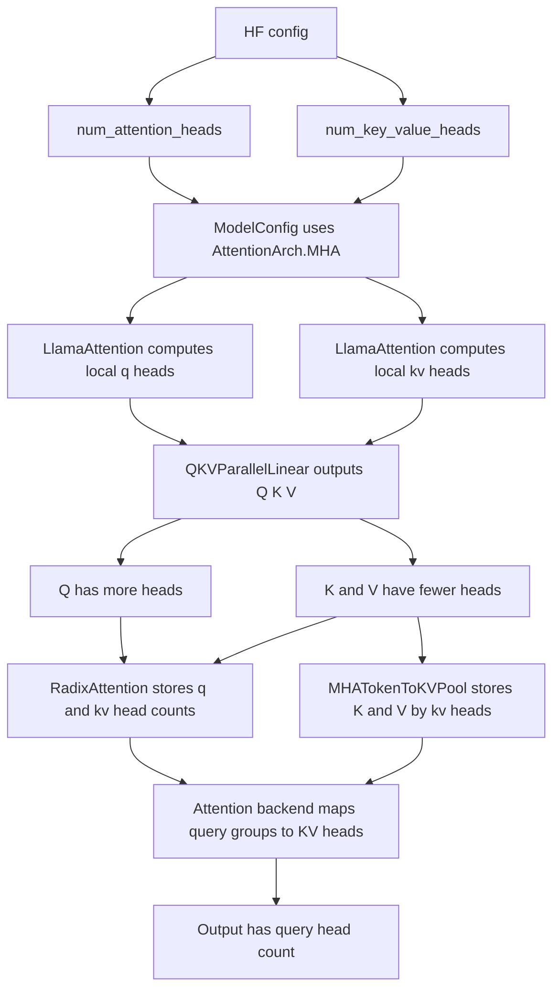

# SGLang GQA 模型源码导读

本文基于当前仓库源码介绍 SGLang 中的 GQA 模型路径。GQA 指 Grouped-Query Attention，即多个 query heads 共享一组 key/value heads。需要先明确一点：SGLang 源码里没有单独的 `AttentionArch.GQA`，GQA 被归在 `AttentionArch.MHA` 这条运行时路径下，只是 `num_attention_heads` 和 `num_key_value_heads` 不相等。

核心源码位置：
- `python/sglang/srt/configs/model_config.py`
- `python/sglang/srt/models/llama.py`
- `python/sglang/srt/layers/radix_attention.py`
- `python/sglang/srt/layers/attention/attention_registry.py`
- `python/sglang/srt/layers/attention/flashattention_backend.py`
- `python/sglang/srt/layers/attention/flashinfer_backend.py`
- `python/sglang/srt/layers/attention/triton_backend.py`
- `python/sglang/srt/mem_cache/memory_pool.py`

## 1. GQA 在 SGLang 中的定位

SGLang 用 `AttentionArch` 区分大的 attention 架构：

```python
class AttentionArch(IntEnum):
    MLA = auto()
    MHA = auto()
```

`ModelConfig._derive_model_shapes()` 对非 MLA 模型最终会设置：

```python
self.attention_arch = AttentionArch.MHA
```

随后读取两个关键字段：

```python
self.num_attention_heads = self.hf_text_config.num_attention_heads
self.num_key_value_heads = getattr(
    self.hf_text_config, "num_key_value_heads", None
)
if self.num_key_value_heads is None:
    self.num_key_value_heads = self.num_attention_heads
```

因此，在 SGLang 里可以这样理解：

```text
num_key_value_heads == num_attention_heads  -> 严格 MHA
num_key_value_heads <  num_attention_heads  -> GQA
num_key_value_heads == 1                    -> MQA
```

三者都走 `AttentionArch.MHA`，差异主要体现在 Q/K/V projection 的输出形状、`RadixAttention` 的 head 参数、KV cache 的 head 数，以及 attention backend 如何把 query heads 映射到较少的 KV heads。

## 2. head 数如何从模型配置传入运行时

`ModelConfig` 提供了两个运行时查询接口：

```python
def get_num_attention_heads(self, tensor_parallel_size) -> int:
    total_num_attention_heads = self.num_attention_heads
    return max(1, total_num_attention_heads // tensor_parallel_size)

def get_num_kv_heads(self, tensor_parallel_size) -> int:
    total_num_kv_heads = self.get_total_num_kv_heads()
    return max(1, total_num_kv_heads // tensor_parallel_size)
```

`get_total_num_kv_heads()` 会兼容不同模型的字段名，例如：
- `num_key_value_heads`
- `num_kv_heads`
- `n_head_kv`
- `multi_query_group_num`
- `num_attention_groups`
- MPT/DBRX 的 `attn_config.kv_n_heads`

如果模型没有提供 KV head 数，就默认等于 attention head 数，也就是普通 MHA。

在 tensor parallel 下，GQA 有一个特殊点：如果总 KV head 数小于 TP size，SGLang 会复制 KV heads，确保每张卡至少有一个 KV head：

```python
return max(1, total_num_kv_heads // tensor_parallel_size)
```

`LlamaAttention` 中也有对应注释：

```python
if self.total_num_kv_heads >= tp_size:
    assert self.total_num_kv_heads % tp_size == 0
else:
    assert tp_size % self.total_num_kv_heads == 0
self.num_kv_heads = max(1, self.total_num_kv_heads // tp_size)
```

这表示：
- KV heads 多于或等于 TP size 时，按 TP 切分。
- KV heads 少于 TP size 时，在 TP ranks 间复制。

## 3. 典型实现：LlamaAttention

`python/sglang/srt/models/llama.py::LlamaAttention` 是理解 GQA 的典型入口。初始化时传入：

```python
self.self_attn = LlamaAttention(
    config=config,
    hidden_size=self.hidden_size,
    num_heads=config.num_attention_heads,
    num_kv_heads=config.num_key_value_heads,
    ...
)
```

在 `LlamaAttention.__init__()` 中：

```python
self.total_num_heads = num_heads
self.num_heads = self.total_num_heads // tp_size
self.total_num_kv_heads = num_kv_heads
self.num_kv_heads = max(1, self.total_num_kv_heads // tp_size)
self.head_dim = getattr(
    config, "head_dim", self.hidden_size // self.total_num_heads
)
self.q_size = self.num_heads * self.head_dim
self.kv_size = self.num_kv_heads * self.head_dim
```

GQA 的关键就在 `q_size` 和 `kv_size` 不同：

```text
q_size  = local_q_heads  * head_dim
kv_size = local_kv_heads * head_dim
```

如果一个模型有 32 个 Q heads、8 个 KV heads，那么每 4 个 Q heads 共享 1 个 KV head。TP 切分后，每张卡上的比例仍由 `num_heads / num_kv_heads` 决定。

## 4. QKV projection 如何体现 GQA

`LlamaAttention` 使用 `QKVParallelLinear` 生成融合后的 QKV：

```python
self.qkv_proj = QKVParallelLinear(
    hidden_size,
    self.head_dim,
    self.total_num_heads,
    self.total_num_kv_heads,
    ...
)
```

forward 时再按本地 shape 切分：

```python
qkv, _ = self.qkv_proj(hidden_states)
q, k, v = qkv.split([self.q_size, self.kv_size, self.kv_size], dim=-1)
q, k = self.rotary_emb(positions, q, k)
```

所以 GQA 并不是在 attention kernel 之前把 K/V 复制成和 Q heads 一样多，而是 projection 直接只产生较少的 K/V heads：

```text
Q shape = [tokens, local_q_heads  * head_dim]
K shape = [tokens, local_kv_heads * head_dim]
V shape = [tokens, local_kv_heads * head_dim]
```

这也是 GQA 节省 KV cache 的根本原因：历史 token 只需要缓存较少的 K/V heads。

## 5. RadixAttention 中的 GQA 参数

`LlamaAttention` 创建 `RadixAttention` 时传入：

```python
self.attn = RadixAttention(
    self.num_heads,
    self.head_dim,
    self.scaling,
    num_kv_heads=self.num_kv_heads,
    layer_id=layer_id,
    ...
)
```

`RadixAttention` 内部保存：

```python
self.tp_q_head_num = num_heads
self.tp_k_head_num = num_kv_heads
self.tp_v_head_num = num_kv_heads
self.head_dim = head_dim
self.qk_head_dim = head_dim
self.v_head_dim = v_head_dim if v_head_dim != -1 else head_dim
```

forward 时会把 K/V reshape 成 KV head 数：

```python
k = k.view(-1, self.tp_k_head_num, self.qk_head_dim)
v = v.view(-1, self.tp_v_head_num, self.v_head_dim)
```

然后统一调用当前 attention backend：

```python
return get_attn_backend().forward(
    q,
    k,
    v,
    self,
    forward_batch,
    save_kv_cache,
    **kwargs,
)
```

因此，GQA 的 head 映射信息会通过 `layer.tp_q_head_num` 和 `layer.tp_k_head_num` 传给 backend。不同 backend 会用这两个数决定 query head 和 KV head 的分组关系。

## 6. Attention backend 如何处理 GQA

不同 backend 的实现细节不同，但核心都是：

```text
q_group = tp_q_head_num / tp_k_head_num
```

每个 KV head 服务 `q_group` 个 query heads。

源码中可以看到多处直接使用这个关系：

```python
q_group = num_q_heads // num_kv_heads
```

例如 AITER 工具路径会读取：

```python
num_kv_heads = layer.tp_k_head_num
num_q_heads = layer.tp_q_head_num
q_group = num_q_heads // num_kv_heads
```

Torch native 和 Flex attention backend 也会显式判断：

```python
use_gqa = layer.tp_q_head_num != layer.tp_k_head_num
```

FlashAttention、FlashInfer、Triton、TRTLLM MHA backend 等路径则把 `layer.tp_q_head_num`、`layer.tp_k_head_num`、`layer.head_dim` 传入各自 kernel 或 wrapper。kernel 负责在计算时把 query head 映射到对应 KV head。

GQA 的一个重要约束是：

```text
tp_q_head_num 必须能被 tp_k_head_num 整除
```

否则无法形成稳定的 query group。部分 backend 或 kernel 会显式 assert 这个关系。

## 7. GQA 的 KV cache 布局

GQA 使用普通 MHA 路径的 `MHATokenToKVPool`，不是 MLA 的 `MLATokenToKVPool`。

`MHATokenToKVPool` 初始化参数里的 `head_num` 对应 KV head 数，不是 Q head 数：

```python
def __init__(
    self,
    size: int,
    page_size: int,
    dtype: torch.dtype,
    head_num: int,
    head_dim: int,
    layer_num: int,
    ...
)
```

普通 NHD 布局下，每层有两个 buffer：

```python
self.k_buffer = [
    torch.zeros(
        (self.size + self.page_size, self.head_num, self.head_dim),
        ...
    )
    for _ in range(self.layer_num)
]
self.v_buffer = [
    torch.zeros(
        (self.size + self.page_size, self.head_num, self.v_head_dim),
        ...
    )
    for _ in range(self.layer_num)
]
```

对于 GQA：

```text
head_num = local_kv_heads
```

所以 KV cache 物理形状是：

```text
K cache = [token_slots, local_kv_heads, head_dim]
V cache = [token_slots, local_kv_heads, v_head_dim]
```

而不是 `[token_slots, local_q_heads, head_dim]`。这和严格 MHA 相比直接减少了 KV cache 占用。

写入时，attention backend 调用：

```python
set_kv_buffer(layer, loc, cache_k, cache_v)
```

`cache_k` 和 `cache_v` 的 head 维就是 `layer.tp_k_head_num`，最终写入 `k_buffer` 和 `v_buffer` 的对应 token slot。

## 8. 与 ReqToTokenPool、RadixCache 的关系

GQA 不改变请求到 token slot 的索引体系。运行时仍然是：

1. scheduler 分配 `out_cache_loc`。
2. `ReqToTokenPool` 记录请求位置到 token slot 的映射。
3. prefix cache 或 radix cache 复用 token slot 索引。
4. attention backend 根据 `ReqToTokenPool` 找到历史 token slots。
5. backend 从 `MHATokenToKVPool` 读取较少 KV heads，并按 GQA 分组服务更多 Q heads。

因此，GQA 与 MHA 共用同一套 KV cache allocator、prefix cache、radix cache 和请求索引机制。差异只在 KV head 数更少。

## 9. GQA、MHA、MQA、MLA 的区别

| 项目 | MHA | GQA | MQA | MLA |
| --- | --- | --- | --- | --- |
| SGLang 架构标记 | `AttentionArch.MHA` | `AttentionArch.MHA` | `AttentionArch.MHA` | `AttentionArch.MLA` |
| Q heads 与 KV heads | 相等 | Q heads 多于 KV heads | KV heads 等于 1 | latent KV 表示 |
| KV pool | `MHATokenToKVPool` | `MHATokenToKVPool` | `MHATokenToKVPool` | `MLATokenToKVPool` |
| cache buffer | `k_buffer` 和 `v_buffer` | `k_buffer` 和 `v_buffer` | `k_buffer` 和 `v_buffer` | 单个 `kv_buffer` |
| 每 token cache head 数 | Q head 数 | KV group head 数 | 1 | 1 个 latent 表示 |
| 主要收益 | 表达直接 | 降低 KV cache 和带宽 | 进一步降低 KV cache | latent 压缩，长上下文更省 |

可以把 GQA 理解为 MHA 和 MQA 之间的折中：它保留多个 KV heads，质量通常比单 KV head 的 MQA 更稳，同时 KV cache 占用低于完整 MHA。

## 10. 运行时关系图



## 11. 源码阅读建议

建议按下面顺序阅读：

1. `model_config.py::_derive_model_shapes()`：看非 MLA 模型如何落到 `AttentionArch.MHA`，以及 `num_key_value_heads` 的默认值。
2. `model_config.py::get_total_num_kv_heads()` 和 `get_num_kv_heads()`：看不同模型字段如何统一成 KV head 数，以及 TP 下如何切分或复制。
3. `llama.py::LlamaAttention`：看 `num_heads`、`num_kv_heads` 如何影响 `q_size`、`kv_size`、`QKVParallelLinear` 和 `RadixAttention`。
4. `radix_attention.py::RadixAttention`：看 `tp_q_head_num` 和 `tp_k_head_num` 如何传给 backend。
5. `memory_pool.py::MHATokenToKVPool`：看 GQA 的 KV cache 实际只按 KV head 数存储。
6. 各 attention backend：看 kernel 如何使用 `tp_q_head_num` 和 `tp_k_head_num` 完成 query group 到 KV head 的映射。

把这些路径连起来看，SGLang 中的 GQA 可以概括为：模型层只生成较少的 K/V heads，KV cache 也只保存这些 K/V heads，attention backend 在计算时把多个 Q heads 分组映射到共享的 KV heads。
