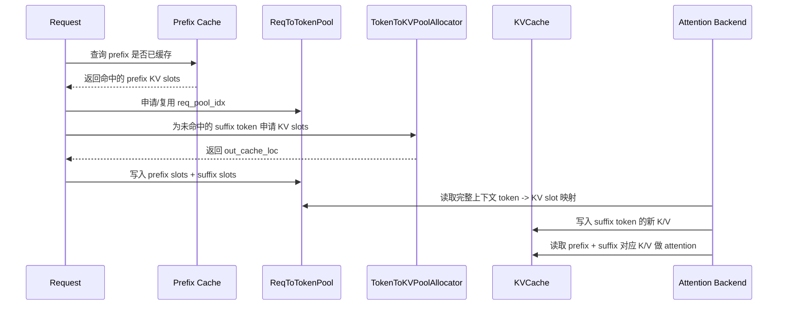
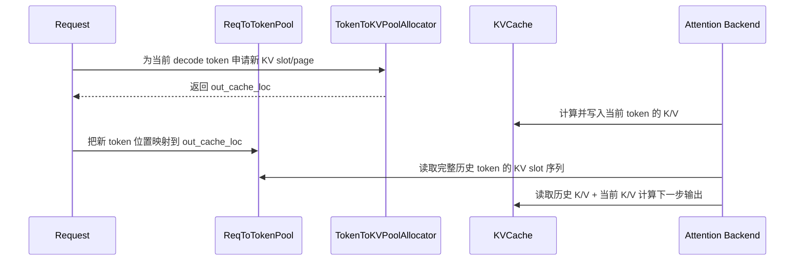
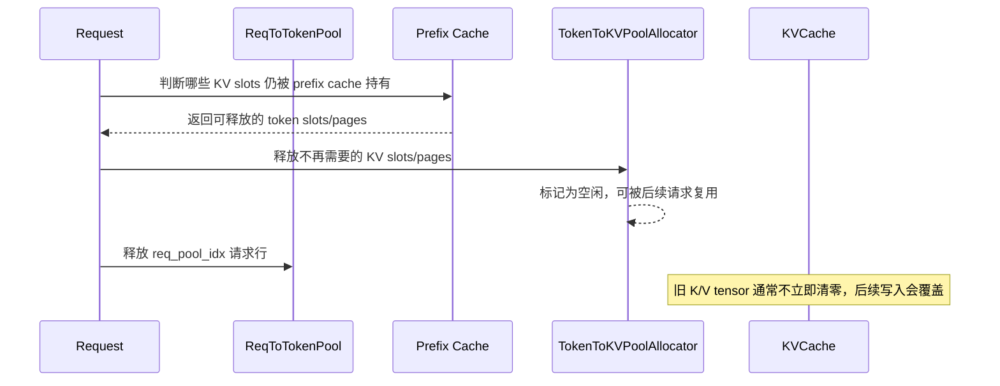

# SGLang 三层内存模型：形象展示

SGLang 的 KV cache 可以想象成一个大型图书馆系统。它不是“一个请求对应一整块连续显存”这么简单，而是由三层结构协作完成：

1. `ReqToTokenPool`：借书登记表，记录“某个请求的第几个 token 放在哪个 KV 位置”。
2. `TokenToKVPoolAllocator`：库位管理员，负责分配和回收 KV slot/page。
3. `KVCache`：真正的书架，保存每层 attention 的 K/V tensor 数据。

```text
请求 Req
  |
  | 1. 我是谁？我的第 i 个 token 在哪里？
  v
ReqToTokenPool
  |
  | 2. token 位置 -> 物理 KV slot/page
  v
TokenToKVPoolAllocator
  |
  | 3. 哪些 slot/page 可用？分配/释放
  v
KVCache
  |
  | 4. 真实 K/V tensor 存在这里
  v
Attention Backend
```

## 一个生活化类比

可以把一次请求看成一位读者，把 token 看成读者借阅的一页页资料。

### 第一层：`ReqToTokenPool` 像借阅登记表

它不保存书本内容，只记录映射关系：

```text
请求 A 的第 0 个 token -> KV slot 1024
请求 A 的第 1 个 token -> KV slot 1025
请求 A 的第 2 个 token -> KV slot 2048
```

也就是：

```text
req_to_token[请求行号, token位置] = 物理KV位置
```

重点：

- 管“请求到 token 位置”的索引。
- 解决“这个请求的上下文 token 分别存在哪里”。
- 不真正保存 K/V tensor。

### 第二层：`TokenToKVPoolAllocator` 像库位管理员

它负责回答：

```text
还有哪些 KV slot 空着？
这个请求新生成 8 个 token，需要分配哪些位置？
请求结束后，哪些 slot/page 可以回收？
```

非分页模式下，分配单位通常是 token slot：

```text
alloc(3) -> [100, 101, 102]
```

分页模式下，真实管理单位是 page，但对上层仍可展开成 token 位置：

```text
page_size = 16
分配 page 10 -> token slot [160, 161, ..., 175]
```

重点：

- 管“哪些物理 KV 位置可用”。
- 负责分配和释放。
- 不保存 K/V tensor 内容。

### 第三层：`KVCache` 像真正的书架

这里才是真实 K/V 数据所在的位置。

以普通 MHA KV cache 为例，每层大致有：

```text
k_buffer[layer_id][slot] = 这个 token 在该层的 key
v_buffer[layer_id][slot] = 这个 token 在该层的 value
```

MLA、FP4、DSA、Hybrid 等模型会有不同物理布局，但本质一样：第三层保存真实 attention 可读取的缓存数据。

重点：

- 管真实 K/V tensor。
- 按 layer 保存。
- attention backend 最终读写这里。

## 三层放在一起看

假设有一个请求 `ReqA`，它已经有 5 个 token：

```text
ReqA:
  token0 -> slot 10
  token1 -> slot 11
  token2 -> slot 12
  token3 -> slot 30
  token4 -> slot 31
```

三层分别看到的是：

```text
第一层 ReqToTokenPool
  ReqA 的 token 序列位置表：
  [10, 11, 12, 30, 31]

第二层 TokenToKVPoolAllocator
  slot 10/11/12/30/31 已被占用
  其他空闲 slot 可继续分配

第三层 KVCache
  k_buffer[layer][10], v_buffer[layer][10]
  k_buffer[layer][11], v_buffer[layer][11]
  ...
  里面是真实 K/V tensor
```

可以画成：

```text
ReqA
 |
 | req_pool_idx = 7
 v
ReqToTokenPool 第 7 行
 |
 | [10, 11, 12, 30, 31]
 v
物理 KV slot
 |
 v
KVCache:
  layer0: K/V at slot 10, 11, 12, 30, 31
  layer1: K/V at slot 10, 11, 12, 30, 31
  layer2: K/V at slot 10, 11, 12, 30, 31
```

## Prefill 阶段：先找旧资料，再申请新库位

Prefill/extend 时，一个请求可能有一段 prefix 已经在 prefix cache 中。

可以想象成：

```text
读者说：我要查一本书的前 100 页。
图书馆发现：前 70 页之前已经有人整理过，放在旧库位。
于是只需要为后 30 页申请新库位。
```

对应到 SGLang：

```text
prefix cache 命中:
  token0-token69 -> 已存在的 KV slot

allocator 新分配:
  token70-token99 -> 新 KV slot

ReqToTokenPool 最终记录完整上下文:
  [旧slot, 旧slot, ..., 新slot, 新slot]
```

attention backend 不需要关心哪些 token 是命中的，哪些 token 是新生成的。它只看 `ReqToTokenPool`，就能拿到完整上下文的 KV 位置。

### Prefill / Extend 时序图



## Decode 阶段：每次追加一页新资料

Decode 每步通常只新增一个 token。

可以想象成：

```text
读者每次写出一页新笔记。
库位管理员给这一页分配一个新位置。
登记表把“第 N 页 -> 新库位”写进去。
书架上保存这一页对应的 K/V 内容。
```

对应流程：

```text
1. allocator 分配新 KV slot
2. attention 计算当前 token 的 K/V
3. KVCache.set_kv_buffer(...) 写入真实 K/V
4. ReqToTokenPool 更新 token 位置映射
```

### Decode 时序图



## 请求结束：登记表和库位都要回收

请求完成后要做两件事：

```text
ReqToTokenPool:
  回收请求行号 req_pool_idx

TokenToKVPoolAllocator:
  回收该请求占用的 KV slot/page
```

第三层 `KVCache` 里的旧 tensor 内容通常不需要立刻清零。只要 allocator 把 slot 标记为空闲，后续新请求写入时会覆盖旧内容。

### 请求结束回收时序图



## 为什么要拆成三层

如果只有一个大 tensor，系统很难同时做到：

- 多请求并发。
- prefix cache 复用。
- chunked prefill。
- paged attention。
- speculative decode。
- KV cache 回收和复用。
- MHA、MLA、DSA、Mamba 等多种后端共存。

三层拆开后职责更清楚：

```text
ReqToTokenPool:
  负责“请求视角”的 token 顺序。

TokenToKVPoolAllocator:
  负责“内存管理视角”的空闲和占用。

KVCache:
  负责“计算视角”的真实 K/V tensor。
```

## 一句话总结

SGLang 的三层内存模型可以理解为：

```text
ReqToTokenPool 是目录。
TokenToKVPoolAllocator 是库位管理员。
KVCache 是真正的书架。
```

请求通过目录找到自己的 token 位置，库位管理员决定哪些位置可用，真正的 K/V 数据则放在书架上供 attention backend 读写。
