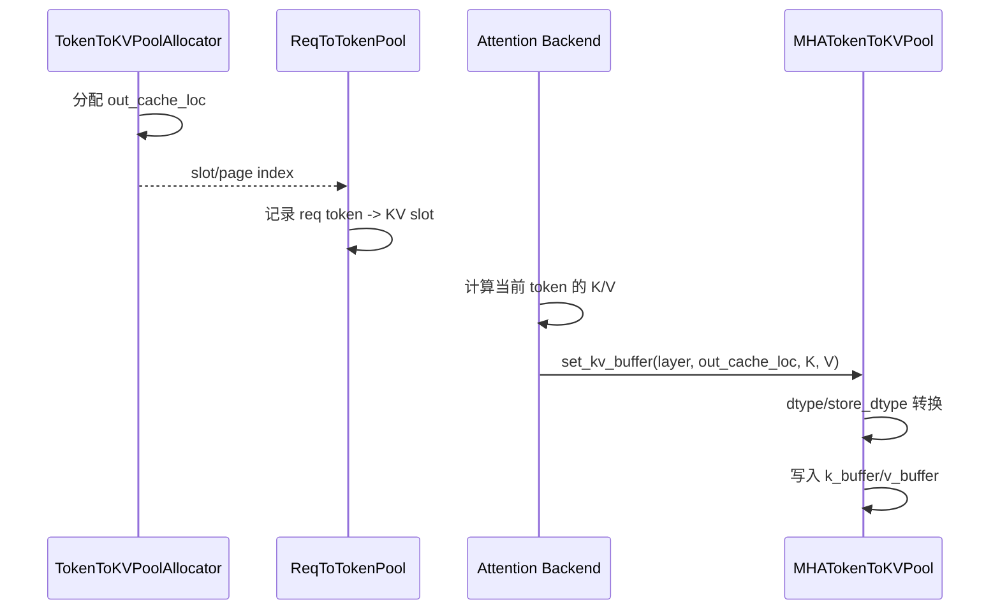
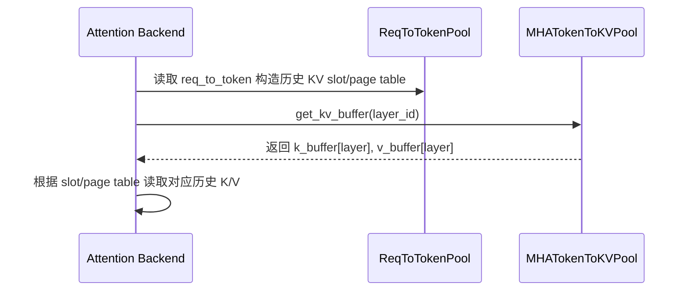

# SGLang `MHATokenToKVPool` 详解

`MHATokenToKVPool` 定义在 `python/sglang/srt/mem_cache/memory_pool.py`，是 SGLang 中普通 MHA/GQA/MQA attention 最常用的物理 KV cache 实现。

它处在 SGLang 三层内存模型的第三层：

```text
ReqToTokenPool
  记录 request 的第 i 个 token 对应哪个 KV slot

TokenToKVPoolAllocator
  分配和释放 KV slot/page

MHATokenToKVPool
  真正保存每一层的 K/V tensor
```

一句话概括：

```text
MHATokenToKVPool 是普通 attention 模型的真实 K/V 书架。
```

## 1. 它解决什么问题

MHA/GQA/MQA 模型在推理时，每生成一个 token，每一层 attention 都会产生 key 和 value。为了后续 token 不重复计算历史 K/V，SGLang 会把这些 K/V 缓存起来。

`MHATokenToKVPool` 做的就是：

1. 为每一层分配 K/V 缓冲区。
2. 按物理 KV slot 写入新 token 的 K/V。
3. 按 layer id 返回 attention backend 需要读取的 K/V buffer。
4. 支持 CPU offload、disaggregation、speculative token 接受后的 KV 搬迁等运行时能力。

它不负责：

- 决定哪个请求能运行。
- 决定分配哪个 KV slot。
- 记录某个 request 的 token 序列。

这些分别由 scheduler、allocator 和 `ReqToTokenPool` 完成。

## 2. 典型数据结构

默认 NHD 布局下，`MHATokenToKVPool` 为每层分别维护两个列表：

```python
self.k_buffer: List[torch.Tensor]
self.v_buffer: List[torch.Tensor]
```

每一层的形状大致是：

```text
k_buffer[layer]: [size + page_size, head_num, head_dim]
v_buffer[layer]: [size + page_size, head_num, v_head_dim]
```

含义如下：

- `size`：可用 token KV slot 数量。
- `page_size`：分页 KV cache 的页大小。
- `size + page_size`：真实 slot 加上 padding/dummy 预留空间。
- `head_num`：KV head 数量。对于 GQA/MQA，它通常小于 query head 数量。
- `head_dim`：key head 维度。
- `v_head_dim`：value head 维度，默认等于 `head_dim`。

可以形象理解为：

```text
layer 0:
  K 书架: slot -> heads -> dim
  V 书架: slot -> heads -> dim

layer 1:
  K 书架: slot -> heads -> dim
  V 书架: slot -> heads -> dim

...
```

## 3. slot 是怎么串起来的

`MHATokenToKVPool` 只知道“我要往 slot 1024 写 K/V”，但它不知道这个 slot 属于哪个请求的第几个 token。

三层协作关系是：

```text
TokenToKVPoolAllocator 分配:
  out_cache_loc = [1024, 1025, 1026]

ReqToTokenPool 记录:
  req_to_token[req_pool_idx, token_pos] = 1024/1025/1026

MHATokenToKVPool 保存:
  k_buffer[layer][1024] = cache_k
  v_buffer[layer][1024] = cache_v
```

也就是说，同一个物理 slot 同时出现在两条线上：

```text
请求索引线:
  request token -> req_to_token -> slot

真实数据线:
  slot -> k_buffer/v_buffer -> K/V tensor
```

## 4. 初始化流程

构造函数核心参数：

```python
MHATokenToKVPool(
    size,
    page_size,
    dtype,
    head_num,
    head_dim,
    layer_num,
    device,
    enable_memory_saver,
    v_head_dim=None,
    start_layer=None,
    end_layer=None,
    enable_alt_stream=True,
    enable_kv_cache_copy=False,
)
```

初始化主要做几件事：

1. 调用 `KVCache.__init__` 保存通用元信息。
2. 计算实际使用的 `head_num/head_dim/v_head_dim`。
3. 选择 KV cache 物理布局。
4. 调用 `_create_buffers()` 分配每层 K/V buffer。
5. 创建 `device_module` 和可选的 `alt_stream`。
6. 如果需要 KV 搬迁，初始化并预热 tiled copy kernel。
7. 记录 KV cache 显存用量。
8. 计算写入 kernel 使用的 `row_dim` 和 `same_kv_dim`。

## 5. 默认 NHD 布局

默认布局是 NHD：

```text
[slot, head, dim]
```

这里的 NHD 可以理解为：

```text
N = token slot 数量，也就是缓存中第几个 token 位置
H = KV head 数量
D = 每个 head 的维度
```

所以 NHD 布局就是把一个 KV cache tensor 排成：

```text
[N, H, D]
```

在 `MHATokenToKVPool` 中，N 对应物理 KV slot，H 对应 `head_num`，D 对应 `head_dim` 或 `v_head_dim`：

```text
k_buffer[layer]: [slot, kv_head, key_head_dim]
v_buffer[layer]: [slot, kv_head, value_head_dim]
```

举例来说，`k_buffer[layer][1024, 3, 17]` 表示：

```text
第 layer 层
物理 KV slot = 1024
第 3 个 KV head
该 head 的第 17 个维度
```

也可以把 NHD 想象成一个三层货架：

```text
第一维 N：第几个 token 的格子
第二维 H：这个 token 下分几个 head 抽屉
第三维 D：每个 head 抽屉里的一排数值
```

NHD 的好处是直观，attention backend 拿到某个 token slot 后，可以很自然地找到该 token 在所有 KV heads 上的向量。

例如：

```text
size = 1_000_000
page_size = 1
head_num = 8
head_dim = 128
layer_num = 32
```

那么每层大致会有：

```text
k_buffer[layer]: [1_000_001, 8, 128]
v_buffer[layer]: [1_000_001, 8, 128]
```

这里多出来的 `page_size` 主要用于 padding/dummy token 写入。这样某些被 padding 的 batch 项即使写到保留位置，也不会破坏正常请求的 KV。

## 6. AITER vectorized_5d 布局

在 ROCm AITER 后端，`MHATokenToKVPool` 可以使用特殊的 5D 物理布局：

```bash
SGLANG_AITER_KV_CACHE_LAYOUT=vectorized_5d
```

启用条件包括：

```text
HIP 平台
SGLANG_USE_AITER=1
SGLANG_AITER_KV_CACHE_LAYOUT=vectorized_5d
```

5D 布局形状：

```text
K: [num_blocks, H, D_k // X, page_size, X]
V: [num_blocks, H, page_size // X, D_v, X]
```

其中：

```text
X = 16 / store_dtype.itemsize
```

例如 FP16/BF16 存储时，`itemsize = 2`，所以 `X = 8`。FP8 底层按 `uint8` 存储时，`X = 16`。

这个布局不是为了代码可读性，而是为了匹配 AITER attention kernel 的访存模式，让 kernel 可以更高效地读取 KV cache。

## 7. dtype 与 store_dtype

`MHATokenToKVPool` 继承自 `KVCache`，逻辑 dtype 是：

```python
self.dtype
```

实际存储 dtype 是：

```python
self.store_dtype
```

对于普通 FP16/BF16：

```text
dtype == store_dtype
```

对于部分 FP8：

```text
dtype = torch.float8_e4m3fn / torch.float8_e5m2
store_dtype = torch.uint8
```

原因是一些 FP8 tensor 的 indexed write 支持不完整，所以底层按 `uint8` 存储，需要读取时通过 `.view(self.dtype)` 还原逻辑视图。

相关读取逻辑：

```python
if self.store_dtype != self.dtype:
    return self.k_buffer[layer_id - self.start_layer].view(self.dtype)
```

## 8. 读取路径

attention backend 通常会调用：

```python
k_cache, v_cache = token_to_kv_pool.get_kv_buffer(layer.layer_id)
```

内部流程：

```text
get_kv_buffer(layer_id)
  -> get_key_buffer(layer_id)
       -> 等待可选 layer_transfer_counter
       -> _get_key_buffer(layer_id)
  -> get_value_buffer(layer_id)
       -> 等待可选 layer_transfer_counter
       -> _get_value_buffer(layer_id)
```

`layer_id` 是模型全局 layer id，访问 buffer 时会转换成当前 pool 内部下标：

```python
layer_id - self.start_layer
```

这对 pipeline parallel 或分层加载很重要，因为一个 worker 可能只负责模型中的一段层。

## 9. 写入路径：`set_kv_buffer`

attention backend 在 prefill/decode 计算出当前 token 的 K/V 后，会调用：

```python
token_to_kv_pool.set_kv_buffer(
    layer,
    out_cache_loc,
    cache_k,
    cache_v,
)
```

写入流程可以概括为：

```text
1. 解析写入位置 loc
2. 检查 loc 是否越界
3. 确定 layer_id
4. 如有必要，把 cache_k/cache_v 转成 pool dtype
5. 如有必要，把 cache_k/cache_v view 成 store_dtype
6. 根据物理布局选择写入 kernel
7. 写入 k_buffer/v_buffer
```

### 普通 NHD 写入

普通布局走：

```python
_set_kv_buffer_impl(...)
```

该函数会根据平台选择不同写法：

```text
CUDA/HIP 且行大小适合:
  使用 JIT store_cache kernel

CPU 且支持 AMX:
  使用 torch.ops.sgl_kernel.store_cache_cpu

CUDA graph capture + alt_stream:
  K/V 写入分到不同 stream，尝试重叠拷贝

否则:
  直接 k_cache[indices] = k
  直接 v_cache[indices] = v
```

### AITER 5D 写入

如果是 `vectorized_5d`：

```python
launch_reshape_and_cache_shuffle_5d(...)
```

它会把上游 attention 产生的普通 K/V reshape 成 AITER 需要的 5D shuffle 布局后写入。

## 10. Prefill 中的有效前缀写入

`set_kv_buffer_prefix_valid` 用于只写每行有效 prefix 的场景。

输入包括：

```python
loc_2d: [batch, max_len]
commit_lens: [batch]
cache_k/cache_v: 展平后的 dense KV rows
```

含义是：

```text
第 i 个请求只提交 loc_2d[i, :commit_lens[i]] 这些位置。
loc_2d[i, commit_lens[i]:] 是无效 padding，不应该写入。
```

CUDA/HIP 上会走 Triton kernel：

```python
_set_kv_buffer_prefix_valid_impl(...)
```

其他平台则先构造有效 mask，再把有效行筛出来复用 `set_kv_buffer`。

## 11. KV cache 搬迁：`move_kv_cache`

`move_kv_cache(tgt_loc, src_loc)` 会把所有层的 K/V 从源 slot 搬到目标 slot：

```text
for every layer:
  k_buffer[layer][tgt_loc] = k_buffer[layer][src_loc]
  v_buffer[layer][tgt_loc] = v_buffer[layer][src_loc]
```

用途包括：

- speculative decoding 接受 draft token 后，把 accepted token 的 KV 移到正式位置。
- 某些缓存压缩或整理场景。

默认走 tiled copy Triton kernel：

```python
copy_all_layer_kv_cache_tiled
```

如果设置：

```bash
SGLANG_NATIVE_MOVE_KV_CACHE=1
```

则会走原生 PyTorch indexed copy：

```python
move_kv_cache_native(...)
```

注意：要使用 tiled copy 路径，构造时需要：

```python
enable_kv_cache_copy=True
```

否则 `move_kv_cache` 会断言失败。

## 12. CPU offload 与恢复

`get_cpu_copy(indices)` 会把指定 KV slot 的所有层 K/V 分块拷贝到 CPU。

返回结构大致是：

```text
kv_cache_cpu[layer][chunk] = [k_cpu, v_cpu]
```

`load_cpu_copy(kv_cache_cpu, indices)` 做反向操作，把 CPU 上保存的 K/V 放回 GPU 对应 slot。

为了避免一次搬太大，它按：

```python
self.cpu_offloading_chunk_size = 8192
```

分块处理。

这主要服务于 KV cache offload、retract、恢复等调度路径。

## 13. disaggregation 支持

`get_contiguous_buf_infos()` 返回三类信息：

```text
kv_data_ptrs: 每层 K/V buffer 的 data_ptr
kv_data_lens: 每个 buffer 的总字节数
kv_item_lens: 单页 item 的字节数
```

这些信息用于 disaggregated prefill/decode 等场景，让远端或通信模块知道每个 KV buffer 的地址和大小。

对 MHA 来说，它会按顺序返回：

```text
所有 K buffer 信息
所有 V buffer 信息
```

## 14. 运行时整体时序

### Prefill / Decode 写入 KV



### Attention 读取历史 KV



## 15. 和其他 KV pool 的区别

| 类 | 物理布局 | 典型用途 |
| --- | --- | --- |
| `MHATokenToKVPool` | K/V 分开保存 | 普通 MHA/GQA/MQA 模型 |
| `MHATokenToKVPoolFP4` | K/V 分开保存，但 FP4 压缩 + scale | MHA KV cache FP4 量化 |
| `MLATokenToKVPool` | 合并 latent KV + RoPE key | MLA 模型 |
| `MLATokenToKVPoolFP4` | 合并 MLA KV，FP4 压缩 + scale | MLA KV cache FP4 量化 |
| `NoOpMHATokenToKVPool` | 小型 placeholder | embedding prefill-only 且跳过真实 KV cache |
| `HybridLinearKVPool` | full KV pool + Mamba state pool | 混合 full attention 与 linear/Mamba 模型 |

## 16. 常见参数影响

### `--kv-cache-dtype`

影响 `dtype/store_dtype` 和 K/V cache 精度。

例如：

```bash
--kv-cache-dtype bf16
--kv-cache-dtype fp8_e4m3
```

如果是：

```bash
--kv-cache-dtype fp4_e2m1
```

普通 MHA 路径会使用 `MHATokenToKVPoolFP4`，不是这里的普通 `MHATokenToKVPool`。

### `--page-size`

影响：

- buffer 预留大小：`size + page_size`
- paged allocator 的 page 粒度
- AITER 5D layout 的合法性约束

### `--max-total-tokens`

影响 `size`，也就是 KV cache 可容纳的 token slot 总数。

### `--max-running-requests`

不直接改变 `MHATokenToKVPool` 的 K/V buffer 形状，但会影响 `ReqToTokenPool` 的行数，并间接影响调度能同时写入多少请求。

### `SGLANG_AITER_KV_CACHE_LAYOUT`

在 ROCm AITER 后端可选择：

```bash
SGLANG_AITER_KV_CACHE_LAYOUT=nhd
SGLANG_AITER_KV_CACHE_LAYOUT=vectorized_5d
```

## 17. 调试时看什么

如果怀疑 MHA KV cache 有问题，可以优先看：

1. `token_to_kv_pool` 的实际类型是否是 `MHATokenToKVPool`。
2. `k_buffer[0].shape` / `v_buffer[0].shape` 是否符合预期。
3. `req_to_token_pool.req_to_token` 中对应 token 是否指向正确 slot。
4. `out_cache_loc` 是否越界。
5. `layer_id - start_layer` 是否落在当前 pool 的层范围内。
6. `dtype` 和 `store_dtype` 是否一致，尤其是 FP8 场景。
7. 是否启用了 AITER 5D layout，后端 kernel 是否匹配。

## 18. 总结

`MHATokenToKVPool` 是普通 attention 模型的物理 KV cache 容器。

它的核心思想很简单：

```text
每一层都有一个 K buffer 和一个 V buffer。
allocator 决定写哪个 slot。
ReqToTokenPool 记录 request token 到 slot 的映射。
attention backend 通过 slot 在 K/V buffer 中读写真实缓存。
```

复杂性主要来自运行时优化：

- FP8 的 `store_dtype` 视图。
- AITER 的 5D 物理布局。
- CUDA graph capture 下的辅助 stream。
- tiled KV copy kernel。
- CPU offload 和 disaggregation 传输。

理解这个类后，SGLang 普通 MHA/GQA/MQA 模型的 KV cache 主路径基本就清楚了。
