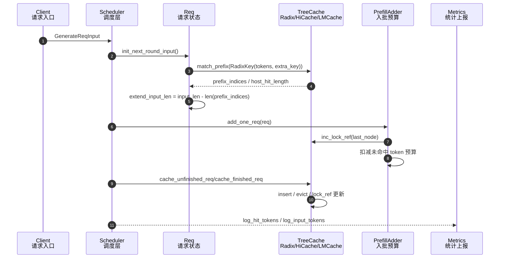

# SGLang KVCache 命中率影响变量、路径与调参建议

本文基于当前源码分析 KV cache / prefix cache 命中率相关的全局变量和启动参数。这里的“命中率”主要指调度器统计的 prefill prefix cache hit rate：

```text
cache_hit_rate = effective_hit_tokens / (effective_input_tokens + effective_hit_tokens)
```

实现位置：`python/sglang/srt/managers/scheduler_components/metrics_reporter.py`。其中 `log_hit_tokens` 来自 `PrefillAdder` 记录的 `prefix_len`，`log_input_tokens` 来自本轮仍需 prefill 的 token 数；被 retract 后重算的 token 会从 effective 统计里扣掉。

## 1. 命中率主路径

核心链路如下：



关键源码锚点：

- `Req.init_next_round_input()`：构造 `RadixKey(token_ids, extra_key, limit)` 并调用 `tree_cache.match_prefix()`，命中结果写入 `prefix_indices`、`host_hit_length` 等字段。见 `schedule_batch.py`。
- `RadixCache.match_prefix()`：如果 cache 未禁用，则先按 `page_size` 对齐，再在 radix tree 中找最长前缀。见 `mem_cache/radix_cache.py`。
- `PrefillAdder.add_one_req()`：以 `prefix_len = len(req.prefix_indices)` 计入命中 token，用 `extend_input_len` / `host_hit_length` / `page_size` 计算本轮需要的真实 KV 预算。见 `schedule_policy.py`。
- `release_kv_cache()` / `maybe_cache_unfinished_req()`：请求结束或 chunk 中间态将 KV 插入 tree cache，后续请求才可能命中。见 `mem_cache/common.py`。

## 2. 直接影响命中率的启动参数

| 参数 | 默认值/来源 | 影响路径 | 调参建议 |
|---|---:|---|---|
| `--disable-radix-cache` | `False` | `build_kv_cache()` 将 `disable=True` 传给 cache；若同时开启 chunked prefill，会选 `ChunkCache`，`match_prefix()` 永远返回空。 | 需要跨请求共享 prefix 时不要开。只在排查正确性、部分不兼容模型、或只关心单请求 chunk 生命周期时使用。 |
| `--radix-eviction-policy` | `lru` | `CacheInitParams.eviction_policy` -> `RadixCache.eviction_strategy` -> `evict()` 选择叶子节点。影响哪些历史 prefix 被保留。 | 通用服务用 `lru`；热点系统提示词重复且有长尾请求时试 `lfu`/`slru`；有请求优先级语义时用 `priority`。 |
| `--page-size` | 模型/后端自动设置 | `RadixKey.match()` 和 `insert()` 都按 `page_size` 向下对齐。`page_size` 越大，短 prefix 或非整页尾部越容易不计入命中。 | 命中率优先且后端允许时用较小 page；吞吐/分页 kernel/DSA 后端优先时保留后端推荐值。`chunked_prefill_size` 必须能被它整除。 |
| `--chunked-prefill-size` | 按 GPU 显存启发式设置，`-1` 关闭 | 限制每轮 prefill chunk；中间 chunk 会 `cache_unfinished_req(..., chunked=True)` 写入 tree，下一轮/后续请求可复用。过小会增加中间插入和调度次数；过大会减少并发机会。 | 长 prompt 且共享前缀明显时保留开启。H100/A100 级别通常从 `8192` 起测；显存紧张或低延迟混部可降到 `2048/4096`。 |
| `--max-total-tokens` | 自动按 KV pool 算 | 决定 token_to_kv_pool 容量。容量越小，`evict_from_tree_cache()` 越频繁，历史 prefix 越容易被驱逐。 | 命中率低且日志显示 evictable 频繁下降时，提高它或提高 `--mem-fraction-static`。 |
| `--mem-fraction-static` | 自动估算 | 影响 KV pool 静态分配大小；间接影响可保留 prefix 的总 token 数。 | OOM 降低；命中率和吞吐受驱逐影响时提高。注意它与 activation/cuda graph 争显存。 |
| `--max-running-requests` | 自动/模型 hook | 并发越高，活跃请求 lock 住的 KV 越多，`protected_size` 增大，能被驱逐/复用的空间减少；过低又降低相似请求同批/近邻调度机会。 | 高共享 prefix 场景不要盲目拉满。结合 `sglang:cache_hit_rate`、`kv_evictable_tokens`、retract 数调。 |
| `--max-prefill-tokens` | `16384` | 约束一次 prefill batch 的未命中 token 上限；不直接改变 tree 内容，但影响哪些请求能同一轮进入 batch 和 chunk 切分。 | 共享长前缀场景可适当提高，避免相似请求被拆散；显存紧张时降低。 |
| `--prefill-max-requests` | `None` | 限制一轮 prefill 的请求数；影响 in-batch prefix caching 和同类请求聚集机会。 | 小 batch 延迟优先可设置；命中率优先通常不设或设得较宽。 |
| `--schedule-policy` | `fcfs` | cache-aware 策略会先计算 prefix match 并改变 waiting queue 顺序。源码支持 `lpm`、`dfs-weight`，也有 `routing-key`。 | 共享 prefix 明显时优先试 `lpm`；网关能提供稳定 routing key 时可试 `routing-key`。 |
| `--enable-hierarchical-cache` | `False` | registry 选择 `HiRadixCache`/`UnifiedRadixCache + HiCache`，命中可来自 GPU device、CPU host、L3 storage。 | GPU KV 容量不足但 prefix 热点明显时开启；host/L3 命中会增加传输延迟，适合长 prefix 复用。 |
| `--hicache-ratio` / `--hicache-size` | `2.0` / `0` | 决定 host KV cache pool 容量。容量越大，GPU 被驱逐后的 prefix 越可能在 host 命中。 | 优先用 `--hicache-size` 固定预算；长上下文服务可从 GPU KV pool 的 1-2 倍开始测。 |
| `--hicache-write-policy` | `write_through` | 控制 KV 何时写到 host/storage。`write_through` 命中覆盖更稳，`write_back` 写流量更低但冷启动/异常时可复用性差。 | 命中率优先用 `write_through`；写带宽瓶颈时测 `write_through_selective` 或 `write_back`。 |
| `--hicache-storage-backend` | `None` | 开启 L3 存储层，`check_prefetch_progress()` 和 `storage_hit_length` 进入统计。 | 多实例/超长 prefix/热数据跨重启复用时配置；普通单机低延迟服务不建议默认开。 |
| `--enable-lmcache` | `False` | registry 选择 `LMCRadixCache`，用 LMCache 作为替代层次缓存。 | 已有 LMCache 部署时使用；不要和 HiCache 盲目同时调，先固定一种方案测命中和尾延迟。 |
| `--enable-lora` / `--lora-paths` | 默认关闭 | `Req.__init__()` 会把 `lora_id` 拼进 `extra_key`。不同 LoRA adapter 不共享 KV。 | 多 LoRA 服务应按 adapter 聚合路由；不要期待不同 LoRA 之间共享 prefix cache。 |
| `--strip-thinking-cache` | `False` | `Req._cache_commit_len()` 在 reasoning token 存在时只提交 prompt prefix，thinking/answer KV 走释放路径。 | 多轮或 reasoning 输出不希望污染 cache 时开启；如果希望复用完整输出前缀，保持关闭。 |
| `--enable-streaming-session` | `False` | registry 可能用 `StreamingSession` wrapper；会长期持有 session KV，提升同 session 续写命中，但占用 protected KV。 | 多轮流式会话开启；高并发短请求慎开，观察 held tokens。 |
| `--radix-cache-backend` | `None` | 允许替换默认 cache factory，直接改变 match/insert/evict 实现。 | 仅用于实验或自定义后端。线上先验证语义和 metrics 一致性。 |

## 3. 请求级字段：常被误认为启动参数

这些不是 server 启动参数，但直接改变命中命名空间：

| 字段 | 来源 | 影响 |
|---|---|---|
| `extra_key` | 原生请求 / OpenAI 兼容扩展 | `RadixKey.extra_key` 的一部分；不同值永不共享 prefix。 |
| `cache_salt` | OpenAI 协议字段 | `_compute_extra_key()` 将 `cache_salt` 和 `extra_key` 拼接，作为最终 `extra_key`。 |
| `lora_id` | LoRA registry | 拼进 `extra_key`，隔离不同 adapter 的 KV。 |
| `routing_key` | 请求 header/benchmark | 不参与 RadixKey，但 `schedule-policy=routing-key` 会优先聚合同 routing key 请求，间接提升命中。 |
| `return_logprob` / `logprob_start_len` | 请求采样参数 | `_compute_max_prefix_len()` 会把最大可匹配 prefix 限到 logprob 起点，避免跳过需要算 logprob 的 token。 |
| `positional_embed_overrides` | 请求输入 | `init_next_round_input()` 会清空待匹配 token，强制不共享 cache。 |

## 4. 全局变量和环境变量

| 变量 | 默认值 | 影响路径 | 建议 |
|---|---:|---|---|
| `SGLANG_RADIX_FORCE_MISS` | `False` | `schedule_batch.py` 和 `schedule_policy.py` 在 `match_prefix()` 后把结果置零。 | 只用于基准对照或排错。线上必须为 `0/False`。 |
| `SGLANG_ENABLE_UNIFIED_RADIX_TREE` | `False` | `registry.default_radix_cache_factory()` 强制选择 `UnifiedRadixCache`；HiCache + hybrid SWA/SSM 也依赖它。 | 需要 unified/hybrid/部分 HiCache 能力时开启；普通 MHA/MLA 先用默认 RadixCache。 |
| `SGLANG_EXPERIMENTAL_CPP_RADIX_TREE` | `False` | registry 选择 `RadixCacheCpp`。 | 仅实验；命中语义应与 Python RadixCache 对齐，但上线前要压测一致性。 |
| `SGLANG_CHUNKED_PREFIX_CACHE_THRESHOLD` | `8192` | DeepSeek MHA forward 中决定 prefix KV 是否走 chunked KV 路径；影响命中后读取 prefix KV 的 kernel 路径，不改变 Radix 命中本身。 | 命中 prefix 很长时可降低门槛测试吞吐；短 prefix 场景默认即可。 |
| `global_config.enable_precache_with_tracing` | `True` | `lang/interpreter.py::run_program_batch()` 会 trace 程序公共前缀并预缓存。 | 使用 SGLang language frontend 批量运行时保留开启；原生 HTTP/OpenAI 请求路径一般不经过这里。 |
| `IN_BATCH_PREFIX_CACHING_CHECK_THRESHOLD` | `32` | `schedule_policy.py` 中控制 waiting queue 内部 prefix 检查门槛。 | 大批量相似 prompt 可适当提高；队列很长且 CPU 调度开销高时降低或设 `-1` 关闭。 |
| `IN_BATCH_PREFIX_CACHING_DEPRIORITIZE_THRESHOLD` | `32` | waiting queue 内 prefix 很长的请求可能被降优先级以等待更好复用。 | 高共享前缀且延迟不敏感可提高；严格 FCFS 延迟场景保持默认或降低。 |
| `SGLANG_CLIP_MAX_NEW_TOKENS_ESTIMATION` | `4096` | 调度器估算 decode 未来 KV 占用时裁剪 `max_new_tokens`，影响 admission 和驱逐压力。 | 输出上限极大但实际较短时默认合理；实际长输出多时提高，避免过度接纳导致 retract/evict。 |
| `SGLANG_VLM_CACHE_SIZE_MB` | `100` | 初始化 multimodal embedding cache；不是 KV prefix cache，但 VLM 显存占用会挤压可给 KV pool 的空间。 | VLM 命中低且 KV cache 更重要时降低；图像复用明显时提高。 |

## 5. 参数影响路径详解

### 5.1 RadixCache 是否参与命中

`build_kv_cache()` 先计算：

```text
disable_radix_cache = server_args.disable_radix_cache
                   or (model_config.is_multimodal and uses_transformers_backend)
```

随后 `registry.default_radix_cache_factory()` 分支：

- `disable_radix_cache=True` 且 `chunked_prefill_size is not None`：返回 `ChunkCache` / `SWAChunkCache`。它的 `match_prefix()` 返回空，不支持跨请求 prefix 命中。
- `enable_hierarchical_cache=True`：返回 `HiRadixCache` 或 `UnifiedRadixCache` 并挂载 HiCache controller。
- `is_hybrid_swa=True`：返回 `SWARadixCache`。
- `is_hybrid_ssm=True`：返回 `MambaRadixCache`。
- `enable_lmcache=True`：返回 `LMCRadixCache`。
- 否则返回普通 `RadixCache`。

因此，命中率第一优先级是确认实际 cache 实现。启动日志中会打印：

```text
Tree cache initialized: source=... impl=...
```

### 5.2 命中粒度由 `extra_key` 与 `page_size` 共同决定

Radix key 的匹配条件不是只看 token：

```text
key = (token_ids, extra_key, is_bigram, limit)
```

影响：

- `cache_salt` / `extra_key` / `lora_id` 任一不同，前缀 token 完全相同也不会共享。
- `page_size > 1` 时，匹配长度向下对齐到整页；例如 `page_size=64`，共享 100 token 只计 64 token，尾部 36 token 仍要 prefill。
- EAGLE speculative 路径会使用 bigram view，逻辑长度与普通 token view 不完全相同。

### 5.3 容量参数通过驱逐影响命中

新 prefill/decode 分配 KV 前会调用 `evict_from_tree_cache()`：

```text
if allocator.available_size() < num_tokens:
    tree_cache.evict(EvictParams(num_tokens=num_tokens))
```

普通 RadixCache 只驱逐 `lock_ref == 0` 的叶子；正在运行、session 持有或 load-back 中的节点会计入 protected，不能驱逐。容量不足时，历史 prefix 会被回收，后续请求命中率下降。

主要相关参数：

- `--max-total-tokens`：直接限制 KV pool token 数。
- `--mem-fraction-static`：影响自动 KV pool 大小。
- `--max-running-requests`：影响 active/protected KV 数量。
- speculative decoding 参数：会提高 decode 预留 KV，间接挤压 cache 空间。
- streaming session：会长期保护 session KV。

### 5.4 chunked prefill 的双重作用

`--chunked-prefill-size` 同时影响命中率和调度：

- 开启后，长 prompt 被拆成多轮。中间轮通过 `cache_unfinished_req(chunked=True)` 插入 tree，使后续 chunk 或后续请求可复用已算 prefix。
- 过小会导致更多中间节点、更多调度开销，也可能因为 page 对齐浪费让统计命中率波动。
- 关闭后，长 prompt 必须整段进入 prefill，完成前不能把中间 prefix 暴露给后续请求复用。

### 5.5 调度策略影响“相似请求是否靠近”

cache-aware policy 会在排序前执行 prefix match：

- `lpm`：最长 prefix match 优先，适合共享系统 prompt / RAG 模板 / 多轮上下文高度相似场景。
- `dfs-weight`：根据 radix tree DFS 权重聚合相近 prefix。
- `routing-key`：不看 token，优先和 running batch 中同 routing key 的请求靠近；适合上游网关已按 prefix 或会话算好 key 的场景。
- `fcfs`：公平简单，但相似请求可能被打散。

注意：调度策略只能改善复用机会；如果 `extra_key` 不同、cache 被关闭或 prefix 已被驱逐，策略无法制造命中。

## 6. 调参建议

### 6.1 单机普通文本服务，目标提升共享系统提示词命中

建议起点：

```bash
--schedule-policy lpm \
--chunked-prefill-size 8192 \
--radix-eviction-policy lru
```

调参顺序：

1. 确认没有设置 `--disable-radix-cache`，且 `SGLANG_RADIX_FORCE_MISS=0`。
2. 确认请求没有给每个用户随机 `cache_salt` / `extra_key`。
3. 如果 `sglang:cache_hit_rate` 仍低，检查 prompt 真实 token 前缀是否一致，尤其 chat template、时间戳、用户 ID、RAG 文档排序。
4. 如果命中先高后低，提高 `--max-total-tokens` 或 `--mem-fraction-static`，或改 `--radix-eviction-policy lfu/slru`。
5. 如果延迟抖动来自长 prefill，降低 `--chunked-prefill-size` 到 `4096`；如果吞吐不足且显存足，提高到 `16384`。

### 6.2 多 LoRA 服务

LoRA 会进入 `extra_key`，不同 adapter 不能共享 KV。建议：

- 上游按 `lora_id` 分流，尽量让同 adapter 请求落到同实例。
- `--schedule-policy routing-key` 时，routing key 至少包含 adapter 维度。
- 不要用全局随机 `cache_salt`；需要隔离租户时，用低基数 tenant salt。

### 6.3 长上下文/RAG，GPU KV 容量不足

建议：

```bash
--enable-hierarchical-cache \
--hicache-size <host_gb> \
--hicache-write-policy write_through
```

调参顺序：

1. 先固定 GPU KV pool：`--mem-fraction-static` 不要太低。
2. 再加 host cache：`--hicache-size` 从 GPU KV pool 的 1-2 倍测。
3. 观察 device/host/storage breakdown：host 命中提升但 TTFT 增加时，说明传输成为瓶颈，需要更高复用长度才值得。
4. 只有需要跨实例/跨重启或超大 L3 时，再配置 `--hicache-storage-backend`。

### 6.4 低延迟短请求

建议：

- 保留 radix cache，但不要过度追求高命中率。
- `--chunked-prefill-size` 可小一些或默认。
- `--prefill-max-requests` 可限制 batch 规模。
- 若 prefix 普遍短于 `page_size`，降低 `page_size` 比调 eviction 更有效，但必须确认 attention backend 支持。

### 6.5 Benchmark 对照

做命中率基线时建议三组：

1. 正常 cache：默认 radix cache。
2. 强制 miss：`SGLANG_RADIX_FORCE_MISS=1`，验证收益上限。
3. 关闭 radix：`--disable-radix-cache`，验证 ChunkCache/无跨请求 prefix 的性能。

不要把第 2 组和第 3 组混为一谈：前者仍走 radix 代码后置零，后者可能选择完全不同 cache 实现。

## 7. 排障 checklist

命中率异常低时按顺序查：

1. 启动日志里的 `Tree cache initialized ... impl=...` 是否是预期实现。
2. 是否设置了 `--disable-radix-cache` 或 `SGLANG_RADIX_FORCE_MISS=1`。
3. `page_size` 是否过大，导致共享短 prefix 被整页向下取整。
4. 请求是否携带高基数 `cache_salt` / `extra_key` / `lora_id`。
5. chat template 是否把时间戳、request id、随机 few-shot 顺序放在最前面。
6. `return_logprob` / `logprob_start_len` 是否限制了最大可跳过 prefix。
7. `max_total_tokens` / `mem_fraction_static` 是否太小，导致频繁 evict。
8. `max_running_requests` 是否太高，导致 protected KV 过多、可驱逐空间不足。
9. 多实例部署时，上游是否把相同 prefix 路由到了不同实例。
10. VLM/LoRA/Transformers backend 是否触发了源码中的兼容性降级。

## 8. 推荐观测指标

至少同时看这些指标，单看 hit rate 容易误判：

- `sglang:cache_hit_rate`：调度器统计的 prefill 命中率。
- `sglang:cached_tokens_total{source="device|host|storage"}`：HiCache/LMCache 场景下的命中来源。
- KV pool available / evictable / protected tokens：判断是容量问题还是命名空间问题。
- retract 请求数：过度接纳会导致重算，metrics 会扣掉 reprocessed token，但尾延迟会变差。
- TTFT / input throughput：host/storage 命中未必总是比 GPU 重算更快，取决于 prefix 长度和 IO。

## 9. 最小建议组合

如果目标是“尽量提高 KV cache 命中率”，优先使用：

```bash
--schedule-policy lpm \
--chunked-prefill-size 8192 \
--radix-eviction-policy lfu \
--mem-fraction-static 0.90
```

并满足：

- 不设置 `--disable-radix-cache`。
- 不设置随机 `cache_salt` / 高基数 `extra_key`。
- 上游按 prefix/tenant/model/LoRA 做稳定路由。
- 根据显存把 `--max-total-tokens` 或 `--mem-fraction-static` 调到不会频繁驱逐。

如果目标是“稳定低延迟”，命中率不是唯一目标，建议从默认 `lru`、默认 chunk size 开始，仅在确认共享 prefix 足够长时切到 `lpm` 或 HiCache。
