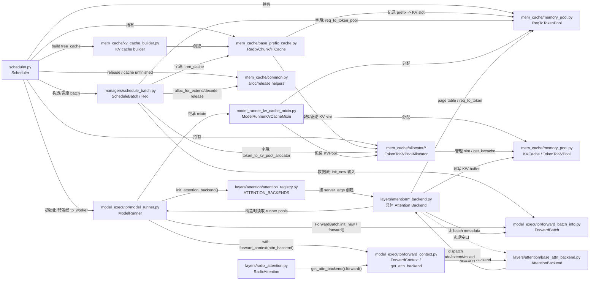

# SGLang KV Cache / ModelRunner / ScheduleBatch / Attention Backend Fan-in Fan-out

本文按模块间的依赖、持有、创建和调用方向梳理：

- `A --> B` 表示 `A` 扇出到 `B`。
- 换句话说，`A` import、持有、创建或调用 `B`。

## 模块扇入扇出摘要

### `ScheduleBatch`

- 扇入：主要来自 `Scheduler`。
- 扇出：`ReqToTokenPool`、`TokenToKVPoolAllocator`、`PrefixCache`、`mem_cache.common`、`ForwardBatch`。
- 作用：承接调度层高层 batch 状态，完成 KV slot 分配、释放、prefix 命中信息维护，并把运行所需字段交给 `ForwardBatch`。

### `ModelRunner`

- 扇入：主要来自 `Scheduler` / `TpModelWorker`。
- 扇出：`ModelRunnerKVCacheMixin`、`ForwardBatch`、attention registry、forward context。
- 作用：初始化模型、KV memory pool、attention backend，并在 forward 时把 `ForwardBatch` 和当前 attention backend 绑定到执行上下文。

### KV Cache

- 扇入：`Scheduler`、`ScheduleBatch`、`ModelRunnerKVCacheMixin`、attention backend。
- 扇出：allocator 管理物理 `KVPool`，prefix cache 管理复用和驱逐。
- 作用：`ReqToTokenPool` 维护请求 token 到物理 KV slot 的映射，`TokenToKVPoolAllocator` 管理 slot/page 分配，`KVPool` 保存真实 K/V tensor。

### Attention Backend

- 扇入：`ModelRunner` 初始化创建，`RadixAttention` 运行时调用。
- 扇出：`ForwardBatch` metadata、`ReqToTokenPool` page table、`KVPool` K/V buffer。
- 作用：按 decode/extend/mixed 模式准备 backend metadata，写入当前 token 的 K/V，并读取历史 K/V 执行 attention kernel。

