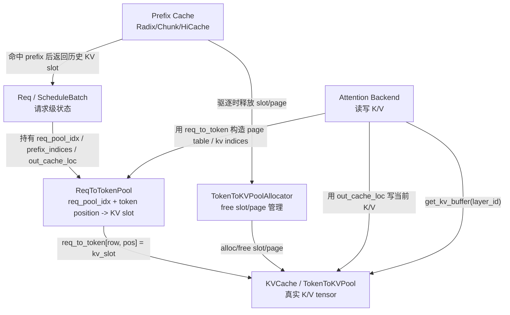

# SGLang 三层内存模型

SGLang 的 KV cache 不是一个单一的大 tensor，而是由三层职责明确的结构协作完成。源码在 `python/sglang/srt/mem_cache/memory_pool.py` 开头也直接说明了这个模型：

1. `ReqToTokenPool`：把 request 映射到 token 的物理 KV 位置。
2. `TokenToKVPoolAllocator`：管理哪些 KV slot/page 可用。
3. `KVCache`：真实持有每层 attention 的 K/V tensor。

可以把它理解成数据库里的三层索引：

- 请求行表：`ReqToTokenPool` 记录“某个请求的第 i 个 token 在哪个 KV slot”。
- 空闲空间管理器：allocator 记录“哪些 KV slot/page 还可以分配”。
- 真实数据页：`KVCache` 记录“slot/page 里真正的 K/V tensor 数据”。



## 第一层：`ReqToTokenPool`

`ReqToTokenPool` 定义在 `python/sglang/srt/mem_cache/memory_pool.py`。它的核心字段是：

```python
self.req_to_token = torch.zeros(
    (self._alloc_size, max_context_len),
    dtype=torch.int32,
    device=device,
)
self.free_slots = list(range(1, self._alloc_size))
```

其中：

- 行维度是 request slot，也就是 `req_pool_idx`。
- 列维度是该请求内的 token 位置。
- 单元格值是 token 对应的物理 KV slot。
- 第 0 行是 padding/dummy 行，正常请求从 slot 1 开始分配。

例如，某个请求拿到 `req_pool_idx = 17`，它已有 5 个 token，那么：

```text
req_to_token[17, 0] = 1024
req_to_token[17, 1] = 1025
req_to_token[17, 2] = 2048
req_to_token[17, 3] = 2049
req_to_token[17, 4] = 2050
```

这表示这个请求的第 0 到第 4 个 token 分别存放在物理 KV slot 1024、1025、2048、2049、2050。

这里要注意：`ReqToTokenPool` 不持有 K/V tensor 本身，它只持有“请求 token 到物理 KV slot”的映射。attention backend 后续通过这个表构造 page table、kv indices 或其他 backend metadata。

### request slot 的生命周期

`ReqToTokenPool.alloc(reqs)` 做的是 request row 分配：

- 如果请求还没有 `req_pool_idx`，从 `free_slots` 取一个空闲行。
- 如果请求已有 `req_pool_idx`，例如 chunked prefill 跨 chunk 继续运行，则复用原来的行。
- 请求结束后，`ReqToTokenPool.free(req)` 把该行号放回 `free_slots`。

所以第一层管理的是“请求维度”的并发容量。它限制的是同时活跃 request 数，而不是 KV token 总数。

## 第二层：`TokenToKVPoolAllocator`

allocator 定义在 `python/sglang/srt/mem_cache/allocator/`。它管理物理 KV slot/page 的空闲集合，但不直接保存 K/V tensor。

基类 `BaseTokenToKVPoolAllocator` 持有：

```python
self.size = size
self.page_size = page_size
self._kvcache = kvcache
self.free_pages = None
self.release_pages = None
```

关键接口是：

- `alloc(need_size)`：分配一批 KV slot。
- `free(free_index)`：释放一批 KV slot。
- `available_size()`：返回可用 token slot 数。
- `get_kvcache()`：拿到第三层真实 KV pool。
- `alloc_extend(...)` / `alloc_decode(...)`：paged allocator 的专用路径。

### 非分页 allocator

`TokenToKVPoolAllocator` 在 `allocator/token.py` 中，`page_size = 1`。它的分配粒度就是 token：

```python
self.free_pages = torch.arange(1, self.size + 1, dtype=torch.int64, device=self.device)
```

这里变量名仍叫 `free_pages`，但在非分页模式下每个“page”就是一个 token slot。

`alloc(need_size)` 直接从 `free_pages` 头部切出 `need_size` 个 slot；`free(free_index)` 把 slot 追加回空闲集合。

### 分页 allocator

`PagedTokenToKVPoolAllocator` 在 `allocator/paged.py` 中。它的空闲集合以 page 为单位管理，但返回值仍然是 token 粒度的物理 index。

例如 `page_size = 16`，分配一个 page id 为 10 的 page，返回的 token slot 是：

```text
160, 161, 162, ..., 175
```

分页 allocator 的几个关键点：

- `alloc(need_size)` 要求 `need_size` page aligned，然后返回完整 page 展开的 token indices。
- `alloc_extend(...)` 会根据 `prefix_lens`、`seq_lens`、`last_loc` 计算本轮 extend 需要的新 slot。
- `alloc_decode(...)` 会根据当前 `seq_lens` 和上一 token 的 `last_loc` 判断是否需要新 page。
- `free(free_index)` 会把 token indices 除以 `page_size` 后去重，最终释放 page。

因此分页模式下，`ReqToTokenPool` 仍然记录 token 粒度 slot，但 allocator 的真实复用粒度是 page。

## 第三层：`KVCache`

`KVCache` 是真实 K/V tensor 的抽象基类，定义在 `memory_pool.py`。核心接口是：

```python
get_key_buffer(layer_id)
get_value_buffer(layer_id)
get_kv_buffer(layer_id)
set_kv_buffer(layer, loc, cache_k, cache_v)
```

它保存每一层 attention 的 K/V buffer。常见实现包括：

- `MHATokenToKVPool`：标准 MHA/GQA 路径，分别持有 `k_buffer` 和 `v_buffer`。
- `MLATokenToKVPool`：MLA 路径，持有合并后的 MLA KV buffer。
- `MHATokenToKVPoolFP4` / `MLATokenToKVPoolFP4`：量化 KV cache。
- `SWAKVPool`：同时管理 full attention pool 和 sliding-window pool。
- `HybridLinearKVPool`：混合 Mamba/linear attention 场景。
- `DeepSeekV4TokenToKVPool` / DSA 相关 pool：特殊压缩和稀疏 attention 场景。

以 `MHATokenToKVPool` 为例，普通 NHD layout 下每层会创建：

```python
self.k_buffer[layer_id]: [size + page_size, head_num, head_dim]
self.v_buffer[layer_id]: [size + page_size, head_num, v_head_dim]
```

`size + page_size` 中额外的 `page_size` 主要给 padding/dummy token 留空间。slot 0 也被保留给 padding/dummy 写入。

attention backend 写 KV 时调用：

```python
token_to_kv_pool.set_kv_buffer(layer, out_cache_loc, k, v)
```

attention backend 读 KV 时调用：

```python
key_cache, value_cache = token_to_kv_pool.get_kv_buffer(layer.layer_id)
```

## 三层如何协作：初始化

KV cache 的初始化主要由 `ModelRunnerKVCacheMixin` 完成，入口在 `model_runner.alloc_memory_pool()`。

初始化顺序是：

1. 创建 `ReqToTokenPool`
   - 决定最多能同时承载多少 running requests。
   - 分配 `req_to_token` 矩阵。

2. 创建真实 `token_to_kv_pool`
   - 根据模型结构选择 MHA、MLA、DSA、SWA、Hybrid 等 pool。
   - 按层分配 K/V tensor。
   - 这一步是真正吃 GPU memory 的地方。

3. 创建 `token_to_kv_pool_allocator`
   - 把真实 KV pool 包起来。
   - 负责后续 slot/page 分配和释放。

4. 创建或挂接 prefix cache
   - `Scheduler` 通过 `kv_cache_builder` 创建 radix/chunk/hicache 等 tree cache。
   - prefix cache 复用第一层和第二层的信息：命中时返回历史 KV slot，驱逐时通过 allocator 释放 slot/page。

## Prefill / Extend：写入 prefix + suffix 映射

prefill 或 extend 阶段的核心问题是：请求已有一段 prefix 可能命中缓存，本轮只需要为未命中的 suffix 分配新 KV。

流程大致是：

1. `Req.init_next_round_input(tree_cache)` 查询 prefix cache。
2. prefix cache 返回命中的 `prefix_indices`。
3. `ScheduleBatch.prepare_for_extend()` 计算：
   - `prefix_lens`
   - `extend_lens`
   - `seq_lens`
   - `extend_num_tokens`
4. `mem_cache.common.alloc_for_extend(batch)` 分配 request rows 和 suffix KV slots。
5. `write_cache_indices(...)` 写入 `req_to_token_pool.req_to_token`。

最终 `req_to_token` 中会同时包含两段：

```text
[0, prefix_len)       -> prefix cache 命中的历史 KV slot
[prefix_len, seq_len) -> 本轮新分配的 out_cache_loc
```

也就是说，attention backend 不需要知道哪些 token 是 cache hit、哪些 token 是新算的。它只要看 `req_to_token`，就能得到这个请求完整上下文的 KV slot 序列。

## Decode：每步追加新 KV slot

decode 阶段通常每个请求每步新增一个 token。核心流程是：

1. `ScheduleBatch.prepare_for_decode()` 准备 decode batch。
2. `alloc_for_decode(batch, token_per_req)` 调 allocator 分配新 slot。
3. 把新 slot 写入：

```text
req_to_token_pool.req_to_token[req_pool_idx, seq_len] = out_cache_loc
```

4. 更新请求级 bookkeeping：
   - `seq_lens`
   - `kv_committed_len`
   - `kv_allocated_len`

非分页模式下，decode 只是拿一个新 token slot。

分页模式下，decode 会先看 `last_loc`：

- 如果当前 token 还能落在上一 page 后面，返回 `last_loc + 1`。
- 如果跨 page 边界，则消耗一个新 page，并返回新 page 的第一个 token slot。

所以分页 allocator 对外仍然返回 token 粒度 index，但内部保证同一请求的 token 按 page 规则布局。

## Attention backend 如何使用三层模型

attention backend 是三层模型的主要消费者。以 triton、flashinfer、flashattention backend 的通用模式看：

1. 构造 backend 时，从 `ModelRunner` 读取：
   - `req_to_token_pool`
   - `token_to_kv_pool`
   - `token_to_kv_pool_allocator`

2. 每次 forward 前，从 `ForwardBatch` 读取：
   - `req_pool_indices`
   - `seq_lens`
   - `out_cache_loc`
   - `extend_prefix_lens`
   - `extend_seq_lens`

3. 写入当前 token 的 K/V：

```python
self.token_to_kv_pool.set_kv_buffer(
    layer,
    forward_batch.out_cache_loc,
    k,
    v,
)
```

4. 构造 attention metadata：

```python
self.req_to_token_pool.req_to_token[
    forward_batch.req_pool_indices,
    :max_seq_len
]
```

5. 从真实 pool 取 K/V tensor 给 kernel：

```python
key_cache, value_cache = self.token_to_kv_pool.get_kv_buffer(layer.layer_id)
```

这就是三层模型在 forward 中的完整闭环：

```text
ForwardBatch.out_cache_loc
  -> 写当前 K/V 到 KVCache

ReqToTokenPool.req_to_token
  -> 告诉 kernel 每个请求历史 token 在哪些 KV slot

KVCache.get_kv_buffer(layer)
  -> 给 kernel 真实 K/V tensor
```

## Prefix cache 与三层模型的关系

Prefix cache 不是这三层里的某一层，而是围绕三层做复用和驱逐的“索引系统”。

它保存的是 token prefix 到 KV slot 的映射。例如 radix cache 的节点中会保存：

- token key 片段。
- 对应的 KV indices。
- lock/ref 信息。
- host cache 或 HiCache 相关信息。

命中时：

- `Req.prefix_indices` 被设置为已经存在的 KV slot。
- extend 阶段只为 suffix 分配新 slot。
- `write_cache_indices` 把 prefix slot 和 suffix slot 拼进 `ReqToTokenPool`。

驱逐时：

- prefix cache 选择可驱逐节点。
- 调 `token_to_kv_pool_allocator.free(node.value)` 释放对应 KV slot/page。
- 真实 `KVCache` tensor 不一定清零，但这些 slot/page 重新变成可分配空间。

因此 prefix cache 负责“哪些历史 KV 可以复用”，allocator 负责“复用失败时哪里还能写”，KV pool 负责“真实数据在哪里”。

## 释放路径

请求结束或中止时，释放通常分两类：

1. request row 释放
   - `ReqToTokenPool.free(req)` 释放 `req_pool_idx`。
   - 这表示这个 request row 可以给其他请求复用。

2. KV slot/page 释放或插入 prefix cache
   - 如果 KV 需要进入 prefix cache，则 slot 会被 tree cache 持有，不能立即 free。
   - 如果不插入或被驱逐，则通过 allocator 释放。

这也是为什么 `ReqToTokenPool` 和 allocator 是两层独立结构：释放 request row 不代表立刻释放所有 KV slot。某些 KV slot 可能因为 prefix cache 复用仍然保留。

## 常见变体

### `page_size == 1`

这是最直观的模式：

- allocator 以 token 为单位分配。
- `req_to_token` 中的值就是单个 token slot。
- free 时也是 token slot 粒度。

### `page_size > 1`

分页模式：

- allocator 以 page 为单位管理空闲空间。
- 返回给调度和 backend 的仍是 token 粒度 index。
- prefix cache 通常需要 page aligned，避免缓存半页带来的复用和释放复杂度。

### SWA / Sliding Window Attention

SWA 会引入 full pool 和 sliding-window pool 的对应关系：

- `SWAKVPool` 管理两套或组合式 KV 存储。
- `SWATokenToKVPoolAllocator` 同时考虑 full KV 和 SWA KV 的分配释放。
- backend 写入时可能需要 `KVWriteLoc(loc, swa_loc)`，同时写 full 和 swa 位置。
- 超出窗口的 SWA slot 会被 `free_swa_out_of_window_slots` 释放。

### MLA / DSA / DeepSeek V4

这些路径会改变第三层真实 KV 的布局：

- MHA 是分开的 K/V buffer。
- MLA 可能是合并后的 `kv_buffer`。
- DSA/DeepSeek V4 可能有压缩 KV、索引器状态、额外 state pool。

但前三层职责不变：

- 第一层仍然告诉请求的 token 对应哪些逻辑/物理位置。
- 第二层仍然管理位置分配和释放。
- 第三层仍然保存实际 tensor，只是布局更复杂。

## 关键结论

三层模型的核心价值是把三个问题拆开：

1. 请求序列如何映射到 KV 位置：`ReqToTokenPool`。
2. KV 空间如何分配、释放、分页、驱逐：`TokenToKVPoolAllocator`。
3. 每层 attention 的真实 K/V tensor 如何存取：`KVCache`。

调度层主要操作第一层和第二层，attention backend 主要消费第一层并读写第三层，prefix cache 横跨第一层和第二层做复用与驱逐。这种拆分让 SGLang 可以在同一套调度语义下支持普通 MHA、MLA、分页 KV、SWA、HiCache、DSA 和量化 KV cache。

