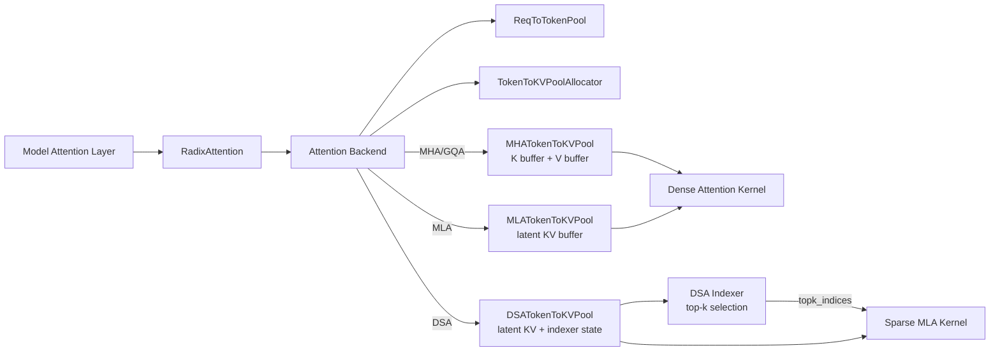

# MHA、MLA、DoubleSparse/DSA

本文解释三类 attention 形态在 SGLang 中的含义和落点：

- MHA：标准 Multi-Head Attention，也包括工程上相近的 GQA/MQA 普通 dense attention 路径。
- MLA：Multi-head Latent Attention，DeepSeek、Kimi、MiniCPM、Sarvam 等模型使用的低 KV cache 开销路径。
- DoubleSparse / DSA：当前仓库主要以 `DSA`、`DeepSeek Sparse Attention`、`DeepseekSparseAttnBackend` 命名，旧参数里可见 `nsa` alias。它是在 MLA 基础上进一步通过 indexer 选择 top-k KV token 的稀疏 attention 路径。

## 1. MHA：标准多头注意力

MHA 的核心形式是：

```text
Q: [tokens, num_q_heads, head_dim]
K: [tokens, num_kv_heads, head_dim]
V: [tokens, num_kv_heads, v_head_dim]

Attention(Q, K, V) = softmax(QK^T / sqrt(d)) V
```

标准 MHA 中，`num_q_heads == num_kv_heads`。很多现代模型使用 GQA/MQA，`num_kv_heads` 小于 `num_q_heads`，但在 SGLang 的普通 KV cache 路径里仍然属于 MHA-style dense attention：每个 token 的 K/V 都直接写进 KV cache，attention 时对可见上下文做 dense attention。

### SGLang 中的 MHA 表示

模型层通常使用 `python/sglang/srt/layers/radix_attention.py::RadixAttention` 作为统一 attention layer wrapper。它保存：

- `tp_q_head_num`
- `tp_k_head_num`
- `tp_v_head_num`
- `head_dim`
- `v_head_dim`
- `layer_id`

运行时，`RadixAttention.forward(...)` 不直接决定具体 kernel，而是调用当前 forward context 里的 attention backend：

```python
return get_attn_backend().forward(
    q,
    k,
    v,
    self,
    forward_batch,
    save_kv_cache,
    **kwargs,
)
```

也就是说，MHA/GQA 的模型层与 backend 解耦。backend 可以是 triton、flashinfer、flashattention、torch native、fa3 等。

### MHA 的 KV cache 布局

MHA 的真实 KV pool 是 `python/sglang/srt/mem_cache/memory_pool.py::MHATokenToKVPool`。

普通 NHD layout 下，每层分别持有：

```text
k_buffer[layer_id]: [size + page_size, head_num, head_dim]
v_buffer[layer_id]: [size + page_size, head_num, v_head_dim]
```

其中：

- `size` 是可用 KV token slot 数。
- `page_size` 是分页 KV cache 的 page 大小；非分页时通常是 1。
- 额外的 `page_size` 用于 padding/dummy token。
- `head_num` 对应该 TP rank 本地的 KV head 数。

写入路径：

```python
token_to_kv_pool.set_kv_buffer(layer, out_cache_loc, k, v)
```

读取路径：

```python
key_cache, value_cache = token_to_kv_pool.get_kv_buffer(layer.layer_id)
```

attention backend 再结合 `ReqToTokenPool.req_to_token` 构造 page table 或 kv indices。

### MHA 的特点

优点：

- 实现最直接。
- kernel 生态成熟，FlashAttention、FlashInfer、Triton 等都有高性能实现。
- 对短上下文、普通模型、广泛硬件支持最好。

代价：

- KV cache 体积大。
- 每个 token 都需要保存完整 K/V。
- 长上下文下 decode 的 memory bandwidth 压力明显。

MHA KV cache 大致与下面因素成正比：

```text
num_layers * num_tokens * num_kv_heads * (k_head_dim + v_head_dim) * dtype_size
```

GQA/MQA 通过减少 `num_kv_heads` 降低 KV cache，但它仍然保存完整 K/V 表示。

## 2. MLA：Multi-head Latent Attention

MLA 的目标是减少 KV cache 体积。它不把每个 head 完整 K/V 都缓存下来，而是缓存一个低秩 latent 表示，再在计算时通过投影恢复或吸收到 attention 计算里。

在 DeepSeek 风格 MLA 中，关键维度通常包括：

- `kv_lora_rank`：低秩 latent KV 维度。
- `qk_nope_head_dim`：不使用 RoPE 的 Q/K 维度。
- `qk_rope_head_dim`：使用 RoPE 的 Q/K 维度。
- `v_head_dim`：V 维度。

KV cache 不再保存：

```text
K: [num_kv_heads, qk_head_dim]
V: [num_kv_heads, v_head_dim]
```

而是保存：

```text
latent KV: [kv_lora_rank + qk_rope_head_dim]
```

其中：

- `kv_lora_rank` 部分是低秩 latent 内容。
- `qk_rope_head_dim` 部分保存带位置编码的 rope key 信息。

### SGLang 中的 MLA 模型结构

DeepSeek V2/V3 路径在 `python/sglang/srt/models/deepseek_v2.py::DeepseekV2AttentionMLA`。

核心组件包括：

- `kv_a_proj_with_mqa`
  - 从 hidden states 生成低秩 latent KV 和 rope K。
- `kv_a_layernorm`
  - 对 latent KV 做归一化。
- `kv_b_proj`
  - 从 latent KV 恢复或吸收出每个 head 的 K/V 分量。
- `attn_mqa`
  - MLA 主路径使用的 `RadixAttention`，维度是 `kv_lora_rank + qk_rope_head_dim`。
- `attn_mha`
  - 某些 dense fallback、chunked prefix 或兼容路径使用的 MHA 形式 attention。

源码中可以看到两个 `RadixAttention`：

```text
attn_mqa:
  head_dim = kv_lora_rank + qk_rope_head_dim
  v_head_dim = kv_lora_rank

attn_mha:
  head_dim = qk_nope_head_dim + qk_rope_head_dim
  v_head_dim = v_head_dim
```

这反映了 MLA 的双形态：缓存和主计算围绕 latent KV，但某些路径仍然会展开到 MHA-like dense form。

### MLA 的 KV cache 布局

MLA 的真实 KV pool 是 `python/sglang/srt/mem_cache/memory_pool.py::MLATokenToKVPool`。

它每层只保存一个 `kv_buffer`：

```text
kv_buffer[layer_id]: [size + page_size, 1, kv_lora_rank + qk_rope_head_dim]
```

这里的 `1` 表示 MLA cache 不是按多个 KV heads 保存完整 K/V，而是每 token 保存一份 latent KV。

读取接口仍然兼容 `KVCache`：

```python
get_key_buffer(layer_id)
get_value_buffer(layer_id)
get_kv_buffer(layer_id)
```

但语义不同：

- `get_key_buffer` 返回完整 latent KV buffer。
- `get_value_buffer` 返回前 `kv_lora_rank` 部分。
- `get_kv_buffer` 返回二者组合，供 backend 按 MLA kernel 语义使用。

写入有两种常见入口：

```python
set_kv_buffer(layer, loc, cache_k, cache_v)
set_mla_kv_buffer(layer, loc, cache_k_nope, cache_k_rope)
```

`set_mla_kv_buffer` 会把 non-RoPE latent 部分和 RoPE 部分写进同一个 MLA KV cache。

### MLA 的性能意义

MLA 的主要收益是 KV cache 显著变小。对长上下文和高并发 decode 来说，这通常比减少算力更关键，因为 decode 阶段经常受 KV cache memory bandwidth 限制。

MHA-style KV cache 大致是：

```text
num_kv_heads * (qk_head_dim + v_head_dim)
```

MLA KV cache 大致是：

```text
kv_lora_rank + qk_rope_head_dim
```

例如 DeepSeek 风格模型中，`kv_lora_rank` 和 `qk_rope_head_dim` 远小于完整多头 K/V 展开后的维度，因此 KV cache 体积明显降低。

### MLA 的 backend

SGLang 支持多个 MLA backend，入口在 `attention_registry.py`：

- `flashinfer` / `flashinfer_mla`
- `flashmla`
- `trtllm_mla`
- `tokenspeed_mla`
- `cutlass_mla`
- `fa3`
- `triton`
- `aiter` 等

`ModelRunner` 会根据模型配置和 server args 设置 `use_mla_backend`，再通过 registry 创建具体 backend。

MLA 的复杂点在于：

- KV cache 不是普通 K/V 分离形态。
- q/nope、q/rope、k/nope、k/rope 的组合和 RoPE 处理更复杂。
- 一些优化会做 weight absorption，把 `kv_b_proj` 的效果吸收到 attention 计算中，减少显式展开。
- DP Attention 对 MLA 特别有价值，因为 MLA 的 KV 在 TP rank 之间更容易出现重复存储，DP attention 可以减少重复 KV cache。

## 3. DoubleSparse / DSA：在 MLA 上做稀疏选择

当前仓库和文档里更常用的名字是 DSA：DeepSeek Sparse Attention。用户说的 DoubleSparse 在这里可以理解为 DSA 这一类“带 indexer 的稀疏 MLA attention”路径。

DSA 出现在 DeepSeek-V3.2、GLM-5 等模型中。官方文档描述为：

- DeepSeek-V3.2 在 DeepSeek-V3.1-Terminus 基础上继续训练，引入 DeepSeek Sparse Attention。
- DSA 是 fine-grained sparse attention。
- 它由 lightning indexer 驱动，在长上下文场景降低 attention 成本。

### DSA 的核心思想

普通 MLA 仍然对上下文内所有 token 做 attention，只是 KV cache 表示更小。

DSA 进一步做一件事：

```text
对每个 query token，用 indexer 从历史 KV 中选出 top-k 相关 token；
attention kernel 只 attend 这些 selected KV token。
```

因此 DSA 有两条数据流：

1. 正常 MLA KV cache
   - 保存 latent KV 和 rope KV。
   - 用于最终 attention 输出。

2. indexer KV / index cache
   - 保存或计算用于快速筛选 top-k 的索引表示。
   - 输出 `topk_indices`。

最终 sparse attention kernel 使用：

```text
Q + MLA KV cache + topk_indices -> sparse attention output
```

### SGLang 中的 DSA backend

DSA backend 是：

```text
python/sglang/srt/layers/attention/dsa_backend.py::DeepseekSparseAttnBackend
```

它注册在 `attention_registry.py`：

```text
attention_backend = "dsa"
```

旧 alias：

```text
attention_backend = "nsa"
```

会 warning 并转到 DSA。

DSA backend 支持的 prefill/decode kernel 包括：

- `flashmla_sparse`
- `flashmla_kv`
- `flashmla_auto`
- `fa3`
- `tilelang`
- `aiter`
- `trtllm`

server args 中对应：

```text
--dsa-prefill-backend
--dsa-decode-backend
--dsa-topk-backend
```

旧 alias：

```text
--nsa-prefill-backend
--nsa-decode-backend
```

### DSA 的 KV cache 布局

DSA 的 pool 是 `DSATokenToKVPool`，它继承自 `MLATokenToKVPool`：

```text
class DSATokenToKVPool(MLATokenToKVPool)
```

这说明 DSA 的主 KV cache 仍然是 MLA-style latent KV cache，而不是回到普通 MHA K/V。

但 DSA 会额外维护 indexer 相关 buffer：

- `index_head_dim`
- indexer K cache
- top-k transform metadata
- DSA-specific page table / sequence length metadata

源码里 `DSAMetadata` 保存了大量运行时元数据，例如：

- `page_table_1`
- `real_page_table`
- `dsa_cache_seqlens_int32`
- `dsa_cu_seqlens_q`
- `dsa_cu_seqlens_k`
- `dsa_seqlens_expanded`
- `topk_indices_offset`
- `indexer_k_start_end`
- `indexer_seq_lens`
- `token_to_batch_idx`

这些不是普通 MHA/MLA 所需的元数据，而是为了让 indexer 和 sparse kernel 在 ragged/page table 之间正确转换。

### DSA 的执行流程

可以把 DSA forward 拆成四步：

1. 准备 batch metadata
   - `DeepseekSparseAttnBackend.init_forward_metadata(...)`
   - 计算 page table、sequence lengths、top-k transform 方法、indexer 范围。

2. indexer 计算 top-k
   - `dsa/dsa_indexer.py`
   - 根据 query/indexer key 得到 `topk_indices`。
   - top-k backend 可选 `sgl-kernel`、`torch`、`flashinfer`。

3. transform top-k indices
   - 将 top-k 的逻辑 token index 转换成 sparse kernel 需要的 page table 或 ragged KV index。
   - 对应 `TopkTransformMethod.RAGGED` 或 `TopkTransformMethod.PAGED`。

4. sparse attention
   - `flashmla_sparse`：使用 sparse indices 读 BF16 KV。
   - `flashmla_kv`：面向 FP8 KV cache 的路径。
   - `trtllm` / `tilelang` / `fa3` 等按硬件和 dtype 选择。

### MHA_ONE_SHOT fallback

DSA backend 里有一个重要优化：短 prefill 可自动走标准 MHA。

文档中默认阈值是 2048 tokens。短序列时，稀疏 indexer 和 sparse kernel 的额外开销可能不划算，因此 DSA backend 会用 `MHA_ONE_SHOT`：

```text
对 prefix + extend token 一次性做 dense MHA attention。
```

这不是模型变成 MHA，而是 DSA backend 针对短序列选择 dense attention kernel，以提高吞吐。

阈值可通过环境变量调整：

```text
SGLANG_DSA_PREFILL_DENSE_ATTN_KV_LEN_THRESHOLD
```

旧 alias：

```text
SGLANG_NSA_PREFILL_DENSE_ATTN_KV_LEN_THRESHOLD
```

阈值调大可能提升 prefill 性能，但可能有精度风险，文档中也提示了这一点。

## 4. 三者对比

| 项目 | MHA / GQA | MLA | DoubleSparse / DSA |
| --- | --- | --- | --- |
| KV cache 内容 | 完整 K/V | latent KV + rope K | MLA-style KV + indexer 相关状态 |
| Attention 范围 | dense 全上下文 | dense 全上下文 | indexer 选出的 top-k sparse 上下文 |
| 主要节省 | GQA/MQA 可减少 KV heads | 显著减少每 token KV 维度 | 长上下文下减少实际 attend token 数 |
| SGLang pool | `MHATokenToKVPool` | `MLATokenToKVPool` | `DSATokenToKVPool` |
| SGLang backend | triton/flashinfer/fa/torch 等 | flashinfer_mla/flashmla/fa3/trtllm_mla 等 | `DeepseekSparseAttnBackend` |
| 复杂度 | 最低 | 中等，需要 latent/absorb 逻辑 | 最高，需要 indexer/top-k/sparse kernel |
| 典型模型 | Llama/Qwen/Mistral 等 | DeepSeek V2/V3、Kimi、Sarvam MLA | DeepSeek V3.2、GLM-5 |

## 5. 与三层内存模型的关系

三层内存模型仍然成立，只是第三层真实 KV pool 的布局不同。

### MHA

```text
ReqToTokenPool:
  req token -> KV slot

Allocator:
  管理 token/page slot

KVCache:
  k_buffer[layer][slot, head, dim]
  v_buffer[layer][slot, head, dim]
```

### MLA

```text
ReqToTokenPool:
  req token -> KV slot

Allocator:
  管理 token/page slot

KVCache:
  kv_buffer[layer][slot, 1, kv_lora_rank + qk_rope_head_dim]
```

### DSA

```text
ReqToTokenPool:
  req token -> KV slot

Allocator:
  管理 token/page slot，部分路径要求 page_size 固定或对齐

KVCache:
  MLA-style kv_buffer
  + DSA indexer KV / metadata / topk indices
```

## 6. Mermaid 总览



## 7. 实践判断

看一个模型或路径属于哪类，可以从几个信号判断：

- 如果 KV pool 是 `MHATokenToKVPool`，通常是普通 MHA/GQA dense attention。
- 如果模型有 `kv_lora_rank`、`qk_rope_head_dim`、`kv_a_proj_with_mqa`、`kv_b_proj`，通常是 MLA。
- 如果 attention backend 是 `dsa`，或者模型配置被 `is_deepseek_dsa(...)` 识别，通常是 DSA/DoubleSparse。
- 如果 backend 中出现 `topk_indices`、`dsa_index_topk`、`dsa_topk_backend`、`DeepseekSparseAttnBackend`，就是稀疏 attention 路径。
- 如果短 prefill 下 DSA 走 `MHA_ONE_SHOT`，它只是 DSA backend 的 dense fallback，不代表模型结构退化为普通 MHA。

简化理解：

```text
MHA：缓存完整 K/V，对全上下文做 dense attention。
MLA：缓存低秩 latent KV，对全上下文做 dense attention。
DSA：缓存 MLA-style KV，用 indexer 选 top-k，对稀疏上下文做 attention。
```

