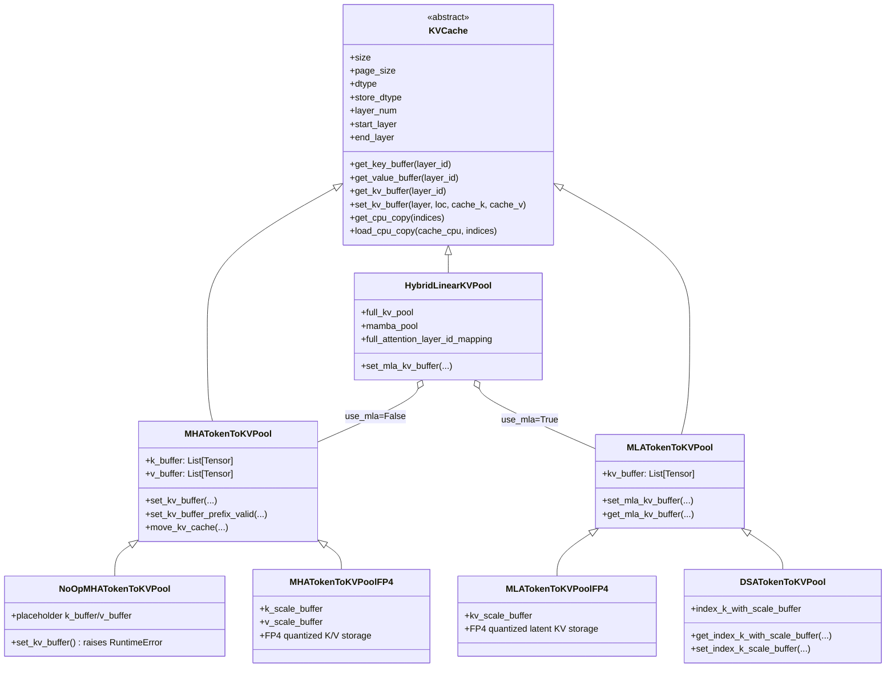
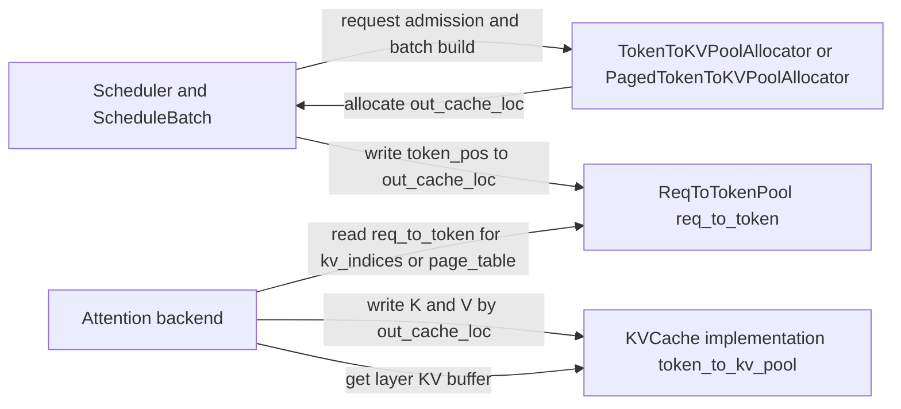
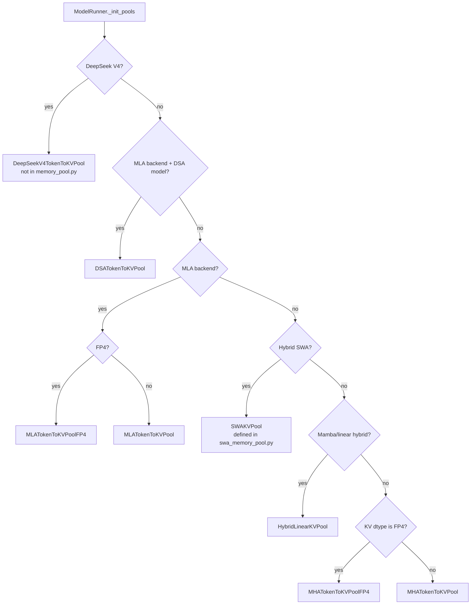

# SGLang `memory_pool.py::KVCache` 及实现类导读

本文基于 `python/sglang/srt/mem_cache/memory_pool.py` 梳理 `KVCache` 抽象类及其在同文件中的实现类。这里的 `KVCache` 是 SGLang KV cache 三层结构中的最底层：它真正持有每层的物理 K/V tensor。上层 `ReqToTokenPool` 负责“请求 token 位置 -> KV slot”的映射，`TokenToKVPoolAllocator` 负责 slot/page 分配，`KVCache` 负责这些 slot 里的真实 K/V 数据。

## 1. 类关系图



## 2. 运行时关系图



关键点是：`Allocator` 分配的是 KV slot index，`ReqToTokenPool` 记录请求如何找到这些 slot，`KVCache` 在这些 slot 上保存真实 K/V。三者通过同一个 `out_cache_loc` 串起来。

## 3. `KVCache` 抽象基类

`KVCache` 是所有物理 KV pool 的抽象基类，定义在 `memory_pool.py` 中。它初始化并保存所有实现类共有的元数据：

- `size`：真实 KV token slot 数。
- `page_size`：分页 KV cache 的 page 大小；非分页场景通常为 1。
- `dtype`：逻辑 KV dtype。
- `store_dtype`：实际存储 dtype。源码中对 FP8 做了特殊处理：如果 `dtype` 是 `torch.float8_e5m2`、`torch.float8_e4m3fn` 或 `torch.float8_e4m3fnuz`，底层存储使用 `torch.uint8`，因为部分 float8 tensor 的 indexed write 支持不完整。
- `layer_num`：当前 worker 负责的层数。
- `start_layer` / `end_layer`：pipeline parallel 或分层加载时的层范围。
- `memory_saver_adapter`：用于 KV cache 显存区域管理。
- `cpu_offloading_chunk_size`：CPU offload 时按 chunk 搬运 KV。
- `layer_transfer_counter`：layer-wise KV loading 场景下用于同步某层是否已传输完成。
- `custom_mem_pool`：disaggregation / NVLink 场景下可选的自定义 memory pool。

抽象接口主要有四类：

- 读 buffer：`get_key_buffer`、`get_value_buffer`、`get_kv_buffer`。
- 写 buffer：`set_kv_buffer`。
- CPU offload：`get_cpu_copy`、`load_cpu_copy`。
- 显存统计：`get_kv_size_bytes` 由实现类提供，`_finalize_allocation_log` 统一记录日志和 `mem_usage`。

## 4. `MHATokenToKVPool`

`MHATokenToKVPool` 是普通 MHA/GQA 模型最常用的实现类。它为每一层分别保存 K 和 V：

```text
k_buffer[layer]: [size + page_size, head_num, head_dim]
v_buffer[layer]: [size + page_size, head_num, v_head_dim]
```

`size + page_size` 中多出来的空间用于 dummy/padded 写入和分页对齐。allocator 通常从 1 开始分配有效 slot，slot 0 可以作为安全的 padding 目标。

### 4.1 默认 NHD 和 AITER 5D layout

默认 layout 是 NHD，即 `[slot, head, dim]`。

在 HIP + AITER backend 下，如果设置 `SGLANG_AITER_KV_CACHE_LAYOUT=vectorized_5d`，会使用 SHUFFLE 5D layout：

```text
K: [num_blocks, H, D_k / X, page_size, X]
V: [num_blocks, H, page_size / X, D_v, X]
```

这是为了让 AITER kernel 直接消费更适合向量化访问的物理布局。非 AITER 平台不会启用该布局。

### 4.2 读写路径

读取接口：

```python
get_key_buffer(layer_id)
get_value_buffer(layer_id)
get_kv_buffer(layer_id)
```

如果 `store_dtype != dtype`，读取时会把底层 `uint8` buffer `view` 成逻辑 dtype。

写入接口 `set_kv_buffer(...)` 的主要步骤：

1. 用 `unwrap_write_loc` 从 `KVWriteLoc` 或裸 tensor 中取出 full-pool 写入位置。
2. 用 `maybe_detect_oob` 检查 slot 是否越界。
3. 如有必要，把 `cache_k/cache_v` cast 到 pool 的 `dtype`。
4. 如果底层以 `store_dtype` 保存，则转成对应 view。
5. AITER 5D layout 走 `launch_reshape_and_cache_shuffle_5d`。
6. 默认路径走 `_set_kv_buffer_impl`。

`_set_kv_buffer_impl` 会按平台选择优化写入：

- CUDA/HIP 上优先使用 JIT `store_cache`。
- CPU AMX 上使用 `torch.ops.sgl_kernel.store_cache_cpu`。
- CUDA graph capture 时可用 `alt_stream` 分流 K/V 写入。
- 否则退化为直接 indexed assignment。

### 4.3 额外能力

`MHATokenToKVPool` 还支持：

- `set_kv_buffer_prefix_valid`：按二维 loc 和 commit length 只写有效 prefix 区域。
- `move_kv_cache`：把所有层的 K/V 从 `src_loc` 搬到 `tgt_loc`，用于 speculative decoding 等场景。
- `get_cpu_copy` / `load_cpu_copy`：按 layer 和 chunk 做 CPU offload 或恢复。
- `get_contiguous_buf_infos`：返回 K/V buffer 的 data pointer、buffer byte length 和 item byte length，用于 disaggregation 传输。

## 5. `NoOpMHATokenToKVPool`

`NoOpMHATokenToKVPool` 继承自 `MHATokenToKVPool`，用于特殊的 prefill-only 场景，例如 embedding mode 下的 FA `fa_skip_kv_cache` 路径。

它不会分配真正的大型 KV cache，只为每层创建很小的 placeholder：

```text
k_buffer[layer]: [page_size, head_num, head_dim]
v_buffer[layer]: [page_size, head_num, v_head_dim]
```

这样可以让代码中无条件访问 `k_buffer/v_buffer` 的路径继续工作，但显存占用接近 0。该类的 `set_kv_buffer` 会直接抛错，因为一旦真的写 KV，就说明当前 workload 不应该使用 no-op pool。

## 6. `MHATokenToKVPoolFP4`

`MHATokenToKVPoolFP4` 是 MHA 的 FP4 KV cache 实现。它继承 `MHATokenToKVPool`，但重写 buffer 创建和读写逻辑。

主要结构：

```text
k_buffer[layer]:       [size + page_size, head_num, head_dim / 2] uint8
v_buffer[layer]:       [size + page_size, head_num, head_dim / 2] uint8
k_scale_buffer[layer]: [size + page_size, head_num * head_dim / 16] uint8
v_scale_buffer[layer]: [size + page_size, head_num * head_dim / 16] uint8
```

FP4 两个值压缩到一个 byte，因此主 buffer 的最后一维是 `head_dim / 2`。scale buffer 保存 block quantization 所需的 scale。写入时会调用 FP4 quantization 工具，把 K/V 和 scale 分别写入主 buffer 与 scale buffer。

## 7. `MLATokenToKVPool`

`MLATokenToKVPool` 是 MLA 模型的物理 KV pool。与 MHA 不同，MLA 不维护独立的 K/V 两个 buffer，而是每层维护一个 combined latent KV buffer：

```text
kv_buffer[layer]: [size + page_size, 1, kv_lora_rank + qk_rope_head_dim]
```

其中：

- 前 `kv_lora_rank` 维是 latent/nope 部分。
- 后 `qk_rope_head_dim` 维是 rope 部分。

`get_key_buffer(layer_id)` 返回整块 combined buffer。`get_value_buffer(layer_id)` 返回前 `kv_lora_rank` 维的视图。`get_kv_buffer(layer_id)` 返回 `(combined_buffer, value_view)`。

### 7.1 MLA 专用读写

除通用 `set_kv_buffer` 外，MLA pool 还提供：

```python
set_mla_kv_buffer(layer, loc, cache_k_nope, cache_k_rope)
get_mla_kv_buffer(layer, loc, dst_dtype=None)
```

`set_mla_kv_buffer` 用 `set_mla_kv_buffer_triton` 把 `cache_k_nope` 和 `cache_k_rope` 写入同一个 combined buffer，避免在 Python 侧显式拼接。`get_mla_kv_buffer` 则用 `get_mla_kv_buffer_triton` 从 combined buffer 中拆出 nope 和 rope 两段。

DSA + FP8 场景下，`MLATokenToKVPool` 会走特殊量化路径，例如 `quantize_k_cache_separate` 或 `set_mla_kv_buffer_triton_fp8_quant`。

## 8. `MLATokenToKVPoolFP4`

`MLATokenToKVPoolFP4` 是 MLA 的 FP4 版本。它继承 `MLATokenToKVPool`，但把 combined KV 以 FP4 压缩格式保存：

```text
kv_buffer[layer]:       [size + page_size, 1, kv_cache_dim / 2] uint8
kv_scale_buffer[layer]: [size + page_size, kv_cache_dim / 16] uint8
```

读取 `get_key_buffer` 时会使用 `BlockFP4KVQuantizeUtil.batched_dequantize` 反量化。写入 `set_kv_buffer` 或 `set_mla_kv_buffer` 时会先量化，然后把数据和 scale 写入对应 buffer。

## 9. `DSATokenToKVPool`

`DSATokenToKVPool` 继承 `MLATokenToKVPool`，用于 DeepSeek Sparse Attention。它保留 MLA combined KV 的 `kv_buffer`，同时额外维护 indexer 使用的 buffer：

```text
index_k_with_scale_buffer[layer]:
    [num_pages, page_size * (index_head_dim + index_head_dim / 128 * 4)]
```

源码中固定：

- `quant_block_size = 128`
- `index_k_with_scale_buffer_dtype = torch.uint8`
- `rope_storage_dtype = torch.bfloat16`
- `index_head_dim == 128`

非 HIP 平台要求 `page_size == 64`；HIP 上根据 AITER preshuffle 能力允许不同约束。

DSA 新增的核心接口包括：

- `get_index_k_with_scale_buffer(layer_id)`
- `get_index_k_continuous(layer_id, seq_len, page_indices)`
- `get_index_k_scale_continuous(layer_id, seq_len, page_indices)`
- `get_index_k_scale_buffer(...)`
- `set_index_k_scale_buffer(layer_id, loc, index_k, index_k_scale)`

`move_kv_cache` 也被重写：它不仅移动 MLA latent KV，还会同步移动 `index_k_with_scale_buffer`，确保 speculative decoding 或 KV 重排后 indexer cache 与主 KV 仍然一致。

CPU offload 也被增强：`get_cpu_copy` 返回 `{"kv": ..., "index_k": ...}`，避免恢复请求时只恢复主 KV、却留下其他请求写过的 index/scale 数据。

## 10. `HybridLinearKVPool`

`HybridLinearKVPool` 用于 full attention + linear/Mamba attention 混合模型。它自身继承 `KVCache`，但内部并不直接创建所有 K/V tensor，而是组合：

- `full_kv_pool`：只给 full attention 层使用，可以是 `MHATokenToKVPool` 或 `MLATokenToKVPool`。
- `mamba_pool`：保存 Mamba/linear attention 的 state。

它维护一张层号映射：

```python
self.full_attention_layer_id_mapping = {
    id: i for i, id in enumerate(full_attention_layer_ids)
}
```

外部仍用原始 `layer_id` 调用 `get_kv_buffer` / `set_kv_buffer`，`HybridLinearKVPool` 会先把模型全局层号转换成 `full_kv_pool` 内部的紧凑层号，再委托给 `full_kv_pool`。

如果 `use_mla=False`，`full_kv_pool` 是 MHA pool；如果 `use_mla=True`，`full_kv_pool` 是 MLA pool。因此它既是一个 `KVCache` 实现，也是一个组合适配器。

## 11. `KVWriteLoc` 和 SWA 写入位置

`memory_pool.py` 中还定义了 `KVWriteLoc`：

```python
@dataclass
class KVWriteLoc:
    loc: torch.Tensor
    swa_loc: Optional[torch.Tensor] = None
```

它不是 `KVCache` 子类，但对 KV pool 写入很重要。`loc` 是 full KV pool 的写入位置，`swa_loc` 是 sliding-window attention pool 的写入位置。普通 `MHATokenToKVPool` 和 `MLATokenToKVPool` 通过 `unwrap_write_loc` 只取 `loc`；SWA 组合 pool 则可以同时使用两套位置。

这个设计让 attention backend 不必为 full/SWA pool 写两套调用逻辑，可以统一传入 `KVWriteLoc(cache_loc, swa_out_cache_loc)`。

## 12. 选择逻辑概览

虽然本文聚焦 `memory_pool.py`，但实际使用哪个 `KVCache` 实现由 `ModelRunner._init_pools` 决定：



同文件中的实现类覆盖了最核心的 MHA、MLA、DSA、FP4 和 Mamba hybrid 情况；SWA、DeepSeek V4、NPU 平台实现等位于其他文件中，但仍遵循 `KVCache` 接口。

## 13. 设计总结

`KVCache` 的核心价值是把“真实 KV tensor 的物理布局”从调度、请求映射、prefix cache 和 attention backend 中抽象出来。

- MHA 用独立 `k_buffer/v_buffer`。
- MLA 用 combined `kv_buffer`。
- FP4/FP8 用 `uint8` 存储加 scale 或 dtype view。
- DSA 在 MLA KV 之外增加 indexer cache。
- HybridLinear 用组合模式把 full attention KV 和 Mamba state 合并成一个统一接口。
- NoOp pool 用 placeholder 保持接口形状，同时避免 prefill-only 场景分配真实 KV。

因此 attention backend 只需要面向 `set_kv_buffer` / `get_kv_buffer` / `get_key_buffer` 等接口编程，而具体底层是 MHA、MLA、DSA、量化、Mamba hybrid 还是 no-op，都由 pool 实现类隐藏。
