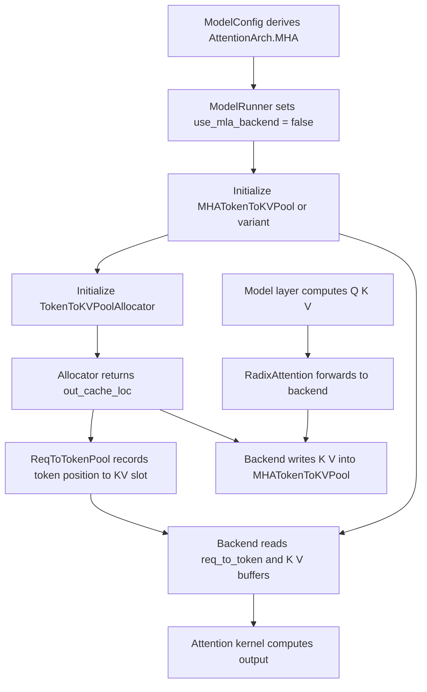

# SGLang MHA 模型源码导读

本文基于当前仓库源码介绍 SGLang 中的 MHA 模型路径。这里的 MHA 指 Multi-Head Attention 架构族，在 SGLang 的 `ModelConfig` 中对应 `AttentionArch.MHA`。典型模型包括 Llama、Qwen、Mistral、Mixtral、Gemma 等大多数传统 Transformer decoder-only 模型。注意：SGLang 里很多“非 MLA”的 GQA/MQA 模型也走 MHA 架构路径，只是 `num_attention_heads` 和 `num_key_value_heads` 可能不同。

核心源码位置：

- `python/sglang/srt/configs/model_config.py`
- `python/sglang/srt/models/llama.py`
- `python/sglang/srt/layers/radix_attention.py`
- `python/sglang/srt/layers/attention/attention_registry.py`
- `python/sglang/srt/model_executor/model_runner_kv_cache_mixin.py`
- `python/sglang/srt/mem_cache/memory_pool.py`

## 1. MHA 在 SGLang 中如何识别

SGLang 用 `AttentionArch` 区分模型 attention 架构：

```python
class AttentionArch(IntEnum):
    MLA = auto()
    MHA = auto()
```

`ModelConfig._derive_model_shapes()` 会根据 HuggingFace config 的 `architectures`、`num_attention_heads`、`num_key_value_heads`、DeepSeek/GLM/Kimi 等特殊字段推导 attention 架构。

源码中大量特殊模型会显式设置为 `AttentionArch.MLA`，例如 DeepSeek V2/V3、部分 GLM MoE Lite、Kimi、MiniCPM3 等。除此之外，默认分支会落到：

```python
self.attention_arch = AttentionArch.MHA
```

因此，在 SGLang 中可以把 MHA 路径理解为：不需要 MLA latent KV 表示的常规 Q/K/V attention 架构。它可以是标准 MHA，也可以是 GQA/MQA，只要模型 forward 产生显式 K/V，并把 K/V 写入普通 KV cache。

`ModelRunner` 里再把这个配置变成运行时布尔值：

```python
self.use_mla_backend = self.model_config.attention_arch == AttentionArch.MLA
```

所以 MHA 模型的关键判断就是：

```text
not runner.use_mla_backend
```

## 2. MHA/GQA/MQA 的头数关系

以 `LlamaAttention` 为例，初始化时会接收：

- `num_heads`：query heads 总数。
- `num_kv_heads`：key/value heads 总数。
- `head_dim`：每个 head 的维度。

在 tensor parallel 下，SGLang 会按 TP size 切分 heads：

```python
self.total_num_heads = num_heads
self.num_heads = self.total_num_heads // tp_size
self.total_num_kv_heads = num_kv_heads
self.num_kv_heads = max(1, self.total_num_kv_heads // tp_size)
```

如果 `num_key_value_heads == num_attention_heads`，就是严格意义上的 MHA，每个 Q head 有自己的 K/V head。

如果 `num_key_value_heads < num_attention_heads`，就是 GQA/MQA。SGLang 仍然走 MHA 架构路径，因为它仍然使用普通 K/V cache，只是 K/V head 数少于 Q head 数。`RadixAttention` 中对应字段是：

```python
self.tp_q_head_num = num_heads
self.tp_k_head_num = num_kv_heads
self.tp_v_head_num = num_kv_heads
```

## 3. 典型模型层：`LlamaAttention`

`python/sglang/srt/models/llama.py::LlamaAttention` 是理解 MHA 路径的好入口。

初始化时它创建 fused QKV projection：

```python
self.qkv_proj = QKVParallelLinear(
    hidden_size,
    self.head_dim,
    self.total_num_heads,
    self.total_num_kv_heads,
    ...
)
```

然后创建输出 projection：

```python
self.o_proj = RowParallelLinear(
    self.total_num_heads * self.head_dim,
    hidden_size,
    ...
)
```

再创建 RoPE 和 `RadixAttention`：

```python
self.rotary_emb = get_rope(...)
self.attn = RadixAttention(
    self.num_heads,
    self.head_dim,
    self.scaling,
    num_kv_heads=self.num_kv_heads,
    layer_id=layer_id,
    ...
)
```

forward 时流程很直接：

```python
qkv, _ = self.qkv_proj(hidden_states)
q, k, v = qkv.split([self.q_size, self.kv_size, self.kv_size], dim=-1)
q, k = self.rotary_emb(positions, q, k)
attn_output = self.attn(q, k, v, forward_batch)
output, _ = self.o_proj(attn_output)
```

所以 MHA 模型层的主线是：

```text
hidden_states -> qkv_proj -> q/k/v -> RoPE(q,k) -> RadixAttention -> o_proj
```

## 4. `RadixAttention` 是统一入口

`RadixAttention` 位于 `python/sglang/srt/layers/radix_attention.py`。它本身不实现具体 FlashAttention/FlashInfer/Triton kernel，而是把请求转发给当前 attention backend：

```python
return get_attn_backend().forward(
    q,
    k,
    v,
    self,
    forward_batch,
    save_kv_cache,
    **kwargs,
)
```

在进入 backend 前，`RadixAttention.forward` 会把 MHA K/V reshape 成 backend 需要的形状：

```python
k = k.view(-1, self.tp_k_head_num, self.qk_head_dim)
v = v.view(-1, self.tp_v_head_num, self.v_head_dim)
```

因此，模型文件只需要负责生成 Q/K/V；具体的 prefill、decode、paged KV cache、CUDA graph、prefix cache 等逻辑都在 attention backend 和 scheduler 侧处理。

## 5. MHA 的 KV cache：`MHATokenToKVPool`

MHA 模型使用的物理 KV pool 通常是 `MHATokenToKVPool`，定义在 `python/sglang/srt/mem_cache/memory_pool.py`。

它为每层分别维护 K 和 V：

```text
k_buffer[layer]: [size + page_size, num_kv_heads, head_dim]
v_buffer[layer]: [size + page_size, num_kv_heads, v_head_dim]
```

这和 MLA 的 combined latent KV 不同。MHA 路径保存的是显式 K/V 张量。

写入由 attention backend 调用：

```python
token_to_kv_pool.set_kv_buffer(layer, out_cache_loc, k, v)
```

读取由 attention backend 在构造 kernel 输入时调用：

```python
k_cache, v_cache = token_to_kv_pool.get_kv_buffer(layer.layer_id)
```

`out_cache_loc` 由 `TokenToKVPoolAllocator` 分配，并同时写入 `ReqToTokenPool.req_to_token`。所以运行时同一个 KV slot 会连接两件事：

- `ReqToTokenPool`：请求的第几个 token 对应哪个 KV slot。
- `MHATokenToKVPool`：这个 KV slot 中真实的 K/V 数据是什么。

## 6. MHA 模型的 pool 初始化

`ModelRunner._init_pools` 中，如果不是 MLA、不是 DSA、不是 Mamba hybrid、不是 SWA 特殊模型，最终会创建 MHA pool：

```python
pool_cls = (
    NoOpMHATokenToKVPool
    if self.server_args.prefill_only_disable_kv_cache
    else MHATokenToKVPool
)
self.token_to_kv_pool = pool_cls(...)
```

如果 KV cache dtype 是 FP4，会使用：

```python
MHATokenToKVPoolFP4
```

如果是 NPU 平台，会使用平台实现：

```python
NPUMHATokenToKVPool
```

如果是 hybrid SWA 模型，会使用 `SWAKVPool` 包一层 MHA pool，分别管理 full attention 和 sliding-window attention 的 KV。

## 7. MHA attention backend 选择

`server_args.py::_get_default_attn_backend` 会根据硬件、是否 speculative decoding、page size 等条件给 MHA 模型选择默认 backend。

源码注释明确写到 MHA 架构，例如 Llama、Qwen：

```text
Models with MHA Architecture (e.g: Llama, QWen)
```

默认选择逻辑大致是：

- Hopper + CUDA 12.3 且没有复杂 speculative topk：默认 `fa3`。
- Blackwell SM100/SM103 且条件满足：默认 `trtllm_mha`。
- HIP：默认 `aiter`。
- MPS：默认 `torch_native`。
- 其他 CUDA 场景：如果 FlashInfer 可用且模型没有 attention sinks，默认 `flashinfer`，否则 `triton`。

`attention_registry.py` 中也能看到 MHA/MLA 后端分流。例如：

```python
if not runner.use_mla_backend:
    return FlashInferAttnBackend(...)
else:
    return FlashInferMLAAttnBackend(...)
```

`trtllm_mha` 还会显式拒绝 MLA：

```python
if runner.use_mla_backend:
    raise ValueError("trtllm_mha backend can only be used with non-MLA models.")
```

这说明 backend 层也把 MHA 看作“非 MLA 的普通 Q/K/V attention 架构”。

## 8. 运行时流程图



## 9. MHA 与 MLA 的核心区别

| 维度 | MHA 路径 | MLA 路径 |
|------|----------|----------|
| SGLang 架构标记 | `AttentionArch.MHA` | `AttentionArch.MLA` |
| `runner.use_mla_backend` | `False` | `True` |
| KV pool | `MHATokenToKVPool` | `MLATokenToKVPool` |
| KV buffer | 分离的 `k_buffer` 和 `v_buffer` | 合并的 `kv_buffer` |
| 每 slot 内容 | 显式 K 和显式 V | latent/nope + rope |
| backend | `fa3`、`flashinfer`、`triton`、`trtllm_mha`、`aiter` 等 | `flashinfer_mla`、`trtllm_mla`、`cutlass_mla`、`tokenspeed_mla` 等 |
| 典型模型 | Llama、Qwen、Mistral、Gemma | DeepSeek V2/V3、部分 GLM/Kimi/MLA 模型 |

MHA 的优势是结构通用、backend 支持广、和大多数 HuggingFace 模型结构一致；代价是每个历史 token 通常需要保存完整 K/V，KV cache 体积可能比 MLA 更大。

## 10. 与 prefix cache 的关系

MHA 模型同样使用 SGLang 的 prefix/radix cache。prefix cache 保存的是已经计算好的 KV slot indices，而不是 K/V tensor 本身。

prefill 时：

1. scheduler 用 token 序列查 radix cache。
2. 命中的 prefix 返回 `prefix_indices`。
3. 未命中的 suffix 由 allocator 分配新 `out_cache_loc`。
4. `ReqToTokenPool` 写入完整序列映射。
5. MHA backend 只计算并写入 suffix 部分的新 K/V。

decode 时：

1. allocator 为每个请求分配下一个 token 的 KV slot。
2. `ReqToTokenPool` 追加这个 slot。
3. backend 将本层新 token 的 K/V 写入 `MHATokenToKVPool`。
4. kernel 通过 `req_to_token` 找到完整历史 KV 并计算 attention。

## 11. 一句话总结

SGLang 中的 MHA 模型是默认的普通 Q/K/V attention 路径：模型层生成显式 Q、K、V，`RadixAttention` 把计算交给 attention backend，`MHATokenToKVPool` 按层保存分离的 K/V buffer，`ReqToTokenPool` 提供请求 token 到 KV slot 的索引，allocator 管理 slot/page 生命周期。只要模型不走 MLA latent KV 架构，大多数 Transformer/GQA/MQA 模型都会落到这条 MHA 运行路径。
