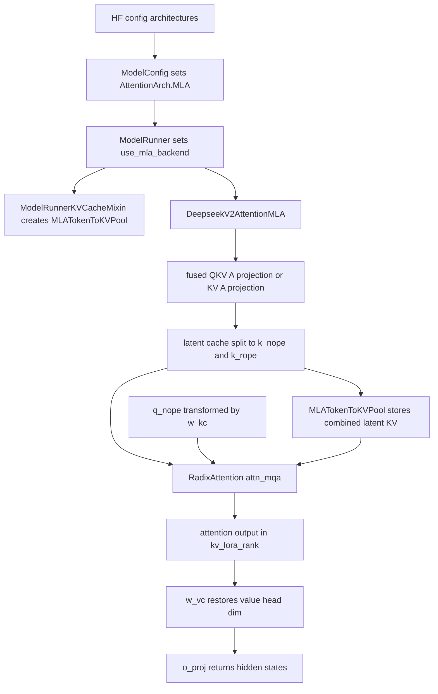

# SGLang MLA 模型源码导读

本文基于当前仓库源码介绍 SGLang 中的 MLA 模型路径。这里的 MLA 指 Multi-head Latent Attention。和普通 MHA/GQA 路径相比，MLA 的核心差异是 KV cache 不直接保存每个 KV head 的完整 K/V，而是保存压缩后的 latent KV 表示，再在 attention 计算中通过权重吸收和投影完成等价计算。这样可以显著降低长上下文场景下的 KV cache 占用。

核心源码位置：
- `python/sglang/srt/configs/model_config.py`
- `python/sglang/srt/models/deepseek_v2.py`
- `python/sglang/srt/models/deepseek_common/attention_forward_methods/forward_mla.py`
- `python/sglang/srt/models/deepseek_common/attention_backend_handler.py`
- `python/sglang/srt/layers/attention/attention_registry.py`
- `python/sglang/srt/model_executor/model_runner.py`
- `python/sglang/srt/model_executor/model_runner_kv_cache_mixin.py`
- `python/sglang/srt/mem_cache/memory_pool.py`

## 1. MLA 在 SGLang 中如何识别

SGLang 用 `AttentionArch` 区分 attention 架构：

```python
class AttentionArch(IntEnum):
    MLA = auto()
    MHA = auto()
```

`ModelConfig._derive_model_shapes()` 会根据 HuggingFace config 的 `architectures` 和模型特有字段推导 attention 架构。DeepSeek V2/V3、DeepSeek V3.2、部分 GLM MoE Lite、Kimi、MiniCPM3、Bailing、Sarvam MLA 等模型会被设置为：

```python
self.attention_arch = AttentionArch.MLA
self.kv_lora_rank = self.hf_text_config.kv_lora_rank
self.qk_nope_head_dim = self.hf_text_config.qk_nope_head_dim
self.qk_rope_head_dim = self.hf_text_config.qk_rope_head_dim
self.v_head_dim = self.hf_text_config.v_head_dim
```

这些字段是 MLA 路径的关键形状参数：
- `kv_lora_rank`：KV latent 表示的维度，也是 MLA KV cache 中 no-position 部分的维度。
- `qk_nope_head_dim`：不参与 RoPE 的 query/key 维度。
- `qk_rope_head_dim`：参与 RoPE 的 query/key 维度。
- `v_head_dim`：attention 输出被还原到 value 空间后的 head 维度。

`ModelRunner` 初始化时把模型配置转成运行时布尔值：

```python
self.use_mla_backend = self.model_config.attention_arch == AttentionArch.MLA
```

后续 KV cache pool、attention backend、投机解码兼容性检查等都会围绕 `runner.use_mla_backend` 分支展开。

## 2. DeepSeek V2 MLA 层结构

MLA 的典型实现入口是 `deepseek_v2.py::DeepseekV2AttentionMLA`。这个类同时继承了 MHA 和 MLA forward mixin：

```python
class DeepseekV2AttentionMLA(
    nn.Module,
    DeepseekMHAForwardMixin,
    DeepseekMLAForwardMixin,
    DeepseekMLARocmForwardMixin,
    DeepseekMLACpuForwardMixin,
):
```

它保留 MHA forward 能力，是因为部分 backend 或特殊 batch 模式会回退到 MHA、MHA chunked KV、MHA one-shot 等路径；但 MLA 模型的主路径是 `DeepseekMLAForwardMixin` 中的 absorb forward。

初始化阶段可以分成几组组件：

1. Query latent 路径

如果配置里有 `q_lora_rank`，SGLang 会把 query A projection 和 KV A projection 融合成一个 replicated linear：

```python
self.fused_qkv_a_proj_with_mqa = ReplicatedLinear(
    self.hidden_size,
    self.q_lora_rank + self.kv_lora_rank + self.qk_rope_head_dim,
    ...
)
self.q_a_layernorm = RMSNorm(self.q_lora_rank, eps=config.rms_norm_eps)
self.q_b_proj = ColumnParallelLinear(
    q_lora_rank,
    self.num_heads * self.qk_head_dim,
    ...
)
```

这条路径先得到 query latent，再通过 `q_b_proj` 还原出本层 attention 需要的 query head。

2. KV latent 路径

当没有 fused QKV A projection 时，KV A projection 单独存在：

```python
self.kv_a_proj_with_mqa = ReplicatedLinear(
    self.hidden_size,
    self.kv_lora_rank + self.qk_rope_head_dim,
    ...
)
```

无论 fused 还是非 fused，最终都会得到一个 `latent_cache`，它按维度切成：

```text
latent_cache = [k_nope, k_pe]
k_nope dim = kv_lora_rank
k_pe dim = qk_rope_head_dim
```

其中 `k_nope` 会经过 `kv_a_layernorm`，`k_pe` 是参与 RoPE 的 key 部分。

3. KV B projection 与输出 projection

`kv_b_proj` 把 KV latent 空间映射到普通 attention 所需的 key/value head 空间：

```python
self.kv_b_proj = ColumnParallelLinear(
    self.kv_lora_rank,
    self.num_heads * (self.qk_nope_head_dim + self.v_head_dim),
    ...
)
```

MLA 主路径不会简单地先展开所有历史 KV 再做 attention，而是在初始化 MLA forward 时把 `kv_b_proj` 的权重拆成 `w_kc` 和 `w_vc`，在 query 侧和输出侧用 batched GEMM 做“吸收”计算：
- `w_kc`：把 query 的 no-position 部分变换到 latent KV 空间，用于和 cached `k_nope` 做 attention。
- `w_vc`：把 attention 结果从 latent KV 空间还原到 value head 空间。

最后通过普通的输出 projection：

```python
self.o_proj = RowParallelLinear(
    self.num_heads * self.v_head_dim,
    self.hidden_size,
    ...
)
```

## 3. MLA forward 的主流程

`DeepseekV2AttentionMLA.forward_prepare()` 会先根据当前 backend 和 batch 模式选择 forward 方法：

```python
attn_forward_method = self.dispatch_attn_forward_method(forward_batch)
```

常见分支包括：
- `AttnForwardMethod.MLA`：标准 MLA absorb 路径。
- `AttnForwardMethod.MLA_FUSED_ROPE_ROCM`：ROCm 上融合 RoPE 的 MLA 路径。
- `AttnForwardMethod.MLA_FUSED_ROPE_CPU`：CPU 上融合 RoPE 的 MLA 路径。
- `AttnForwardMethod.MHA` / `MHA_CHUNKED_KV` / `MHA_ONE_SHOT`：某些 backend 或短 prefill 场景下的兼容路径。
- `MLA_NPU` / `DSA_NPU`：NPU 平台专用路径。

标准 MLA 路径进入 `forward_mla.py::forward_absorb_prepare()` 和 `forward_absorb_core()`。

### 3.1 prepare 阶段

prepare 阶段主要做四件事：

1. 计算 latent 表示

当 `q_lora_rank` 存在时：

```python
qkv_latent = self.fused_qkv_a_proj_with_mqa(hidden_states)[0]
```

然后按 `[q_lora_rank, kv_lora_rank + qk_rope_head_dim]` 切分出 query latent 和 KV latent。

2. 生成 query

query latent 经过 `q_a_layernorm` 和 `q_b_proj`，得到形状为 `[-1, num_local_heads, qk_head_dim]` 的 query，再切成：

```text
q = [q_nope, q_pe]
q_nope dim = qk_nope_head_dim
q_pe dim = qk_rope_head_dim
```

3. 生成 cached key 部分

KV latent 被切成：

```text
k_nope = latent_cache[..., :kv_lora_rank]
k_pe = latent_cache[..., kv_lora_rank:]
```

`q_pe` 和 `k_pe` 会根据 backend 情况应用 RoPE。有些 TRTLLM MLA、tokenspeed MLA、ROCm fused 路径会把 RoPE 和 cache 写入融合到后续 kernel 中。

4. 对 query 做吸收变换

`q_nope` 会和 `w_kc` 做 batched GEMM，得到 `q_nope_out`。此时 query 已经从普通 `qk_nope_head_dim` 空间变换到 `kv_lora_rank` 空间，可以直接和缓存中的 `k_nope` 做 attention。

### 3.2 core 阶段

`forward_absorb_core()` 调用 `self.attn_mqa` 执行 attention。这里的 `attn_mqa` 是一个 `RadixAttention`，但它的 key/value 维度是 MLA latent 维度：

```python
self.attn_mqa = RadixAttention(
    self.num_local_heads,
    self.kv_lora_rank + self.qk_rope_head_dim,
    self.scaling,
    num_kv_heads=1,
    v_head_dim=self.kv_lora_rank,
    ...
)
```

这说明 MLA 在 KV cache 层面更像 MQA：每个 token 每层只存一份 latent KV，而不是按多个 KV head 存完整 K/V。

attention 输出的形状会被视为 `[-1, num_local_heads, kv_lora_rank]`。随后通过 `w_vc` 做 batched GEMM，把 latent attention 输出还原到 `v_head_dim`：

```text
attn_output in latent dim -> w_vc -> value head dim -> o_proj -> hidden size
```

因此 MLA 的“压缩”发生在 KV cache 和 attention 内部，最终对外仍输出标准 transformer block 所需的 hidden states。

## 4. MLA KV cache 存储布局

MLA 模型不会使用普通 MHA 的 `MHATokenToKVPool`，而是使用 `memory_pool.py::MLATokenToKVPool`。`ModelRunnerKVCacheMixin` 中的初始化逻辑大致是：

```python
elif self.use_mla_backend and not self.mambaish_config:
    self.token_to_kv_pool = MLATokenToKVPool(...)
```

如果是 FP4 checkpoint，会使用 `MLATokenToKVPoolFP4`；如果是 DeepSeek sparse attention 模型，会进入 `DSATokenToKVPool` 或 HiSparse DSA 相关 pool；NPU 平台则可能使用 `NPUMLATokenToKVPool`。

`MLATokenToKVPool` 的每层 buffer 形状是：

```python
torch.zeros(
    (self.size + self.page_size, 1, self.kv_cache_dim),
    dtype=self.store_dtype,
    device=self.device,
)
```

普通 MLA 下：

```text
kv_cache_dim = kv_lora_rank + qk_rope_head_dim
```

也就是每个 token 每层保存一条合并后的 latent KV：

```text
kv_buffer[token] = [k_nope, k_rope]
```

对应访问接口：

```python
def get_key_buffer(self, layer_id):
    return self.kv_buffer[layer_id - self.start_layer]

def get_value_buffer(self, layer_id):
    return self.kv_buffer[layer_id - self.start_layer][..., : self.kv_lora_rank]

def get_kv_buffer(self, layer_id):
    return self.get_key_buffer(layer_id), self.get_value_buffer(layer_id)
```

这里的命名需要注意：`get_key_buffer()` 返回的是完整 `[k_nope, k_rope]` 合并 buffer；`get_value_buffer()` 返回的是前半段 `k_nope` 视图。它不是传统 MHA 意义上的完整 V cache，而是 MLA attention 把 latent KV 当作 value 侧输入时使用的视图。

写入时有两个接口：

```python
def set_kv_buffer(layer, loc_info, cache_k, cache_v):
    self.kv_buffer[layer_id - self.start_layer][loc] = cache_k
```

这个接口用于已经拼好的 combined cache。

```python
def set_mla_kv_buffer(layer, loc, cache_k_nope, cache_k_rope):
    set_mla_kv_buffer_triton(
        self.kv_buffer[layer_id - self.start_layer],
        loc,
        cache_k_nope,
        cache_k_rope,
    )
```

这个接口直接把 `k_nope` 和 `k_rope` 分段写入同一个 buffer。DSA FP8 路径还会对 `k_nope` 和 `k_rope` 分别量化，或者使用 HIP FP8 专用写入 kernel。

## 5. Attention backend 选择

`server_args.py::_get_default_attn_backend()` 会根据是否是 MLA 模型和硬件选择默认 backend：

```text
MLA + Hopper CUDA 12.3 -> fa3
MLA + Blackwell -> flashinfer
MLA + HIP -> aiter 或 triton
MLA + MPS -> torch_native
其他 MLA -> triton
```

`attention_registry.py` 中有 MLA 相关注册：
- `flashinfer`：如果 `runner.use_mla_backend` 为真，返回 `FlashInferMLAAttnBackend`。
- `trtllm_mla`：只允许 MLA 模型使用。
- `tokenspeed_mla`：只允许 MLA 模型使用。
- `cutedsl_mla`：只允许 MLA 模型使用。
- `cutlass_mla`：返回 `CutlassMLABackend`。
- `flashmla`：返回 `FlashMLABackend`。

DeepSeek MLA 层不会直接硬编码某一个 backend，而是通过 `dispatch_attn_forward_method()` 查询当前 backend 名称，再交给 `deepseek_common/attention_backend_handler.py` 决定走 MLA、MHA one-shot、chunked KV、NPU 或 fused RoPE 路径。

## 6. 和 ReqToTokenPool、RadixCache 的关系

MLA 改变的是 token slot 中保存的 KV 数据格式，不改变请求到 token slot 的索引机制。

运行时仍然是：

1. scheduler 为请求分配 token slot。
2. `ReqToTokenPool` 记录每个请求位置对应的 `out_cache_loc`。
3. prefix cache 或 radix cache 复用的是 token slot 索引。
4. attention backend 根据 `ReqToTokenPool` 找到历史 token 的 slot，再到 `MLATokenToKVPool` 读取 `[k_nope, k_rope]`。

因此，MHA 和 MLA 都复用同一套请求级索引体系；差异在于 `token_to_kv_pool` 中每个 slot 的物理布局不同。

## 7. MLA 与 MHA 的核心差异

| 项目 | MHA/GQA 路径 | MLA 路径 |
| --- | --- | --- |
| 架构标记 | `AttentionArch.MHA` | `AttentionArch.MLA` |
| 典型模型 | Llama、Qwen、Mistral、Gemma | DeepSeek V2/V3、MiniCPM3、Kimi 等 |
| KV pool | `MHATokenToKVPool` | `MLATokenToKVPool` |
| 每层 cache buffer | `k_buffer` 和 `v_buffer` 分开 | 单个 `kv_buffer` |
| cache 内容 | 显式 K 和 V | `[k_nope, k_rope]` latent KV |
| KV head 形态 | `num_kv_heads` 个 KV head | `num_kv_heads=1` 的 latent MQA 形态 |
| 输出还原 | attention 输出直接接 `o_proj` | attention 输出先经 `w_vc` 还原再接 `o_proj` |
| 主要收益 | 实现直接，backend 覆盖广 | KV cache 占用更低，长上下文更友好 |

## 8. 运行时关系图



## 9. 源码阅读建议

阅读 MLA 路径时建议按下面顺序看：

1. `model_config.py::_derive_model_shapes()`：确认哪些模型会被标记为 `AttentionArch.MLA`，以及 `kv_lora_rank`、`qk_nope_head_dim`、`qk_rope_head_dim` 等形状从哪里来。
2. `model_runner.py` 和 `model_runner_kv_cache_mixin.py`：看 `use_mla_backend` 如何影响 attention backend 和 KV pool 初始化。
3. `memory_pool.py::MLATokenToKVPool`：看 MLA KV cache 的真实 buffer 布局。
4. `deepseek_v2.py::DeepseekV2AttentionMLA`：看 MLA attention 层有哪些 projection 和 `RadixAttention` 子模块。
5. `forward_mla.py::forward_absorb_prepare()` 和 `forward_absorb_core()`：看 latent KV 如何被写入 cache、query 如何被吸收到 latent 空间、输出如何用 `w_vc` 还原。

把这几处连起来看，可以把 SGLang 的 MLA 理解为：模型层产生压缩 latent KV，KV pool 按 `[k_nope, k_rope]` 保存，attention backend 在 latent 空间完成历史 KV 访问和注意力计算，最后再通过 value correction 权重还原成标准 hidden states。
