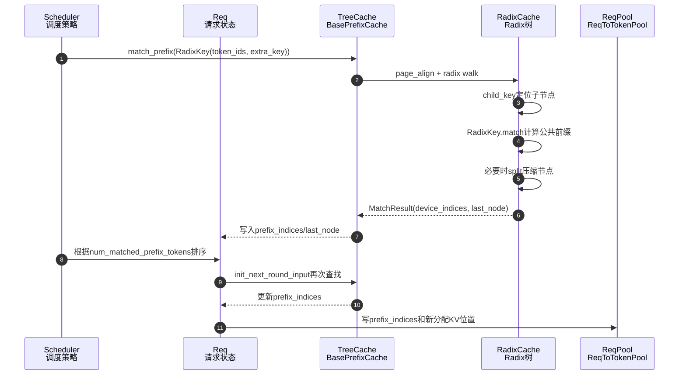

# SGLang KV Cache 查找逻辑

本文基于 `code/sglang/python/sglang/srt` 源码，梳理 SGLang 中 KV cache prefix lookup 的主线逻辑。这里的“查找”主要指请求进入调度和 prefill 前，通过 token 前缀在 tree cache 中找到可复用的 KV cache indices。

## 1. 总体入口

SGLang 把 prefix cache 抽象为 `BasePrefixCache`：

- 源码：`sglang/srt/mem_cache/base_prefix_cache.py`
- 核心接口：`match_prefix(params: MatchPrefixParams) -> MatchResult`
- 主要实现：
  - `RadixCache`：普通 radix tree KV cache，主线实现。
  - `UnifiedRadixCache`：统一 FULL/SWA/MAMBA component 的 radix tree，支持更复杂的 hybrid/hierarchical cache。
  - `RadixCacheCpp`：实验性的 C++ radix tree。
  - `ChunkCache`：radix cache disabled 时使用，不做 prefix 命中，始终返回空命中。
  - `HiRadixCache` / `LMCRadixCache` / `MambaRadixCache` / `SWARadixCache`：在普通 radix 语义上扩展 host cache、LMCache、Mamba、SWA 等能力。

实际构造逻辑在 `sglang/srt/mem_cache/registry.py`：

- 如果 `disable_radix_cache` 且使用 chunked prefill，创建 `ChunkCache` 或 `SWAChunkCache`。
- 如果开启 `SGLANG_EXPERIMENTAL_CPP_RADIX_TREE`，创建 `RadixCacheCpp`。
- 如果开启 unified radix 或 MLX，创建 `UnifiedRadixCache`。
- 如果开启 hierarchical cache，按模型类型创建 `UnifiedRadixCache` 或 `HiRadixCache`。
- 否则普通场景使用 `RadixCache`。

## 2. 调度侧什么时候查找

KV cache lookup 不只发生在真正执行模型前，也会发生在调度排序阶段。

### 2.1 调度策略阶段

源码：`sglang/srt/managers/schedule_policy.py`

`match_prefix_for_req()` 会把请求 token 封装成 `RadixKey`，调用：

```python
tree_cache.match_prefix(
    MatchPrefixParams(
        key=RadixKey(token_ids=token_ids, extra_key=req.extra_key),
        cow_mamba=cow_mamba,
        req=req if include_req else None,
    )
)
```

返回结果会写回请求对象：

- `req.prefix_indices`
- `req.last_node`
- `req.last_host_node`
- `req.best_match_node`
- `req.host_hit_length`
- `req.swa_host_hit_length`
- `req.mamba_host_hit_length`
- `req.num_matched_prefix_tokens`

这些字段随后用于 cache-aware scheduling：

- `lpm`：按最长 prefix match 排序。
- `dfs-weight`：按 radix tree 上的 DFS weight 排序，让共享前缀的请求更容易靠近执行。

这里还有一个 in-batch prefix caching 逻辑：如果请求在已有 tree cache 中命中很短，会用一个临时的 `waiting_queue_radix_tree` 检查等待队列内部是否存在公共前缀，从而避免一批内重复 prefill 同一段 prefix。

### 2.2 请求进入下一轮执行前

源码：`sglang/srt/managers/schedule_batch.py`

`Req.init_next_round_input()` 会刷新当前请求的 `full_untruncated_fill_ids = origin_input_ids + output_ids`，然后再次执行 `tree_cache.match_prefix()`。

这里有几个关键点：

- `key_limit = req._compute_max_prefix_len(input_len)`，默认最多匹配到 `input_len - 1`，给 logprob 等逻辑保留当前位置。
- 如果存在 `positional_embed_overrides`，会禁用 prefix cache，因为相同 token id 可能对应不同 embedding。
- 查找结果写回 `req.prefix_indices` 等字段。
- 最后 `req.set_extend_input_len(input_len - len(req.prefix_indices))`，决定本轮真正需要 prefill 的 token 数量。

## 3. 查找请求的数据模型

### 3.1 MatchPrefixParams

源码：`sglang/srt/mem_cache/base_prefix_cache.py`

`MatchPrefixParams` 包含：

- `key: RadixKey`：查找 key。
- `cow_mamba: bool`：Mamba copy-on-write 相关。
- `req: Optional[Req]`：某些 cache 实现需要请求上下文，例如 Mamba、HiCache load-back。

### 3.2 RadixKey

源码：`sglang/srt/mem_cache/radix_cache.py`

`RadixKey` 是 radix tree 的逻辑 key：

- `token_ids: array[int]`：原始 token id。
- `extra_key: Optional[str]`：额外命名空间，用于区分 LoRA、cache salt、不同上下文版本等。
- `is_bigram: bool`：EAGLE 场景下按 bigram 视图匹配。
- `limit: Optional[int]`：逻辑长度上限，避免为了截断 prefix 复制大数组。

`extra_key` 很重要：两个请求即使 token 前缀完全一样，只要 `extra_key` 不同，就不会共享 radix tree 节点。

`RadixKey.page_aligned(page_size)` 会把匹配长度向下对齐到 page size 的整数倍。`page_size > 1` 时，未满一页的尾部不会进入 tree cache match。

## 4. RadixCache 的数据结构

普通 `RadixCache` 是压缩 radix tree：

- `root_node`：根节点，`lock_ref = 1`，不会被驱逐。
- `TreeNode.key`：该边/节点代表的一段 token prefix，不一定只有一个 token。
- `TreeNode.value`：这一段 token 对应的 KV cache indices，`torch.Tensor[int64]`。
- `TreeNode.children`：按 `child_key` 索引的子节点。
- `TreeNode.lock_ref`：引用计数，运行中请求持有的节点不能被驱逐。
- `TreeNode.last_access_time` / `hit_count` / `priority`：驱逐策略或优先级使用。
- `TreeNode.host_value`：hierarchical cache 相关字段，普通 `RadixCache` 中查找时不区分 host/device。

节点是压缩的。例如插入 `[1, 2, 3, 4]` 后，可能是一个节点保存整段 key；如果后续查找或插入 `[1, 2, 9]`，会在 `[1, 2]` 处 split，把公共前缀暴露成单独节点。

## 5. RadixCache.match_prefix 主流程

源码：`sglang/srt/mem_cache/radix_cache.py`

主流程：

1. 取出 `params.key`。
2. 如果是 EAGLE，`key.maybe_to_bigram_view(self.is_eagle)` 把 key 转成 bigram 视图。
3. 如果 cache disabled 或 key 为空，返回 `_empty_match_result`。
4. 对 key 做 `page_aligned(self.page_size)`。
5. 如果对齐后为空，返回空命中。
6. 调用 `_match_prefix_helper(self.root_node, key)`。
7. 把命中的各段 `value` 用 `torch.cat(value)` 拼起来，作为 `MatchResult.device_indices`。
8. 返回 `MatchResult(device_indices, last_device_node, last_host_node, best_match_node)`。

普通 `RadixCache` 中：

- `last_device_node == last_host_node == best_match_node`
- `host_hit_length == 0`
- `device_indices` 就是可直接复用的 GPU KV cache indices

## 6. _match_prefix_helper 如何沿树查找

核心逻辑在 `RadixCache._match_prefix_helper(node, key)`：

```python
value = []
while len(key) > 0 and child_key in node.children.keys():
    child = node.children[child_key]
    prefix_len = child.key.match(key, page_size=self.page_size)
    if prefix_len < len(child.key):
        new_node = self._split_node(child.key, child, prefix_len)
        value.append(new_node.value)
        node = new_node
        break
    else:
        value.append(child.value)
        node = child
        key = key[prefix_len:]
```

可以拆成几种情况。

### 6.1 找不到 child

`child_key` 是当前 key 的第一个逻辑单位：

- 普通 token 模式：第一个 token，或 page 的 token tuple。
- EAGLE bigram 模式：第一个 bigram，或多个 bigram tuple。
- 如果有 `extra_key`，`child_key` 会变成 `(extra_key, plain_key)`。

如果当前节点没有这个 child，查找停止。当前 `node` 就是最长命中节点。

### 6.2 child 完全匹配

如果 `prefix_len == len(child.key)`，说明请求 key 覆盖了整个 child 节点：

- 把 `child.value` 加入 `value`。
- `node = child`。
- `key = key[prefix_len:]`，继续匹配剩余 token。

最终多个节点的 `value` 会拼接成连续的 `device_indices`。

### 6.3 child 部分匹配

如果 `prefix_len < len(child.key)`，说明请求 key 和 child key 只共享 child 的一部分。

这时会调用 `_split_node(child.key, child, prefix_len)`：

- 新建 `new_node` 保存公共前缀 `child.key[:prefix_len]`。
- `new_node.value = child.value[:prefix_len].clone()`。
- 原来的 `child.key` 缩短为剩余后缀 `child.key[prefix_len:]`。
- 原来的 `child.value` 也缩短为后缀。
- `new_node` 替代 child 原来的位置，child 成为 `new_node` 的子节点。

然后：

- 把 `new_node.value` 加入命中结果。
- 返回 `new_node` 作为最长命中节点。

这意味着查找本身可能修改 radix tree 结构，但不是写入新的 KV，而是把已有压缩节点拆开，让公共前缀成为可复用边界。

## 7. RadixKey.match 的匹配算法

`RadixKey.match(other, page_size)` 返回两个 key 的公共前缀长度，并按 page size 向下取整。

实现上不是逐 token 线性扫描，而是：

1. 用指数步长扩大比较窗口。
2. 发现某个窗口不相等后，在该窗口内二分定位第一个不同 token。
3. 如果是 bigram 模式，逻辑匹配长度要从 raw token 匹配长度换算成 bigram 数。
4. 如果 `page_size > 1`，返回 `(matched // page_size) * page_size`。

这个设计避免长前缀场景下在 Python 层逐 token 循环，主要比较通过 `array` slice 的 C 层比较完成。

## 8. MatchResult 的含义

源码：`sglang/srt/mem_cache/base_prefix_cache.py`

`MatchResult` 是所有 cache 实现的统一返回：

- `device_indices`：已经在 device KV cache 中命中的 indices。普通 prefill 可以直接把它们写入请求的 `req_to_token_pool`。
- `last_device_node`：device 命中的最深节点。请求会对它加锁，避免运行期间被驱逐。
- `last_host_node`：host 层命中的最深节点。普通 `RadixCache` 中等于 `last_device_node`。
- `best_match_node`：多组件或 hierarchical cache 中所有组件共同认可的最深节点，常作为 load-back 锚点。
- `host_hit_length`：Full KV 在 host 命中但还没 load back 到 device 的 token 数。
- `swa_host_hit_length`：SWA host 命中长度。
- `mamba_host_hit_length`：Mamba host 命中数量。
- `mamba_branching_seqlen`：Mamba radix cache 分支点。
- `cache_protected_len`：请求当前受 cache lock 保护的长度。

普通 `RadixCache` 只主要使用前三个字段；HiCache、UnifiedRadixCache、Mamba/SWA 才会填充更多字段。

## 9. 命中结果如何进入执行

查找之后，请求持有 `req.prefix_indices`。在 extend/prefill 分配 KV 时：

源码：`sglang/srt/mem_cache/common.py`

`alloc_for_extend(batch)` 会：

1. 收集每个请求的 `prefix_tensors = [r.prefix_indices for r in batch.reqs]`。
2. 根据 `prefix_lens`、`extend_lens` 分配新 token 的 KV slots。
3. 调用 `write_cache_indices()` 把两部分写入 `req_to_token_pool`：
   - `[0:prefix_len]` 写已命中的 prefix indices。
   - `[prefix_len:seq_len]` 写本轮新分配的 `out_cache_loc`。

因此模型 attention backend 看到的是完整的 req-to-token 映射：前缀部分指向已有 KV cache，新 token 部分指向刚分配的 KV cache。

## 10. 锁引用和驱逐的关系

命中的节点会被请求持有，避免被 eviction 回收。

普通 `RadixCache.inc_lock_ref(node)` 从命中节点一路走到 root：

- 如果节点之前 `lock_ref == 0`，从 `evictable_size_` 移到 `protected_size_`。
- `node.lock_ref += 1`。
- 更新 leaf 可驱逐状态。

`dec_lock_ref(node)` 反向释放：

- 如果节点 `lock_ref == 1`，释放后从 protected 回到 evictable。
- `node.lock_ref -= 1`。

请求完成时，`cache_finished_req()` 会把已提交 KV 插入 radix tree，然后释放 `req.last_node` 的锁。未完成但需要 chunked cache 的请求，会通过 `cache_unfinished_req()` 插入当前 fill 部分，再重新 `match_prefix()` 得到更新后的 prefix indices 和 last node。

## 11. 插入和查找的配合

查找依赖已经缓存的 radix tree 内容，而 tree 内容来自：

- `cache_finished_req()`：请求完成后，把 committed KV 插入 tree。
- `cache_unfinished_req()`：chunked prefill 或请求被中断/分块时，把当前已有 KV 插入 tree，便于后续继续复用。

普通插入逻辑 `_insert_helper()` 和查找很相似：

- 沿 child_key 走树。
- 对已有节点调用 `node.key.match(key)`。
- 完全匹配就继续向下。
- 部分匹配就 split。
- 剩余 key 非空时创建新 leaf，`new_node.value = value.clone()`。

插入返回 `prefix_len`，表示插入前已经存在的前缀长度。调用方会释放重复的 KV slots，避免同一段 KV 同时由请求和 radix cache 重复持有。

## 12. 变体实现的差异

### 12.1 ChunkCache

源码：`sglang/srt/mem_cache/chunk_cache.py`

`ChunkCache.match_prefix()` 永远返回空 `device_indices`。它用于 radix cache disabled 的场景。此时 KV 生命周期跟请求走，不做跨请求 prefix 复用。

### 12.2 RadixCacheCpp

源码：`sglang/srt/mem_cache/radix_cache_cpp.py`

`RadixCacheCpp.match_prefix()` 把 `key.raw_token_ids()` 交给 C++ radix tree：

```python
device_indices_vec, host_indices_length, node_gpu, node_cpu = (
    self.tree.match_prefix(key.raw_token_ids())
)
```

然后把多个 tensor merge 成 `device_indices`。它保留和 Python `BasePrefixCache` 一样的返回协议。

### 12.3 UnifiedRadixCache

源码：`sglang/srt/mem_cache/unified_radix_cache.py`

UnifiedRadixCache 的树结构和普通 RadixCache 类似，但每个节点不再只有一个 `value`，而是有多个 component：

- `FULL`
- `SWA`
- `MAMBA`

查找时 `_match_prefix_helper()` 仍然沿 radix tree walk，但会构造 component validators：

- 非 HiCache：要求 device-only match。
- HiCache：同时追踪 host/device 可用性，分别维护 `best_match_node` 和 `best_match_device_node`。

只有所有 component validator 都接受某个节点，该节点才会成为 `best_match_node`。这样可以避免 FULL 命中很长，但 SWA/MAMBA 状态没有对应可用数据时错误复用。

`_match_post_processor()` 会：

- 刷新 component LRU。
- 更新命中路径的访问时间。
- 用 `best_match_device_value_len` 只拼接 device 上真实可用的 FULL KV indices。
- 调用每个 component 的 `finalize_match_result()`，让 Mamba/SWA 等补充自己的字段。

### 12.4 HiCache / hierarchical cache

HiCache 场景中，查找可能出现：

- device 上只命中一段，返回到 `device_indices`。
- host 上还有更长命中，返回到 `host_hit_length` / `best_match_node`。

调度和后续 load-back 会根据 `best_match_node` 把 host KV 拉回 device。普通 RadixCache 没有这个分层差异。

## 13. 一条普通请求的查找链路



## 14. 关键源码索引

- `sglang/srt/mem_cache/base_prefix_cache.py`
  - `MatchPrefixParams`
  - `MatchResult`
  - `BasePrefixCache.match_prefix`
- `sglang/srt/mem_cache/radix_cache.py`
  - `RadixKey`
  - `TreeNode`
  - `RadixCache.match_prefix`
  - `RadixCache._match_prefix_helper`
  - `RadixCache._split_node`
  - `RadixCache._insert_helper`
  - `RadixCache.cache_finished_req`
  - `RadixCache.cache_unfinished_req`
- `sglang/srt/managers/schedule_policy.py`
  - `match_prefix_for_req`
  - `SchedulePolicy._compute_prefix_matches`
  - LPM / DFS-weight 调度策略
- `sglang/srt/managers/schedule_batch.py`
  - `Req.init_next_round_input`
  - `Req._compute_max_prefix_len`
- `sglang/srt/mem_cache/common.py`
  - `alloc_for_extend`
  - `write_cache_indices`
  - `release_kv_cache`
- `sglang/srt/mem_cache/registry.py`
  - `default_radix_cache_factory`
  - `create_tree_cache`
- `sglang/srt/mem_cache/unified_radix_cache.py`
  - `UnifiedRadixCache.match_prefix`
  - `UnifiedRadixCache._match_prefix_helper`
  - `UnifiedRadixCache._match_post_processor`
- `sglang/srt/mem_cache/chunk_cache.py`
  - `ChunkCache.match_prefix`
- `sglang/srt/mem_cache/radix_cache_cpp.py`
  - `RadixCacheCpp.match_prefix`
