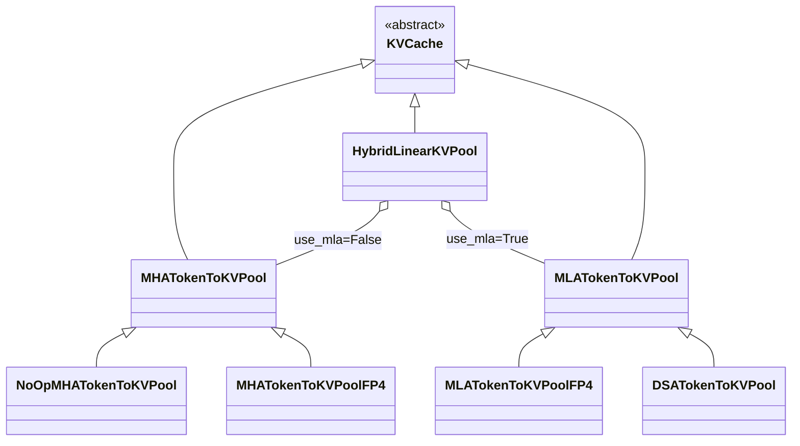

# 学习文章
## sglang代码细读
- 从req到batch https://www.cnblogs.com/sunstrikes/p/18884152
- forward过程 https://www.cnblogs.com/sunstrikes/p/18887861
- cache https://www.cnblogs.com/sunstrikes/p/18891538
### cache
- 因为kv cache有MHA，MLA，DoubleSparse 等多种自定义类型，需要进行一步抽象将框架和cache类型做隔离, 所以有了2级内存池的设计. 
  - 一级保存和cache类型无关的数据(token位置)，跟具体业务隔离，
  - 二级给出抽象类接口, 不同的cache类型按需继承实现interface, 就能通过配置来进行管理.

#### KVCache是真实 K/V tensor 的抽象基类，定义在 memory_pool.py。核心接口是：

```python
get_key_buffer(layer_id)
get_value_buffer(layer_id)
get_kv_buffer(layer_id)
set_kv_buffer(layer, loc, cache_k, cache_v)
```
它保存每一层 attention 的 K/V buffer。
#### kvcache与其实现类的简单类关系图
- MHATokenToKVPool：普通 MHA 模型的 KV pool，保存显式 K/V 张量。
  - MHA: 这里的 MHA 指 Multi-Head Attention 架构族。
  - 多头注意力：
    - 让模型在处理一个 token 时，同时从多个“角度”去关注序列中其他 token。
    - 多头注意力在训练的时候，会从不同角度进行与其他token的注意力计算，每个角度就是一个头，每个头都有自己的QKV，最后把多个头得到的结果拼接起来，再经过一次线性变换，就形成了最终的输出。
    - 多头注意力就是让模型从多个视角同时理解文本。
- NoOpMHATokenToKVPool：一种特殊的 MHA pool，prefill 时不保存 KV，节省内存。
- MHATokenToKVPoolFP4：FP4 版本的 MHA pool，保存 FP4 格式的 K/V。
  - 能够节省显存，但是会损失精度。
- HybridLinearKVPool：混合模型的 KV pool，根据 `use_mla` 选择使用 MHA pool 还是 MLA pool。
- MLATokenToKVPool：MLA 模型的 KV pool，保存 combined latent KV 张量。
  - 中文名称叫做：多头潜在注意力。
- MLATokenToKVPoolFP4：FP4 版本的 MLA pool，保存 FP4 格式的 latent KV。
  - MLATokenToKVPoolFP4 是 MLA 的 FP4 版本。它继承 MLATokenToKVPool，但把 combined KV 以 FP4 压缩格式保存。
- DSATokenToKVPool：DoubleSparse 模型的 KV pool，保存稀疏 K/V 张量。
  - 当前仓库和文档里更常用的名字是 DSA：DeepSeek Sparse Attention。



### ReqToTokenPool
- ReqToTokenPool
  - req_to_token
    - 某个 request 的第 i 个 token，对应 token_to_kv_pool / KV cache 里的哪个物理 token slot。
    - 形状为 `(size + 1, max_context_len)` 的 `int32` GPU tensor。
  - 影响req_to_token张量的行的参数：
    - size：正常可运行请求数，通常来自 max_running_requests。_alloc_size = size + 1：真实 tensor 行数，多出来的第 0 行是 padding/dummy 行。
    - --context-length：影响 model_config.context_len，从而影响 max_context_len。也就是直接拉长或缩短 req_to_token 的列数。
    - --dp-size：多个请求会分配到不同的dp worker，即 requested_per_worker = max_running_requests // dp_size。
  - 影响 req_to_token 张量的列的参数：
    - max_context_len：每个请求最多可映射的 token 位置数，初始化时会用模型 context length 加上一些 speculative decoding 等场景需要的额外长度。
### MHATokenToKVPool的构造
- MHATokenToKVPool.__init__  # 构造函数。
  - 设置头数量 head_num
  - 设置头维度 head_dim
  - 设置value头维度 v_head_dim
  - 设置kvcache布局为nhd    # self.kv_cache_layout = "nhd"
  - 分配缓冲区    # self._create_buffers()
#### 当内存布局为nhd时候的内存结构
```python
self.kv_cache_layout == "nhd"
```

会为每一层分别创建 `K` 和 `V` buffer：

```text
MHATokenToKVPool
|
+-- k_buffer: List[Tensor], 长度 = layer_num
|   |
|   +-- k_buffer[0]: [size + page_size, head_num, head_dim]
|   +-- k_buffer[1]: [size + page_size, head_num, head_dim]
|   +-- ...
|   +-- k_buffer[layer_num - 1]
|
+-- v_buffer: List[Tensor], 长度 = layer_num
    |
    +-- v_buffer[0]: [size + page_size, head_num, v_head_dim]
    +-- v_buffer[1]: [size + page_size, head_num, v_head_dim]
    +-- ...
    +-- v_buffer[layer_num - 1]
```

单层内部可以理解为：

```text
k_buffer[layer_id]

slot 0              -> dummy / padding slot
slot 1              -> token KV slot
slot 2              -> token KV slot
...
slot size           -> token KV slot
slot size+1 ...     -> padding page 区域

每个 slot 内部:
[head_num, head_dim]
```

对应形状：

```text
K:
+--------------------------------------------+
| size + page_size slots                     |
|                                            |
| slot_i -> [head_num, head_dim]             |
+--------------------------------------------+

V:
+--------------------------------------------+
| size + page_size slots                     |
|                                            |
| slot_i -> [head_num, v_head_dim]           |
+--------------------------------------------+
```

- 为什么是 size + page_size

```text
真实可用 KV 容量: size
额外保护区域: page_size
实际分配: size + page_size
```

#### TokenToKVPoolAllocator
- mem_cache/allocator中
  - token.py 非分页allocator。
  - paged.py 分页allocator。

# notes
- abc.ABC在python中用来定义抽下抽象基类，参见KVCache的定义。
