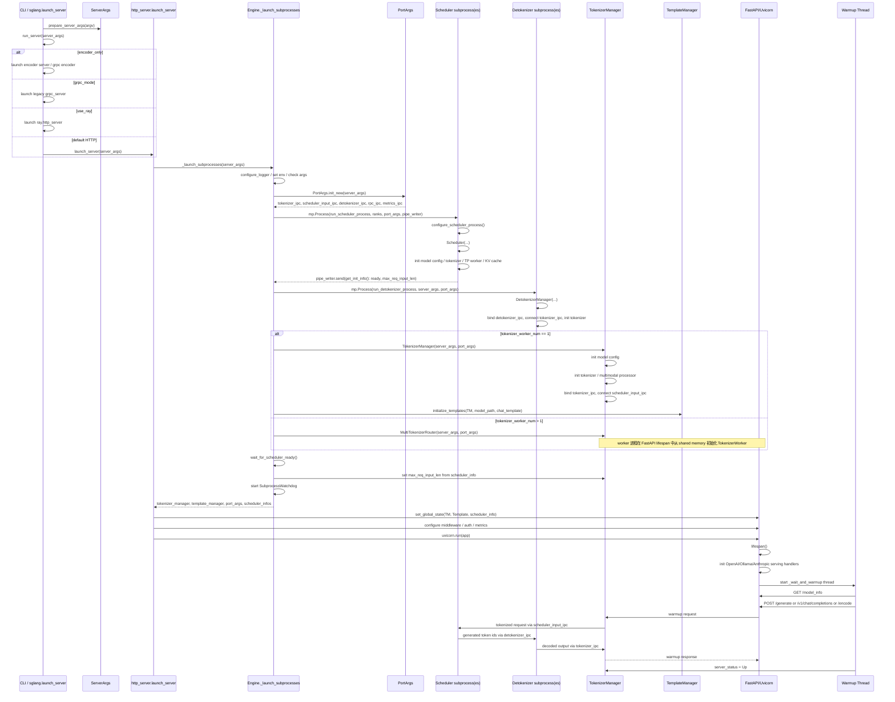
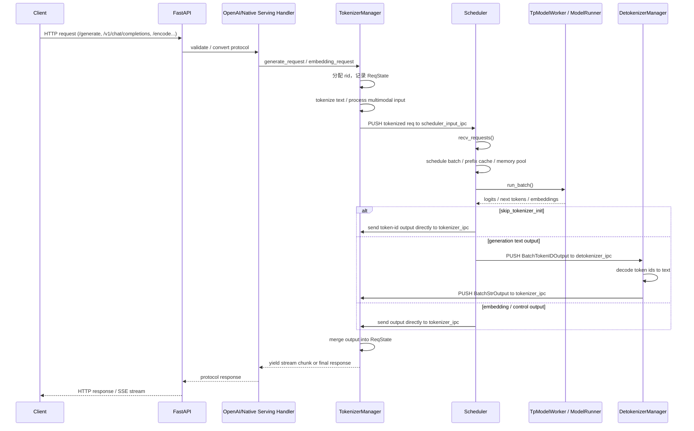

# SGLang 启动模块交互关系

本文基于当前仓库代码，梳理默认启动路径：

- `sglang serve`
- `python -m sglang.launch_server`
- 非 `grpc_mode`
- 非 `use_ray`
- 非 `encoder_only`

也就是普通 HTTP 服务启动路径。

## 核心入口与模块

- 启动入口：`python/sglang/launch_server.py`
- HTTP 服务：`python/sglang/srt/entrypoints/http_server.py`
- Engine 与子进程编排：`python/sglang/srt/entrypoints/engine.py`
- TokenizerManager：`python/sglang/srt/managers/tokenizer_manager.py`
- Scheduler：`python/sglang/srt/managers/scheduler.py`
- DetokenizerManager：`python/sglang/srt/managers/detokenizer_manager.py`
- IPC 地址分配：`python/sglang/srt/server_args.py` 中的 `PortArgs`

## 启动阶段时序图

## 请求阶段时序图

## 模块间关系要点

- 主进程包含 HTTP server、FastAPI app、TokenizerManager 和 TemplateManager。
- 子进程包含 Scheduler 进程组和 Detokenizer 进程组。
- Scheduler 初始化完成后，会通过 `mp.Pipe` 将 `status=ready`、`max_total_num_tokens`、`max_req_input_len` 回传给父进程。
- 普通请求链路主要通过 ZMQ IPC 连接：
  - `TokenizerManager -> Scheduler`：`scheduler_input_ipc_name`
  - `Scheduler -> DetokenizerManager`：`detokenizer_ipc_name`
  - `DetokenizerManager -> TokenizerManager`：`tokenizer_ipc_name`
  - `Engine/Python API -> Scheduler RPC`：`rpc_ipc_name`
- `dp_size > 1` 时，Engine 先启动 `DataParallelController`，再由它管理 DP scheduler。
- `tokenizer_worker_num > 1` 时，主进程使用 `MultiTokenizerRouter`，FastAPI worker 通过 shared memory 初始化自己的 `TokenizerWorker`。
