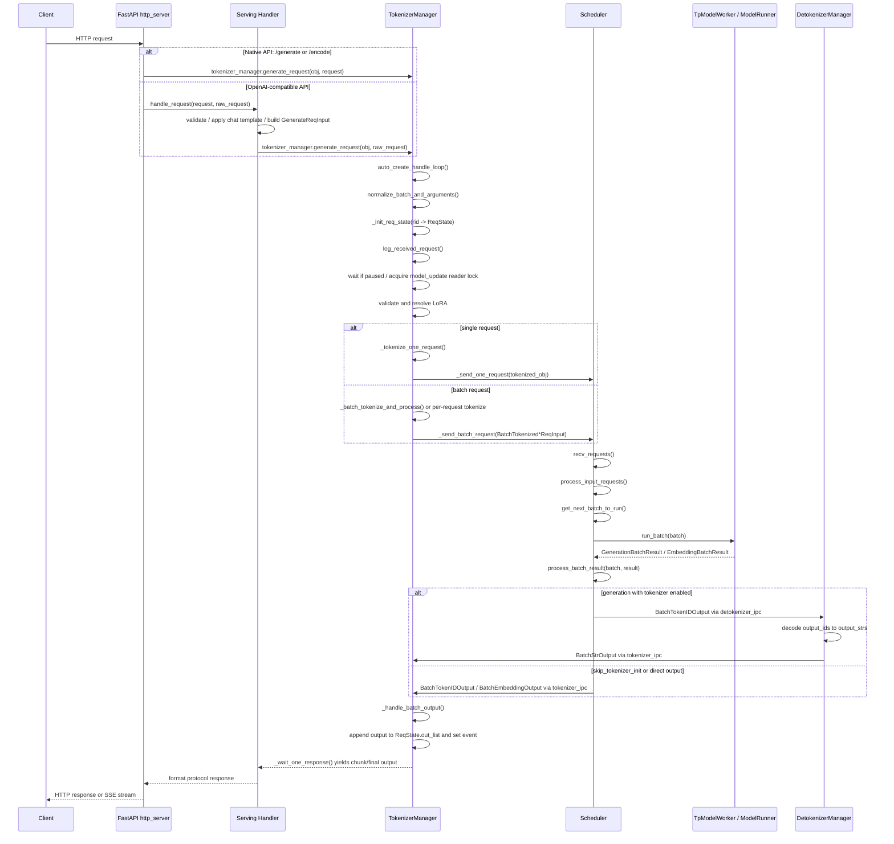
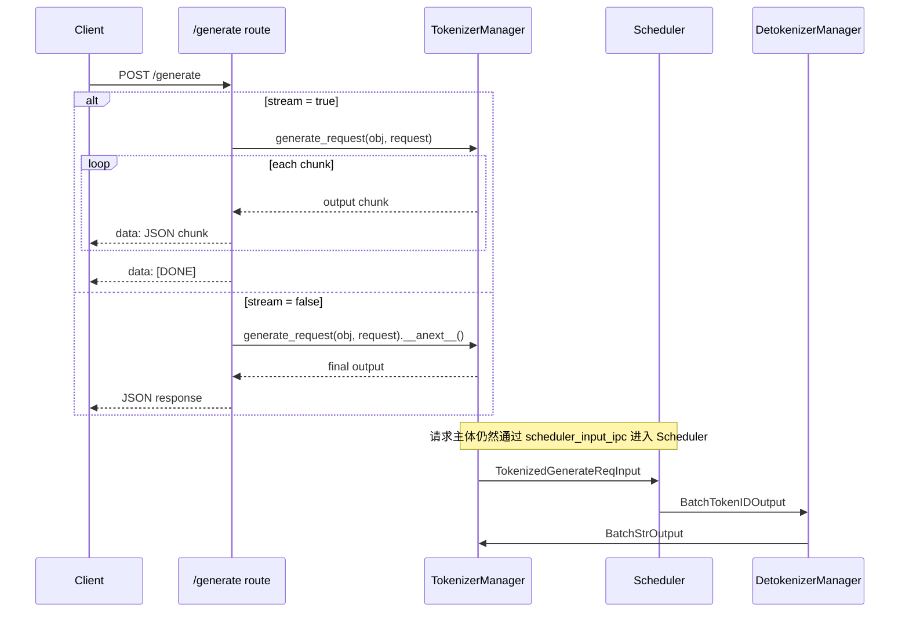
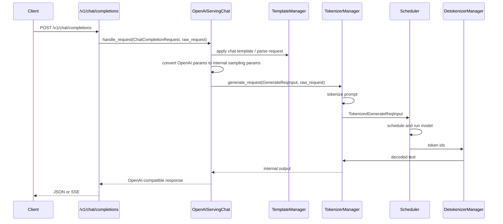
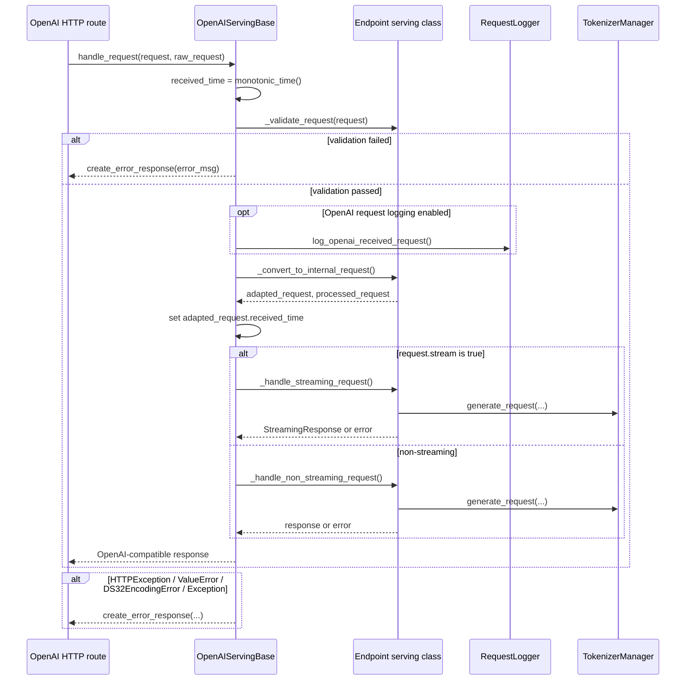
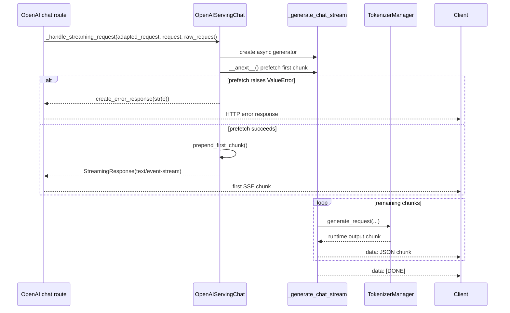
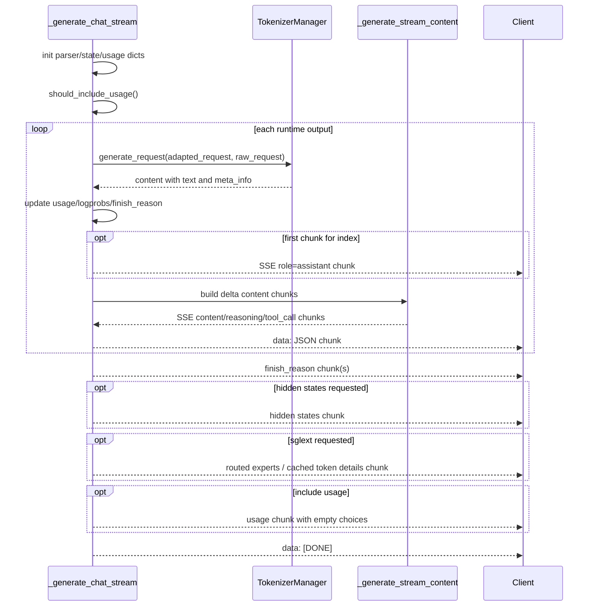
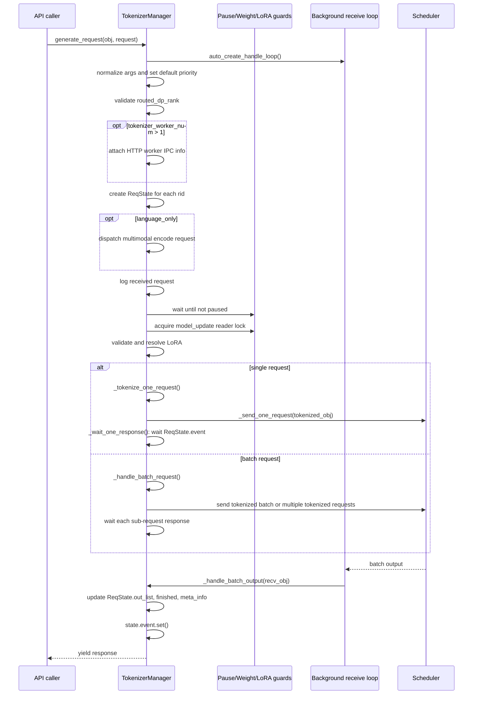
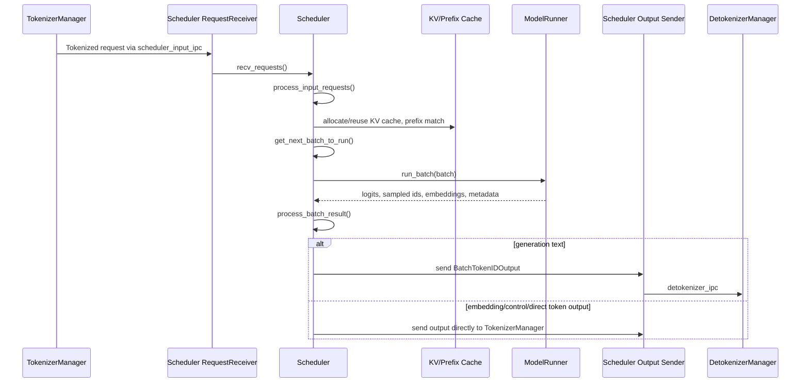
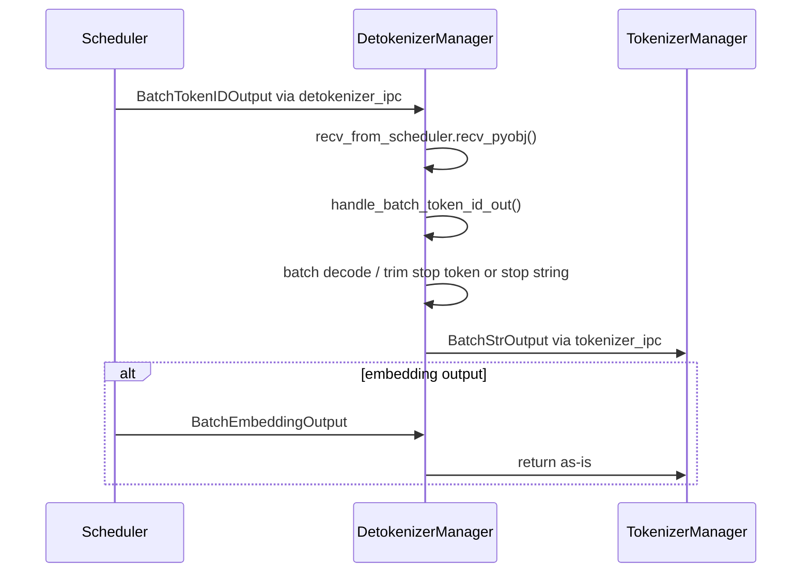
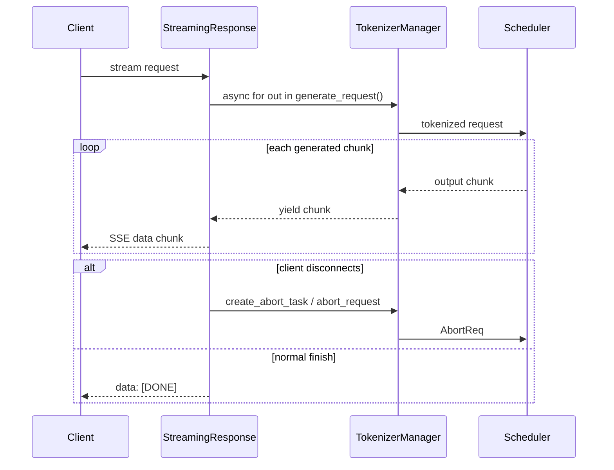

# SGLang 用户请求处理过程

本文基于当前仓库代码，梳理 SGLang 在服务已经启动后，处理一次用户请求时的模块间交互关系。默认关注普通 HTTP server 路径，也就是 `python/sglang/srt/entrypoints/http_server.py` 中的 FastAPI 服务。

## 涉及的核心模块

- HTTP 路由层：`python/sglang/srt/entrypoints/http_server.py`
- OpenAI 协议适配层：`python/sglang/srt/entrypoints/openai/serving_*.py`
- TokenizerManager：`python/sglang/srt/managers/tokenizer_manager.py`
- AsyncDynamicbatchTokenizer：`python/sglang/srt/managers/async_dynamic_batch_tokenizer.py`
- Scheduler：`python/sglang/srt/managers/scheduler.py`
- Scheduler IPC：`python/sglang/srt/managers/scheduler_components/ipc_channels.py`
- DetokenizerManager：`python/sglang/srt/managers/detokenizer_manager.py`
- 请求/响应结构体：`python/sglang/srt/managers/io_struct.py`

## 总体请求链路

SGLang 的请求处理可以理解为三段：

1. API 层：FastAPI 接收 HTTP 请求，OpenAI/Native serving handler 转换协议对象。
2. Tokenizer 层：TokenizerManager 做请求状态管理、tokenize、多模态预处理、LoRA 校验、请求派发。
3. Runtime 层：Scheduler 做动态 batching、KV cache/prefix cache 管理、模型 forward、采样，再把 token ids 交给 DetokenizerManager 或直接返回 TokenizerManager。



## Native `/generate` 请求

`/generate` 是最直接的路径。FastAPI 将 JSON body 解析成 `GenerateReqInput`，然后调用 `TokenizerManager.generate_request()`。如果是流式请求，HTTP 层把 async generator 包成 SSE；如果非流式请求，只取 generator 的第一个最终输出。



## OpenAI `/v1/chat/completions` 请求

OpenAI 兼容接口不会直接把原始请求发给 Scheduler，而是先由 serving handler 做协议转换。例如 `/v1/chat/completions` 会进入 `OpenAIServingChat.handle_request()`，处理模型名、messages、chat template、tool/reasoning 相关字段、sampling params 等，然后构造内部 `GenerateReqInput`。



## OpenAIServingBase.handle_request 流程

`python/sglang/srt/entrypoints/openai/serving_base.py` 中的 `OpenAIServingBase.handle_request()` 是 OpenAI 兼容接口的通用入口。`/v1/chat/completions`、`/v1/completions`、`/v1/embeddings` 等 endpoint 在 HTTP 层拿到 Pydantic request 后，会进入各自 serving handler 的 `handle_request()`；多数 handler 复用这个基类流程，只覆写校验、协议转换、流式/非流式处理方法。

关键步骤：

1. 记录 `received_time = monotonic_time()`，后续写入内部 `GenerateReqInput` 或 `EmbeddingReqInput`。
2. 调用 `_validate_request(request)` 做 OpenAI 协议级校验；如果返回错误字符串，直接 `create_error_response()`。
3. 如果请求日志开启且级别足够，调用 `request_logger.log_openai_received_request()` 记录原始 OpenAI 请求。
4. 调用 `_convert_to_internal_request(request, raw_request)`，把 OpenAI request 转成内部请求对象，并返回处理后的 OpenAI request。
5. 如果内部对象是 `GenerateReqInput` 或 `EmbeddingReqInput`，设置 `adapted_request.received_time`。
6. 根据 `request.stream` 分流：
   - `stream=True`：调用 `_handle_streaming_request(adapted_request, processed_request, raw_request)`。
   - 否则：调用 `_handle_non_streaming_request(adapted_request, processed_request, raw_request)`。
7. 统一捕获异常并转成 OpenAI 风格错误响应：
   - `HTTPException`：使用原 status code 和 detail。
   - `ValueError`：返回 400 `BadRequest`。
   - `DS32EncodingError`：返回 400 `BadRequest`。
   - 其他异常：记录 exception 日志，返回 500 `InternalServerError`。



### 基类与子类分工

- 基类 `OpenAIServingBase` 负责通用控制流、错误响应格式、请求时间戳、原始请求日志和 stream 分发。
- 子类负责 endpoint 语义：
  - `_request_id_prefix()`：定义 request id 前缀。
  - `_validate_request()`：校验具体 OpenAI 请求。
  - `_convert_to_internal_request()`：转换成 `GenerateReqInput` 或 `EmbeddingReqInput`。
  - `_handle_streaming_request()`：实现 SSE/streaming 输出。
  - `_handle_non_streaming_request()`：实现非流式输出。

因此，`handle_request()` 不直接做 tokenize 或调度；它只是把 OpenAI 请求整理成 SGLang 内部请求，然后把执行交给子类的 streaming/non-streaming handler，最终再进入 `TokenizerManager.generate_request()`。

## OpenAIServingChat._handle_streaming_request 流程

`python/sglang/srt/entrypoints/openai/serving_chat.py` 中的 `OpenAIServingChat._handle_streaming_request()` 是 `/v1/chat/completions` 流式请求的入口。它本身只负责把内部异步生成器包装成 FastAPI `StreamingResponse`，真正的 SSE chunk 构造主要在 `_generate_chat_stream()` 和 `_generate_stream_content()` 中完成。

源码对应位置：`OpenAIServingChat._handle_streaming_request()` 创建并预取 `_generate_chat_stream()`；`_generate_chat_stream()` 再持续调用 `TokenizerManager.generate_request()` 拉取 runtime 输出。

### 入口包装流程

关键步骤：

1. 创建流式生成器：`generator = self._generate_chat_stream(adapted_request, request, raw_request)`。
2. 预取第一包：`first_chunk = await generator.__anext__()`。
3. 如果预取阶段抛出 `ValueError`，说明还没发送 HTTP 200，此时可以返回普通 OpenAI error response。
4. 如果预取成功，用 `prepend_first_chunk()` 把第一包重新放回输出流。
5. 返回 `StreamingResponse(..., media_type="text/event-stream")`。
6. 给 `StreamingResponse` 注册 `background=self.tokenizer_manager.create_abort_task(adapted_request)`，用于客户端断连或响应结束时清理/abort。

这里预取第一包的意义很重要：它能在 HTTP streaming response 真正开始前触发一次底层校验。例如上下文长度超限、请求参数不合法等错误，可以直接以 HTTP error 返回，而不是在 SSE 流里输出错误字符串。



### _generate_chat_stream 主流程

`_generate_chat_stream()` 负责把 `TokenizerManager.generate_request()` 返回的内部 chunk 转成 OpenAI Chat Completions SSE 格式。

它会先初始化多组流式状态：

- `parser_dict`：每个 choice 的 tool call parser 状态。
- `reasoning_parser_dict`：每个 choice 的 reasoning parser 状态。
- `is_firsts`：每个 choice 是否第一次输出。
- `stream_offsets`：非增量输出模式下用于从累计文本中截取 delta。
- `n_prev_tokens`：流式 logprobs 的增量位置。
- `has_tool_calls`：记录某个 choice 是否产生过 tool call。
- `finish_reasons`：记录每个 choice 的最终结束原因。
- usage 统计：`prompt_tokens`、`completion_tokens`、`reasoning_tokens`、`cached_tokens`、多模态 token 数等。

然后通过 `should_include_usage()` 判断是否需要输出 usage，以及是否在每个 chunk 中连续输出 usage：

- `include_usage`：结束前额外输出一个空 `choices` 的 usage chunk。
- `continuous_usage_stats`：每个增量 chunk 中都带当前 usage。

核心循环是：

```python
async for content in self.tokenizer_manager.generate_request(
    adapted_request, raw_request
):
    ...
```

每次拿到 `content` 后会做这些事：

1. 读取 `index = content.get("index", 0)`，支持 `n > 1` 时的多 choice。
2. 从 `content["meta_info"]` 更新 prompt/completion/reasoning/cache/multimodal token 统计。
3. 如果 `request.logprobs=True`，根据 `n_prev_tokens` 只输出新增 token 的 logprobs。
4. 读取 `finish_reason`；如果是带 HTTP 状态码的 abort，输出 SSE error chunk 并停止。
5. 每个 choice 第一次输出前，先发送一个 role chunk：`delta.role = "assistant"`，`content=""`。
6. 调用 `_generate_stream_content()` 生成真正的内容 chunk。

主循环结束后，还会补尾包：

- 为每个完成的 choice 输出 `finish_reason` chunk。
- 如果产生过 tool call 且原结束原因是 `stop`，最终 `finish_reason` 会改成 `tool_calls`。
- 如果请求 `return_hidden_states`，额外输出 hidden states chunk。
- 如果请求 `return_routed_experts` 或 `return_cached_tokens_details`，额外输出 `sglext` chunk。
- 如果 `include_usage=True`，额外输出 usage chunk。
- 最后输出 `data: [DONE]`。



### _generate_stream_content 内容分发

`_generate_stream_content()` 负责把内部 `content["text"]` 变成 OpenAI delta。

它首先确定本次增量文本：

- 如果 `incremental_streaming_output=True`，`content["text"]` 本身就是 delta。
- 否则 `content["text"]` 是累计文本，需要用 `stream_offsets[index]` 截取新片段。

之后按请求能力分发：

- reasoning：如果启用 `reasoning_parser` 且 `request.separate_reasoning=True`，输出 `reasoning_content`。
- tool calls：如果请求包含 tools 且启用 tool parser，解析并输出 `delta.tool_calls`。
- 普通文本：输出 `delta.content`。

如果 `continuous_usage_stats=True`，这些内容 chunk 中还会附带当前 usage。

## TokenizerManager 内部处理

`TokenizerManager.generate_request()` 是 HTTP API 和 Python Engine API 进入 runtime 的主要统一入口。

关键步骤：

- `auto_create_handle_loop()`：确保后台接收循环已启动，用于从 `tokenizer_ipc_name` 接收 Scheduler/Detokenizer 返回。
- `normalize_batch_and_arguments()`：规范化单请求、batch、采样参数等，并通过 `_set_default_priority()` 补齐默认优先级。
- DP 路由校验：如果 `GenerateReqInput.routed_dp_rank` 被指定，会检查它是否在 `[0, dp_size)` 范围内。
- 多 tokenizer worker 信息附加：`tokenizer_worker_num > 1` 时调用 `_attach_multi_http_worker_info()`，让返回结果能路由回正确的 HTTP worker。
- `_init_req_state()`：为每个 `rid` 建立 `ReqState`，后续响应通过该状态对象回填。
- EPD/encoder disaggregation：`language_only` 模式下会调用 `_handle_epd_disaggregation_encode_request()`，可能把多模态编码请求派发到 encoder 侧。
- 请求日志：`request_logger.log_received_request()` 记录请求。
- pause 等待：如果服务被 pause，请求会在 `is_pause_cond` 上等待 resume。
- 权重更新并发控制：请求在 `model_update_lock.reader_lock` 下执行，避免和在线权重更新写锁冲突。
- `_validate_and_resolve_lora()`：如果请求携带 LoRA，检查并解析 LoRA registry。
- `_tokenize_one_request()` / `_batch_tokenize_and_process()`：文本 tokenize，多模态请求还会做 processor 处理。
- `AsyncDynamicbatchTokenizer._process_dynamic_batch()`：当启用 `enable_dynamic_batch_tokenizer` 且输入是单条普通字符串时，多个并发单请求可能在 tokenizer 侧短暂合并后统一 encode。
- `_send_one_request()` / `_send_batch_request()`：通过 `send_to_scheduler.send_pyobj()` 把 tokenized request 发给 Scheduler。
- `_wait_one_response()`：等待 `ReqState.event`，被 `_handle_batch_output()` 唤醒后向上层 yield。

源码层面，`generate_request()` 是一个 async generator：

- 流式请求：`_wait_one_response()` 会随着 `ReqState.out_list` 被填充而多次 yield。
- 非流式请求：通常等到 `finished=True` 后 yield 一次最终结果。
- 批请求：进入 `_handle_batch_request()`，内部会根据配置选择批量 tokenize 或逐条 tokenize，再汇总非流式结果或按 chunk 流式返回。



### AsyncDynamicbatchTokenizer._process_dynamic_batch

`_process_dynamic_batch()` 位于 `python/sglang/srt/managers/async_dynamic_batch_tokenizer.py`，只负责 tokenizer 侧的单字符串 prompt 动态合批，不是 Scheduler 中用于模型推理的动态 batching。它的上游入口是 `TokenizerManager._tokenize_texts()`：当 `self.async_dynamic_batch_tokenizer is not None` 且输入形态是 `InputFormat.SINGLE_STRING` 时，单条文本会调用 `self.async_dynamic_batch_tokenizer.encode()`。`encode()` 把 `(prompt, kwargs, result_future)` 放入队列，后台 `_dynamic_batch_loop()` 在很短的 `batch_wait_timeout_s` 窗口内收集更多请求，最后把 `prompts`、`kwargs_list`、`result_futures` 交给 `_process_dynamic_batch()`。

该函数的三个输入列表是一一对应的：

- `prompts`：本轮收集到的原始字符串。
- `kwargs_list`：每个字符串对应的 tokenizer 参数，例如是否返回 `token_type_ids`。
- `result_futures`：每个调用方正在等待的 Future，函数通过这些 Future 回填结果或异常。

核心逻辑分两条路径：

1. 先取 `kwargs_list[0]` 作为基准，检查其他请求的 tokenizer 参数是否完全相同。只有参数完全一致时，多个 prompt 才能安全地合成一次 tokenizer 批量调用。
2. 如果 `can_batch=True` 且 `len(prompts) > 1`，函数用 `partial(self.tokenizer, prompts, **kwargs)` 构造一次批量 tokenizer 调用，并通过 `asyncio.get_running_loop().run_in_executor(self._executor, encode_fn)` 放到单线程 `ThreadPoolExecutor` 中执行，避免同步 tokenizer 阻塞事件循环。批量结果通常是类似 `{"input_ids": [...], ...}` 的字典，函数按下标 `i` 拆出每个请求自己的结果，再 `fut.set_result(data)`。
3. 如果只有单条请求，或者同一批请求的 `kwargs` 不一致，就不能走一次真正的批量 tokenizer 调用。函数会在多请求但参数不一致时记录 warning，然后在线程池里逐条执行 `self.tokenizer(p, **kw)`，再把每条结果按顺序写回对应 Future。
4. 整个处理包在 `try/except` 中。如果 tokenizer 或线程池执行抛异常，函数会记录错误，并对所有尚未完成的 Future 调用 `set_exception(e)`，让等待 `encode()` 的上层协程收到异常，而不是一直挂起。

这段设计的关键收益是把 API 层并发到达的多个单字符串 tokenize 请求合并成一次 fast tokenizer 调用，同时保持调用方接口仍然像普通 `await encode(prompt)` 一样返回单条结果。它也保留了正确性边界：参数不同的请求不会被硬合批，已经完成或取消的 Future 不会被重复写入。

### generate_request 的执行边界

`generate_request()` 本身不执行模型 forward，也不直接 decode token ids。它的边界是：

- 向下：把 `TokenizedGenerateReqInput`、`TokenizedEmbeddingReqInput` 或 batch 版本通过 ZMQ 发给 Scheduler。
- 向上：把 `_handle_batch_output()` 回填到 `ReqState` 的输出 yield 给 HTTP/OpenAI serving/Engine 调用方。
- 横向并发控制：负责 pause、在线权重更新读写锁、LoRA registry acquire、多 tokenizer worker 路由信息等 API server 侧状态。

## Scheduler 内部处理

Scheduler 是实际 runtime 调度核心。普通 loop 中每一轮会：

1. 从 `recv_from_tokenizer` 拉取新请求，也可能从 `recv_from_rpc` 拉取控制请求。
2. `process_input_requests()` 将请求放入 waiting/running 体系，处理 abort、session、权重更新、LoRA、embedding/generation 等不同类型。
3. `get_next_batch_to_run()` 按调度策略、KV cache 状态、内存预算等选出下一批。
4. `run_batch(batch)` 调用 `TpModelWorker / ModelRunner` 执行模型 forward 和采样。
5. `process_batch_result()` 按 prefill/decode/embedding 等路径生成输出。
6. 输出发往 DetokenizerManager 或直接发回 TokenizerManager。



## DetokenizerManager 内部处理

DetokenizerManager 的职责比较单一：从 Scheduler 接收 token ids，使用 tokenizer 解码为字符串，再发回 TokenizerManager。



## 流式请求与非流式请求的区别

- 非流式：`_wait_one_response()` 等到请求 finished 后返回最终结果。
- 流式：每次 Scheduler/Detokenizer 返回增量输出，TokenizerManager 都会唤醒等待方并 yield chunk。
- HTTP 层把 chunk 包装成 SSE：`data: {...}\n\n`，最后发送 `data: [DONE]`。
- 客户端断连时，HTTP background task 或 TokenizerManager 的等待逻辑会触发 abort，将 `AbortReq` 发送到 Scheduler。



## 关键 IPC 通道

- `scheduler_input_ipc_name`：TokenizerManager 将 tokenized request 发给 Scheduler。
- `detokenizer_ipc_name`：Scheduler 将 `BatchTokenIDOutput` 发给 DetokenizerManager。
- `tokenizer_ipc_name`：DetokenizerManager 或 Scheduler 将最终/中间输出发回 TokenizerManager。
- `rpc_ipc_name`：Engine 或控制接口向 Scheduler 发送 RPC/control 请求。
- `metrics_ipc_name`：Scheduler 向 metrics 相关组件发送指标。

## 重要分支

- `skip_tokenizer_init=True`：Scheduler 不走 DetokenizerManager，token id 输出可直接发回 TokenizerManager。
- `tokenizer_worker_num > 1`：请求由 `MultiTokenizerRouter` 和多个 TokenizerWorker 分担，返回时依赖请求携带的 worker IPC 信息路由回对应 HTTP worker。
- `dp_size > 1`：Scheduler 前面会有 DataParallelController，TokenizerManager 先把请求交给 DP controller，再由它路由到具体 DP rank。
- embedding/classify/rerank：仍走 `TokenizerManager.generate_request()`，但内部对象通常是 `EmbeddingReqInput`，Scheduler 产出 `BatchEmbeddingOutput`，不需要普通文本 detokenize。
- disaggregation prefill/decode：Scheduler event loop 和 batch result 处理会切到 disaggregation 专用路径，但 API 层和 TokenizerManager 的基本入口相同。
