# SGLang 整体架构图

> 基于 SGLang 源代码（v0.5.12+）绘制，涵盖进程模型、核心模块、数据流与扩展子系统。

---

## 1. 顶层进程架构

SGLang 采用多进程架构，各进程通过 ZMQ IPC 通信。主进程运行 HTTP Server / Engine / TokenizerManager，子进程运行 Scheduler 和 DetokenizerManager。

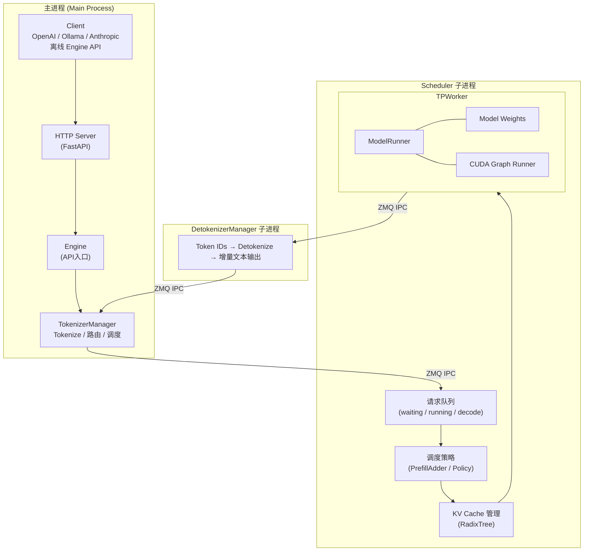

**关键源码路径：**
- 主进程入口：`python/sglang/srt/entrypoints/engine.py`、`http_server.py`
- TokenizerManager：`python/sglang/srt/managers/tokenizer_manager.py`
- Scheduler：`python/sglang/srt/managers/scheduler.py`
- DetokenizerManager：`python/sglang/srt/managers/detokenizer_manager.py`
- TPWorker：`python/sglang/srt/managers/tp_worker.py`
- ModelRunner：`python/sglang/srt/model_executor/model_runner.py`

---

## 2. 请求完整生命周期

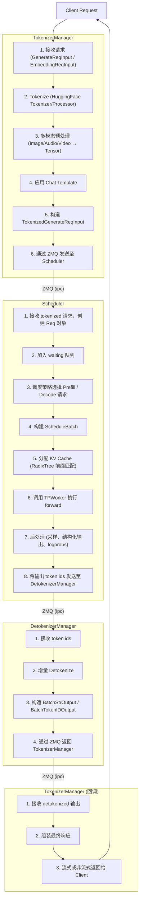

---

## 3. Scheduler 内部架构

Scheduler 是 SGLang 的核心，负责批调度、KV Cache 管理和模型执行协调。它通过 Mixin 模式组合多种功能。

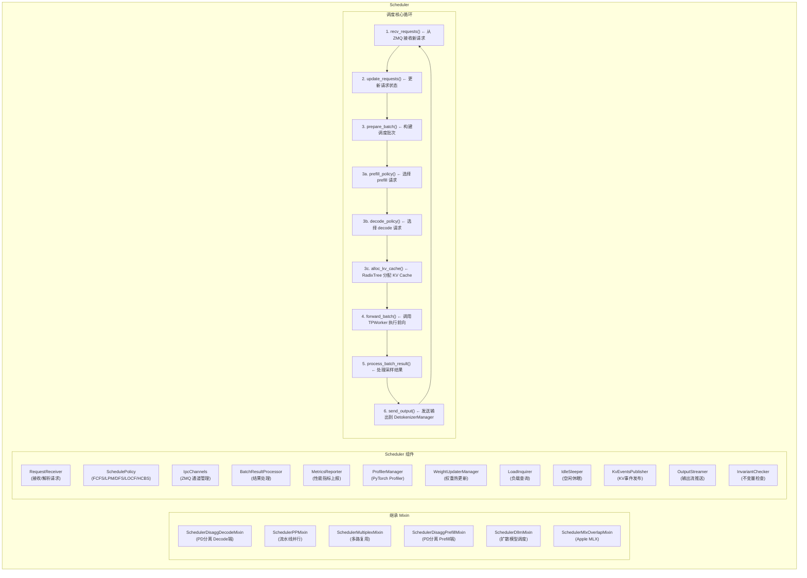

**关键源码路径：**
- Scheduler 主类：`python/sglang/srt/managers/scheduler.py:286`
- 调度策略：`python/sglang/srt/managers/schedule_policy.py`
- 批次构建：`python/sglang/srt/managers/schedule_batch.py`
- 组件目录：`python/sglang/srt/managers/scheduler_components/`

---

## 4. KV Cache 与 RadixAttention 架构

RadixAttention 是 SGLang 的核心创新，通过 Radix Tree 实现前缀共享和自动缓存复用。

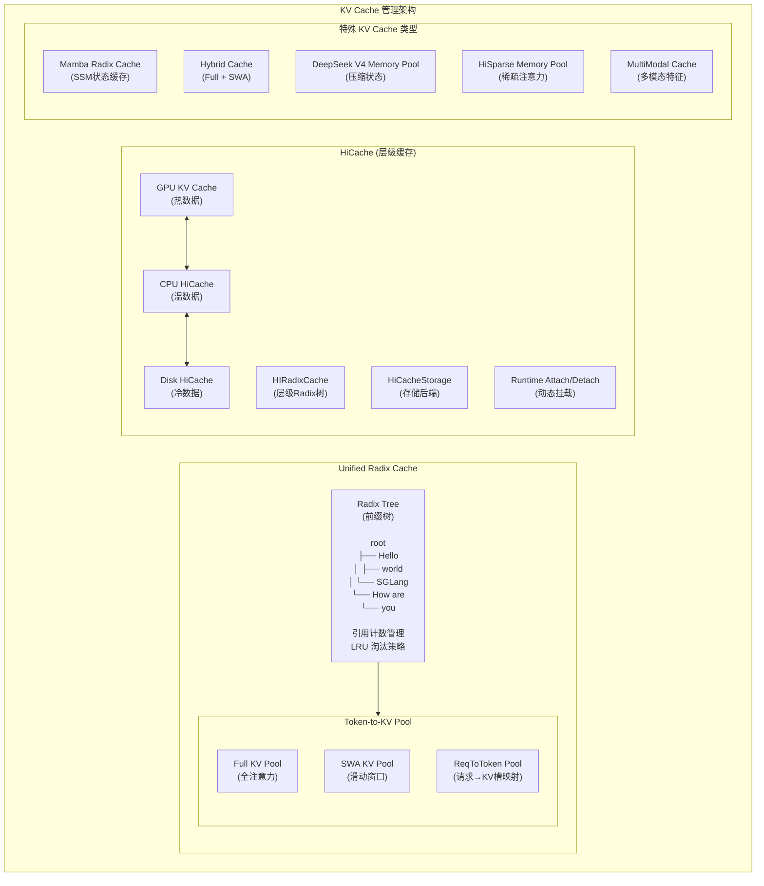

**关键源码路径：**
- Radix Cache：`python/sglang/srt/mem_cache/radix_cache.py`
- C++ 高性能版：`python/sglang/srt/mem_cache/cpp_radix_tree/`、`radix_cache_cpp.py`
- 内存池：`python/sglang/srt/mem_cache/memory_pool.py`
- HiCache：`python/sglang/srt/mem_cache/hiradix_cache.py`、`hicache_storage.py`
- KV Cache Builder：`python/sglang/srt/mem_cache/kv_cache_builder.py`

---

## 5. 模型执行架构（TPWorker + ModelRunner）

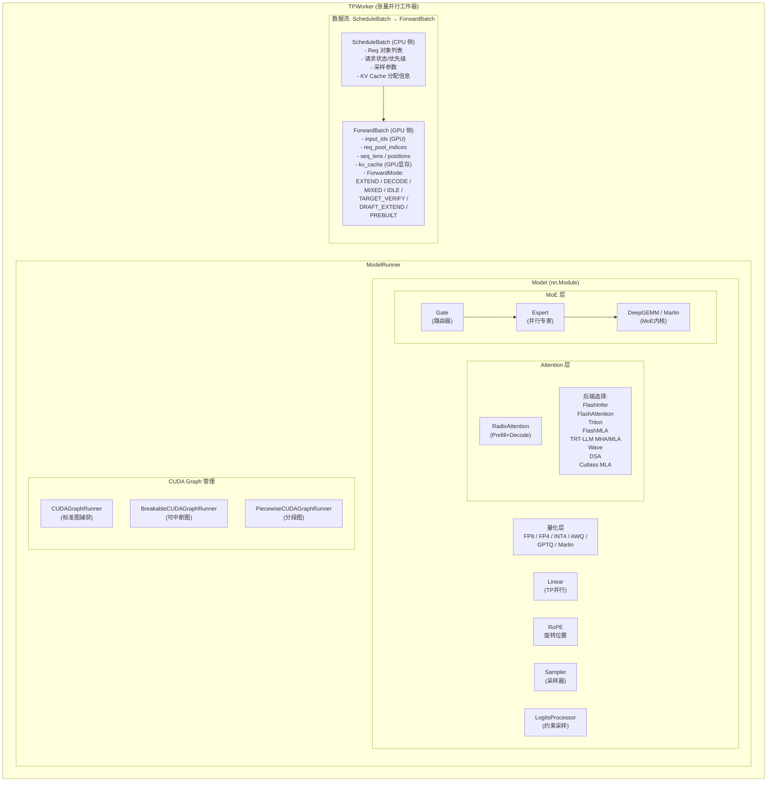

**关键源码路径：**
- ModelRunner：`python/sglang/srt/model_executor/model_runner.py`
- ForwardBatch：`python/sglang/srt/model_executor/forward_batch_info.py`
- CUDA Graph Runner：`python/sglang/srt/model_executor/cuda_graph_runner.py`
- Breakable CUDA Graph：`python/sglang/srt/model_executor/breakable_cuda_graph/`
- Piecewise CUDA Graph：`python/sglang/srt/model_executor/piecewise_cuda_graph_runner.py`
- Attention 后端：`python/sglang/srt/layers/attention/`
- MoE 层：`python/sglang/srt/layers/moe/`
- 量化层：`python/sglang/srt/layers/quantization/`

---

## 6. 分布式并行架构

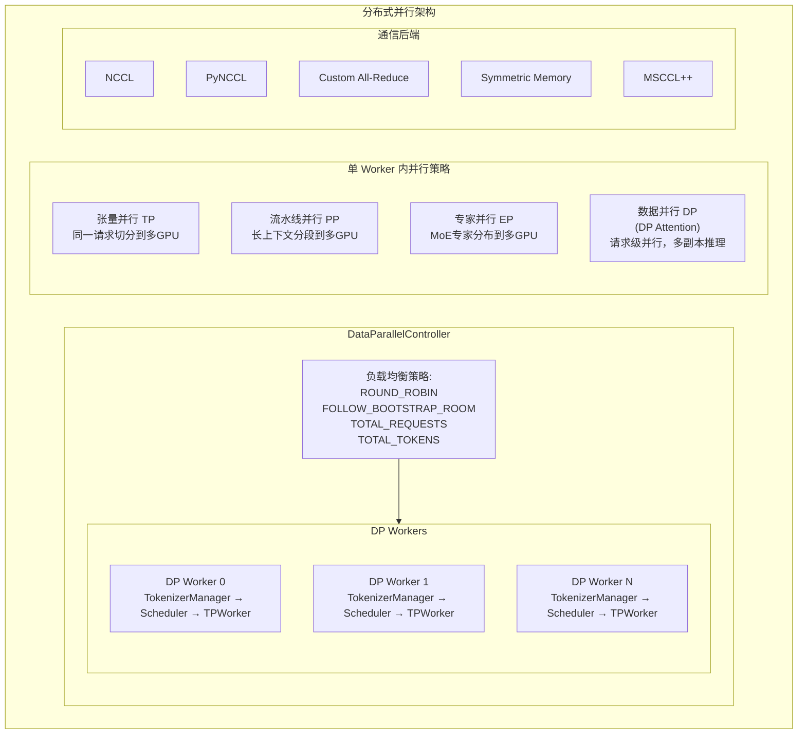

**关键源码路径：**
- DataParallelController：`python/sglang/srt/managers/data_parallel_controller.py`
- 分布式通信：`python/sglang/srt/distributed/`
- 并行状态：`python/sglang/srt/distributed/parallel_state.py`
- 设备通信器：`python/sglang/srt/distributed/device_communicators/`
- DP Attention：`python/sglang/srt/layers/dp_attention.py`
- Elastic EP：`python/sglang/srt/elastic_ep/`
- EP 负载均衡：`python/sglang/srt/eplb/`

---

## 7. PD 分离部署架构（Prefill-Decode Disaggregation）

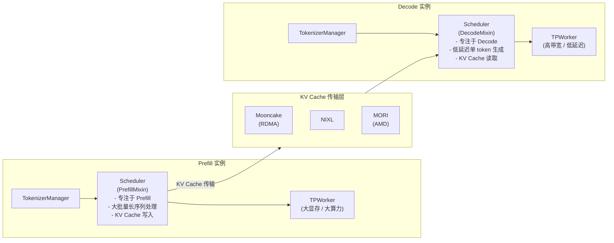

**关键源码路径：**
- PD Prefill 端：`python/sglang/srt/disaggregation/prefill.py`
- PD Decode 端：`python/sglang/srt/disaggregation/decode.py`
- 传输后端：`python/sglang/srt/disaggregation/mooncake/`、`nixl/`、`mori/`
- 通用基础：`python/sglang/srt/disaggregation/base/`、`common/`
- KV 事件：`python/sglang/srt/disaggregation/kv_events.py`

---

## 8. 推测解码架构

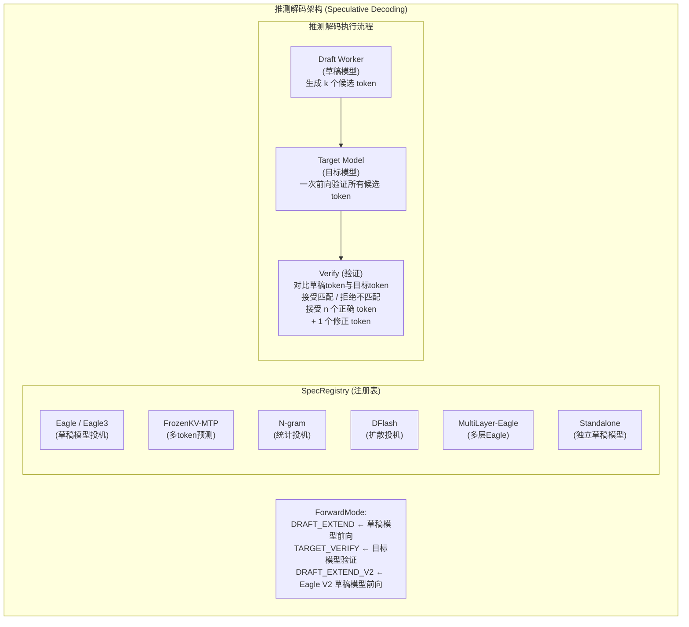

**关键源码路径：**
- 注册表：`python/sglang/srt/speculative/spec_registry.py`
- Eagle Worker：`python/sglang/srt/speculative/eagle_worker.py`、`eagle_worker_v2.py`
- MTP Worker：`python/sglang/srt/speculative/frozen_kv_mtp_worker.py`、`frozen_kv_mtp_worker_v2.py`
- N-gram Worker：`python/sglang/srt/speculative/ngram_worker.py`
- DFlash Worker：`python/sglang/srt/speculative/dflash_worker.py`
- 自适应推测：`python/sglang/srt/speculative/adaptive_runtime_state.py`

---

## 9. 结构化输出架构

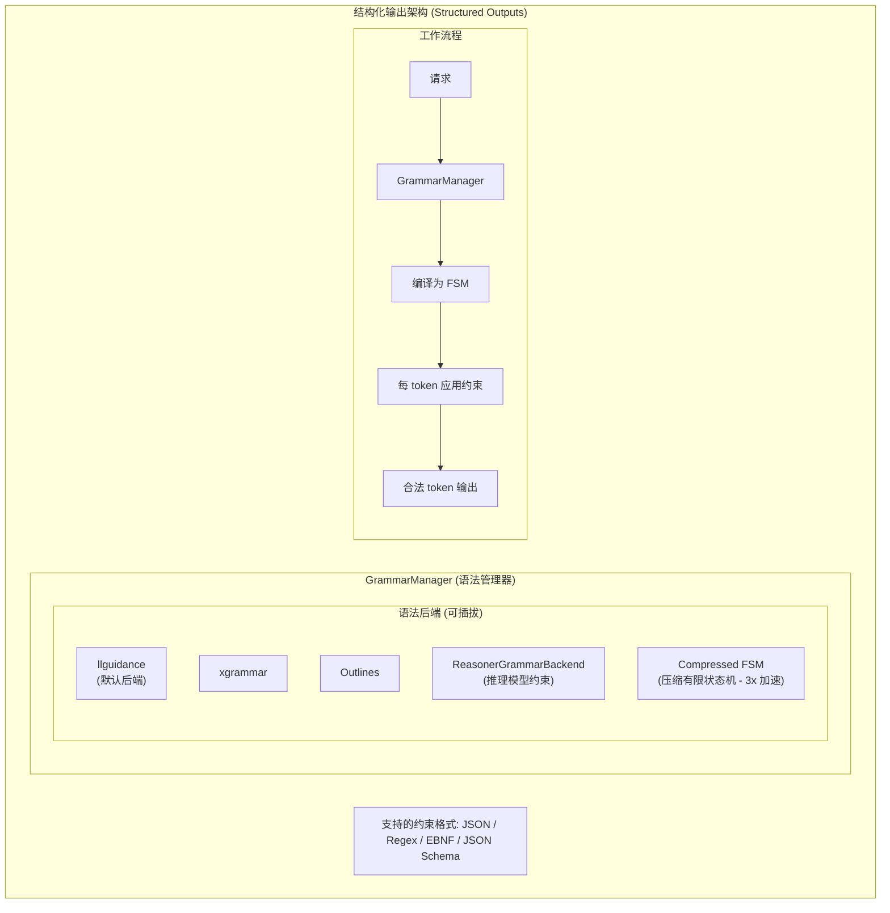

**关键源码路径：**
- GrammarManager：`python/sglang/srt/constrained/grammar_manager.py`
- 后端基类：`python/sglang/srt/constrained/base_grammar_backend.py`
- llguidance：`python/sglang/srt/constrained/llguidance_backend.py`
- xgrammar：`python/sglang/srt/constrained/xgrammar_backend.py`
- Outlines：`python/sglang/srt/constrained/outlines_backend.py`
- Triton 算子：`python/sglang/srt/constrained/triton_ops/`

---

## 10. API 层与入口架构

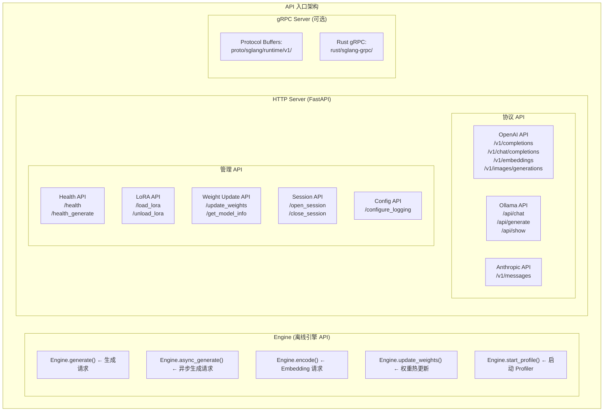

**关键源码路径：**
- Engine：`python/sglang/srt/entrypoints/engine.py`
- HTTP Server：`python/sglang/srt/entrypoints/http_server.py`
- OpenAI API：`python/sglang/srt/entrypoints/openai/`
- Ollama API：`python/sglang/srt/entrypoints/ollama/`
- Anthropic API：`python/sglang/srt/entrypoints/anthropic/`
- gRPC Server：`python/sglang/srt/entrypoints/grpc_server.py`
- EngineBase：`python/sglang/srt/entrypoints/EngineBase.py`

---

## 11. LoRA 服务架构

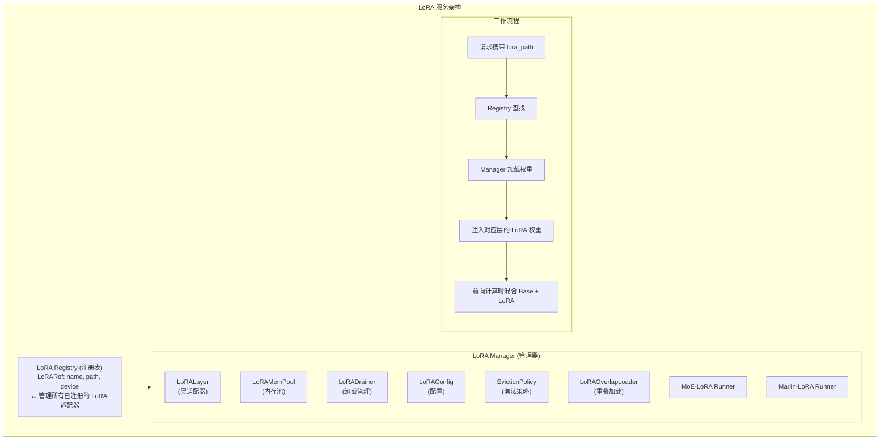

**关键源码路径：**
- LoRA Manager：`python/sglang/srt/lora/lora_manager.py`
- LoRA Registry：`python/sglang/srt/lora/lora_registry.py`
- LoRA Layer：`python/sglang/srt/lora/layers.py`
- LoRA Config：`python/sglang/srt/lora/lora_config.py`
- MoE-LoRA：`python/sglang/srt/lora/lora_moe_runners.py`

---

## 12. 多模态处理架构

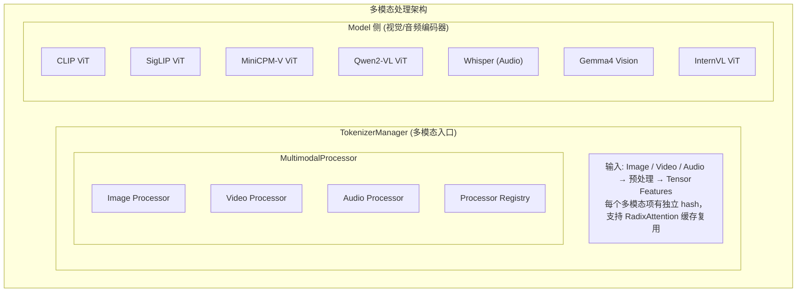

**关键源码路径：**
- 多模态处理器：`python/sglang/srt/managers/multimodal_processor.py`
- 多模态工具：`python/sglang/srt/multimodal/`
- 多模态层：`python/sglang/srt/layers/multimodal.py`
- 多模态缓存：`python/sglang/srt/mem_cache/multimodal_cache.py`
- 模型实现：`python/sglang/srt/models/llava.py`、`qwen2_vl.py`、`gemma3_mm.py` 等

---

## 13. sgl-kernel 内核架构

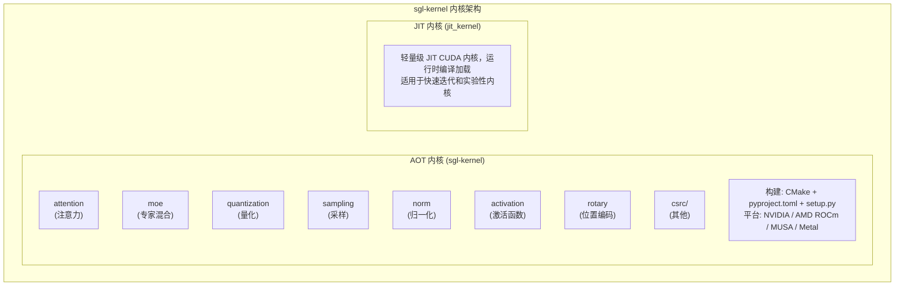

**关键源码路径：**
- sgl-kernel 目录：`sgl-kernel/csrc/`、`sgl-kernel/python/`
- JIT 内核：`python/sglang/jit_kernel/`
- 测试：`tests/kernels/`
- 基准：`sgl-kernel/benchmark/`

---

## 14. 可观测性与监控架构

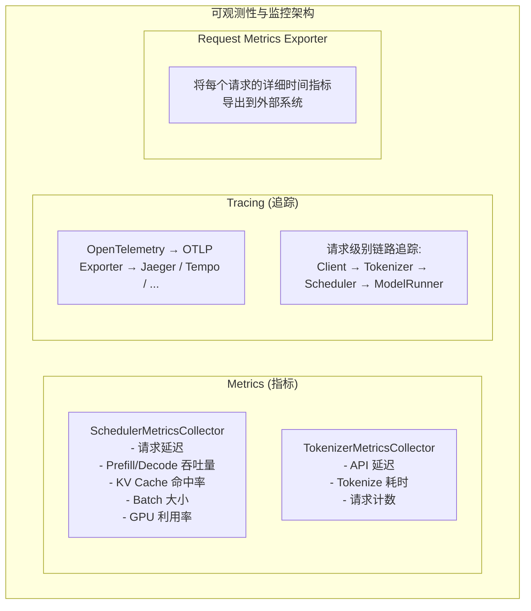

**关键源码路径：**
- 指标收集：`python/sglang/srt/observability/metrics_collector.py`
- 追踪：`python/sglang/srt/observability/trace.py`
- 请求时间统计：`python/sglang/srt/observability/req_time_stats.py`
- CPU 监控：`python/sglang/srt/observability/cpu_monitor.py`
- 指标导出：`python/sglang/srt/observability/request_metrics_exporter.py`

---

## 15. 全景架构总览

```mermaid
flowchart TD
    subgraph ClientLayer["客户端层 (Client Layer)"]
        C1["OpenAI SDK"]
        C2["Anthropic SDK"]
        C3["Ollama CLI"]
        C4["HTTP Client"]
        C5["Python Engine API"]
    end

    subgraph APILayer["API 入口层 (API Layer)"]
        A1["OpenAI API"]
        A2["Ollama API"]
        A3["Anthropic API"]
        A4["Engine (离线)"]
        A5["gRPC Server"]
        A6["Health API"]
        A7["LoRA API"]
    end

    subgraph PreprocessLayer["预处理层 (Preprocess Layer)"]
        TMFull["TokenizerManager\nTokenize | Chat Template | 多模态预处理 | LoRA 路由 | 请求分派"]
    end

    subgraph SchedLayer["调度层 (Scheduling Layer)"]
        Sch["Scheduler\n(批调度核心)"]
        DPC["DPController\n(数据并行控制)"]
        SP["调度策略\nFCFS/LPM/DFS/LOCF/HCBS"]
        RA["RadixAttention\n(前缀缓存)"]
        HC["HiCache\n(层级缓存)"]
        Gram["GrammarManager\n(结构化输出)"]
    end

    subgraph ExecLayer["执行层 (Execution Layer)"]
        MR2["ModelRunner + TPWorker"]
        Attn2["Attention Backends"]
        MoE2["MoE Layers"]
        Lin2["Linear (TP)"]
        Samp2["Sampler"]
        CG2["CUDA Graph Runners"]
        RoPE2["RoPE"]
        Quant2["Quantize Layers"]
        LoRA2["LoRA Layers"]
        LP2["LogitsProcessor"]
    end

    subgraph KernelLayer["内核层 (Kernel Layer)"]
        AOTK["sgl-kernel (AOT)\nCUDA/C++ 预编译内核"]
        JITK["jit_kernel (JIT)\n运行时编译轻量内核"]
        FIK["FlashInfer\n第三方注意力库"]
    end

    subgraph HWLayer["硬件层 (Hardware Layer)"]
        NV["NVIDIA GPU"]
        AMD["AMD GPU"]
        Intel["Intel Xeon CPU"]
        TPU["Google TPU"]
        NPU["Ascend NPU"]
        MT["Moore Threads"]
    end

    subgraph CrossCut["横切关注点 (Cross-cutting Concerns)"]
        Obs["Observability\n(指标/追踪)"]
        Dist["分布式通信\n(NCCL/RDMA)"]
        Wgt["权重管理\n(加载/更新)"]
        Plat["平台适配\n(Platform抽象)"]
    end

    ClientLayer --> APILayer --> PreprocessLayer
    PreprocessLayer -- "ZMQ" --> SchedLayer
    SchedLayer --> ExecLayer
    ExecLayer --> KernelLayer --> HWLayer
```

---

## 附录：进程间通信（IPC）数据结构

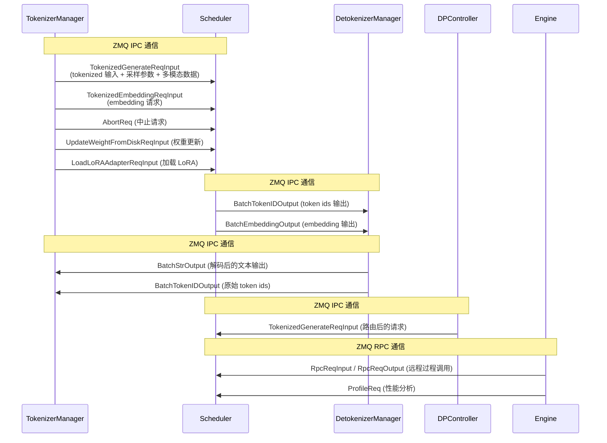

**IPC 数据结构源码：** `python/sglang/srt/managers/io_struct.py`
