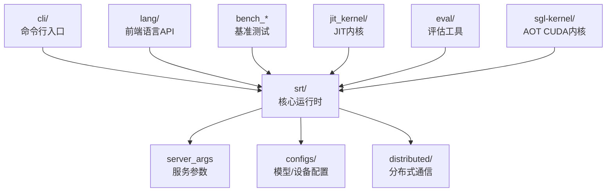
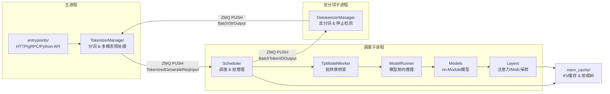
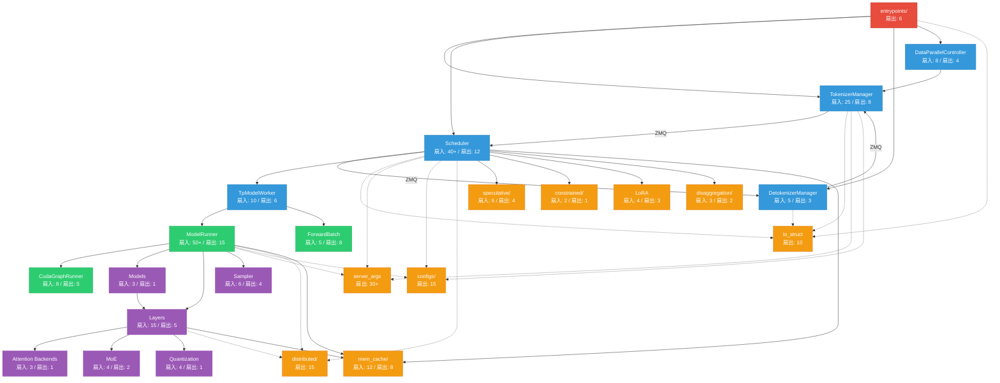

# SGLang 模块扇入扇出分析

## 1. 顶层模块依赖关系



## 2. SRT 核心三进程架构与数据流



## 3. 核心模块扇入扇出图



## 4. 数据结构流转图

```mermaid
flowchart LR
    A["GenerateReqInput<br/>(io_struct)"] -->|TokenizerManager| B["TokenizedGenerateReqInput<br/>(io_struct)"]
    B -->|ZMQ → Scheduler| C["Req<br/>(schedule_batch)"]
    C -->|调度批处理| D["ScheduleBatch<br/>(schedule_batch)"]
    D -->|ForwardBatch.init_new| E["ForwardBatch<br/>(forward_batch_info)"]
    E -->|ModelRunner.forward| F["LogitsProcessorOutput<br/>(layers/logits_processor)"]
    F -->|Sampler采样| G["next_token_ids<br/>(Tensor)"]
    G -->|Scheduler处理| H["BatchTokenIDOutput<br/>(io_struct)"]
    H -->|ZMQ → Detokenizer| I["BatchStrOutput<br/>(io_struct)"]
    I -->|ZMQ → TokenizerManager| J["客户端响应<br/>(dict/stream)"]
```



## 5. 高扇出模块（被多方依赖）

| 模块 | 扇出数 | 依赖者 |
|------|--------|--------|
| `server_args` | 30+ | 几乎所有模块 |
| `managers/io_struct` | 10 | TokenizerManager, Scheduler, DetokenizerManager, Engine, 各entrypoint |
| `configs/model_config` | 15 | ModelRunner, Scheduler, TokenizerManager, TpModelWorker, model_loader, kv_cache_builder |
| `distributed/` | 15 | ModelRunner, Scheduler, TpModelWorker, layers, model_loader |
| `model_executor/forward_batch_info` | 8 | ModelRunner, TpModelWorker, Scheduler, schedule_batch, layers, speculative |

## 6. 高扇入模块（依赖多方）

| 模块 | 扇入数 | 主要依赖来源 |
|------|--------|-------------|
| `model_executor/model_runner` | 50+ | model_loader, layers/*, mem_cache, configs, distributed, sampling, speculative, lora |
| `managers/scheduler` | 40+ | schedule_batch, schedule_policy, io_struct, tp_worker, speculative, constrained, lora, mem_cache, disaggregation, observability, session |
| `managers/tokenizer_manager` | 25 | io_struct, mm_utils, multimodal_processor, sampling_params, spec_info, lora_registry, configs |
| `entrypoints/engine` | 20 | TokenizerManager, Scheduler, DetokenizerManager, DataParallelController, io_struct, server_args |

## 7. Scheduler 子组件扇入扇出

```mermaid
graph TD
    SCH[Scheduler 主类<br/>扇入: 40+]

    SCH --> CMP[scheduler_components/]
    CMP --> IPC[IPCChannels<br/>ZMQ通道管理]
    CMP --> RR[RequestReceiver<br/>请求接收]
    CMP --> OS[OutputStreamer<br/>输出流]
    CMP --> BRP[BatchResultProcessor<br/>批结果处理]
    CMP --> LRP[LogprobResultProcessor<br/>logprob处理]
    CMP --> MR2[MetricsReporter<br/>指标上报]
    CMP --> PS[PoolStatsObserver<br/>池状态观察]
    CMP --> LI[LoadInquirer<br/>负载查询]
    CMP --> WU[WeightUpdater<br/>权重更新]
    CMP --> PM[ProfilerManager<br/>性能分析]
    CMP --> IC[InvariantChecker<br/>不变量检查]
    CMP --> IS[IdleSleeper<br/>空闲休眠]
    CMP --> FW[FlushWrapper<br/>刷新包装]
    CMP --> DPA[DPAttnAdapter<br/>DP注意力适配]
    CMP --> KVE[KvEventsPublisher<br/>KV事件发布]
    CMP --> OSE[OutputSender<br/>输出发送]

    SCH --> SP[SchedulePolicy<br/>调度策略]
    SCH --> SB[ScheduleBatch<br/>批数据结构]
    SCH --> GRAM[GrammarManager<br/>语法约束]
    SCH --> LDR[LoRADrainer<br/>LoRA调度]
    SCH --> SPEC2[SpecWorker<br/>投机解码]
    SCH --> SC[SessionController<br/>会话管理]
    SCH --> DISAGG2[DisaggMixin<br/>分离式推理]
    SCH --> MEM2[KVCache<br/>缓存管理]
